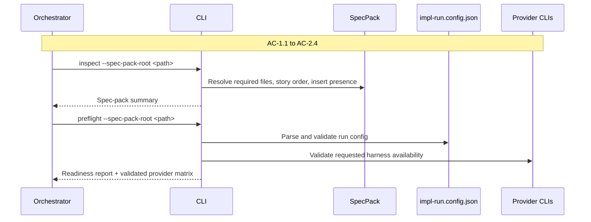
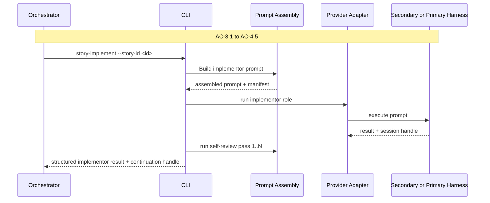
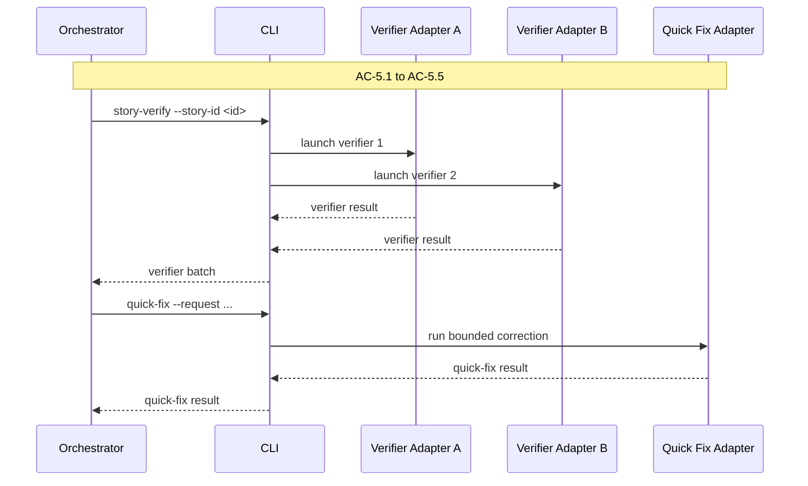
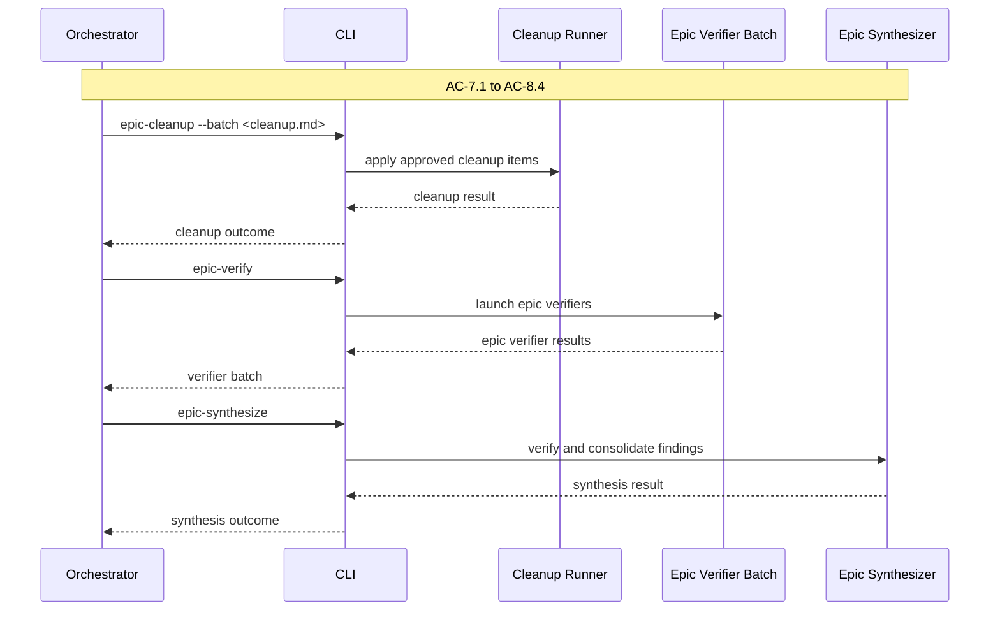

# Technical Design Companion: CLI Runtime Surface

## Purpose

This companion covers the `ls-impl-cli` runtime that executes bounded operations on behalf of the `ls-claude-impl` orchestrator. The CLI is not the methodology. It is the execution surface that makes the methodology practical. It validates readiness, assembles provider-facing prompts, calls secondary harnesses when configured, captures structured outputs, and returns disciplined result contracts to the orchestrator.

The design goal is an agent-first CLI. Every command should correspond to a clear process action that the orchestrator already understands from the skill docs. The CLI should hide internal complexity but not produce mystery. It should accept explicit inputs, return explicit results, and avoid holding orchestration lifecycle in hidden runtime state between calls.

## Runtime Surface Overview

The runtime has five responsibilities:

1. Resolve and validate the spec-pack surface.
2. Load and validate the orchestrator-owned run config.
3. Assemble prompts from embedded base prompts, snippets, runtime values, and public inserts.
4. Execute one bounded operation through the appropriate primary/secondary harness combination.
5. Return structured results that the orchestrator can persist and act on.

The runtime does **not** own:

- story progression
- acceptance decisions
- cumulative baselines across the whole run
- cleanup review decisions
- epic closeout decisions

Those remain with the orchestrator.

## Shared Result Envelope

Every command should return the same outer JSON envelope so the orchestrator can ingest results without command-specific parsing rules.

```typescript
export interface CliError {
  code: string;
  message: string;
  detail?: string;
}

export interface CliArtifactRef {
  kind: string;
  path: string;
}

export interface CliResultEnvelope<T> {
  command: string;
  version: 1;
  status: "ok" | "needs-user-decision" | "blocked" | "error";
  outcome: string;
  result?: T;
  errors: CliError[];
  warnings: string[];
  artifacts: CliArtifactRef[];
  startedAt: string;
  finishedAt: string;
}
```

The JSON envelope is the source of truth. Human-readable `stderr` is allowed for progress or debugging, but the orchestrator should route decisions from the envelope rather than from ad hoc terminal text.

Suggested stable error codes:

- `INVALID_SPEC_PACK`
- `INVALID_RUN_CONFIG`
- `VERIFICATION_GATE_UNRESOLVED`
- `PROVIDER_UNAVAILABLE`
- `PROVIDER_OUTPUT_INVALID`
- `CONTINUATION_HANDLE_INVALID`
- `PROMPT_ASSET_MISSING`
- `PROMPT_INSERT_INVALID`

## Public CLI Contract

The public CLI contract consists of:

1. command signatures in `Command Signatures`
2. shared JSON envelope in `Shared Result Envelope`
3. stdout/stderr/artifact behavior in `Public CLI IO Contract`
4. exit-code and routing behavior in `Exit Codes` and `Result Routing Matrix`
5. provider execution assumptions in `Provider Invocation Contracts`

An implementation that matches those five surfaces should be interchangeable at the orchestrator boundary even if internal module structure changes later.

## Command Surface

The public CLI surface should be small and stable.

| Command | Purpose | Required Inputs | Primary Outputs | Outcome States |
|---|---|---|---|---|
| `inspect` | Resolve spec-pack layout and story inventory | spec-pack root | spec-pack summary, story order, insert presence | `ready`, `needs-user-decision`, `blocked` |
| `preflight` | Validate run config, provider availability, prompt assets, and run readiness | spec-pack root, `impl-run.config.json` | readiness report, validated config, provider matrix | `ready`, `needs-user-decision`, `blocked` |
| `story-implement` | Start implementation for one story | story id, spec-pack root, run config | implementor result, continuation handle | `ready-for-verification`, `needs-followup-fix`, `needs-human-ruling`, `blocked` |
| `story-continue` | Continue a retained implementor session for the current story | continuation handle, follow-up request | continued implementor result | `ready-for-verification`, `needs-followup-fix`, `needs-human-ruling`, `blocked` |
| `story-verify` | Run a fresh verifier batch for one story | story id, run config, verification context | verifier batch result array | `pass`, `revise`, `block` |
| `quick-fix` | Apply a narrow, bounded fix request | free-form task description (`--request-text` or `--request-file`), working directory, role config | quick-fix result | `ready-for-verification`, `needs-more-routing`, `blocked` |
| `epic-cleanup` | Apply cleanup-only corrections before epic verification | cleanup batch, selected fix workflow | cleanup result | `cleaned`, `needs-more-cleanup`, `blocked` |
| `epic-verify` | Run fresh epic-level verification | spec-pack root, run config | epic verifier result array | `pass`, `revise`, `block` |
| `epic-synthesize` | Verify and consolidate epic-level findings | epic verifier results, run config | synthesis result | `ready-for-closeout`, `needs-fixes`, `needs-more-verification`, `blocked` |

The CLI with no arguments should print quick-start help only. The full process explanation stays in the skill docs.

### Command Signatures

The public signatures should stay stable even if internal implementation changes.

| Command | Signature |
|---|---|
| `inspect` | `ls-impl-cli inspect --spec-pack-root <path> [--json]` |
| `preflight` | `ls-impl-cli preflight --spec-pack-root <path> [--config <path>] [--story-gate <cmd>] [--epic-gate <cmd>] [--json]` |
| `story-implement` | `ls-impl-cli story-implement --spec-pack-root <path> --story-id <id> [--config <path>] [--json]` |
| `story-continue` | `ls-impl-cli story-continue --spec-pack-root <path> --story-id <id> --provider <provider> --session-id <id> [--config <path>] [--followup-file <path> | --followup-text <text>] [--json]` |
| `story-verify` | `ls-impl-cli story-verify --spec-pack-root <path> --story-id <id> [--config <path>] [--json]` |
| `quick-fix` | `ls-impl-cli quick-fix --spec-pack-root <path> (--request-file <path> | --request-text <text>) [--config <path>] [--json]` |
| `epic-cleanup` | `ls-impl-cli epic-cleanup --spec-pack-root <path> --cleanup-batch <path> [--config <path>] [--json]` |
| `epic-verify` | `ls-impl-cli epic-verify --spec-pack-root <path> [--config <path>] [--json]` |
| `epic-synthesize` | `ls-impl-cli epic-synthesize --spec-pack-root <path> --verifier-report <path> --verifier-report <path> [--config <path>] [--json]` |

All commands should support `--json` for machine-readable output. Human-readable summaries may exist for manual use, but the orchestrator contract should be the JSON payload.

### Public CLI IO Contract

The CLI should behave consistently across commands.

| Surface | Rule |
|---|---|
| stdout with `--json` | emit exactly one `CliResultEnvelope<T>` JSON object |
| stdout without `--json` | emit a concise human-readable summary only |
| stderr | reserved for progress/debugging; never required for orchestration routing |
| persisted artifacts | write the same JSON envelope that was emitted on stdout |
| default config path | `<spec-pack-root>/impl-run.config.json` unless `--config` overrides it |
| default artifact root | `<spec-pack-root>/artifacts/` |

### Command Examples

```bash
node bin/ls-impl-cli.cjs inspect --spec-pack-root /abs/spec-pack --json
node bin/ls-impl-cli.cjs preflight --spec-pack-root /abs/spec-pack --json
node bin/ls-impl-cli.cjs story-implement --spec-pack-root /abs/spec-pack --story-id story-03 --json
node bin/ls-impl-cli.cjs story-verify --spec-pack-root /abs/spec-pack --story-id story-03 --json
node bin/ls-impl-cli.cjs epic-cleanup --spec-pack-root /abs/spec-pack --cleanup-batch /abs/spec-pack/artifacts/cleanup/cleanup-batch.md --json
```

For commands whose inner payload also contains an `outcome`, the envelope `outcome` is the routing source of truth and must match the inner payload exactly. Schema validation should reject mismatches.

### Exit Codes

Exit codes are a coarse routing signal. The JSON payload remains the source of truth.

| Exit Code | Meaning |
|---|---|
| `0` | Command completed and produced a non-blocking outcome (`ready`, `ready-for-verification`, `pass`, `cleaned`, `ready-for-closeout`) |
| `2` | Command completed but requires follow-up (`needs-user-decision`, `needs-followup-fix`, `needs-human-ruling`, `revise`, `needs-more-routing`, `needs-more-cleanup`, `needs-fixes`, `needs-more-verification`) |
| `3` | Command is blocked by environment, spec-pack, config, or provider readiness issue |
| `1` | Invalid invocation, schema parse failure, or uncaught runtime error |

### Result Routing Matrix

This matrix is authoritative for handler implementation and tests.

| Command Outcome | Envelope Status | Exit Code | Orchestrator Action |
|---|---|---:|---|
| `ready` | `ok` | 0 | proceed to next setup step |
| `ready-for-verification` | `ok` | 0 | run verification or next bounded step |
| `pass` | `ok` | 0 | evaluate for acceptance or next stage |
| `cleaned` | `ok` | 0 | move into epic verification |
| `ready-for-closeout` | `ok` | 0 | run final orchestrator-owned gate |
| `needs-user-decision` | `needs-user-decision` | 2 | pause and request human clarification |
| `needs-followup-fix` | `ok` | 2 | route same-session follow-up or fix path |
| `needs-human-ruling` | `needs-user-decision` | 2 | pause for orchestrator/human ruling |
| `revise` | `ok` | 2 | route fix and rerun verification |
| `needs-more-routing` | `ok` | 2 | select another bounded correction path |
| `needs-more-cleanup` | `ok` | 2 | continue cleanup cycle |
| `needs-fixes` | `ok` | 2 | route fixes before closeout |
| `needs-more-verification` | `ok` | 2 | launch additional verification/synthesis |
| `block` | `blocked` | 3 | stop and inspect blocking error details |
| parse/schema/runtime failure | `error` | 1 | treat as CLI failure rather than feature-state outcome |

## Runtime Module Layout

```text
processes/impl-cli/
├── cli.ts
├── commands/
│   ├── inspect.ts
│   ├── preflight.ts
│   ├── story-implement.ts
│   ├── story-continue.ts
│   ├── story-verify.ts
│   ├── quick-fix.ts
│   ├── epic-cleanup.ts
│   ├── epic-verify.ts
│   └── epic-synthesize.ts
├── core/
│   ├── config-schema.ts
│   ├── spec-pack.ts
│   ├── story-order.ts
│   ├── prompt-assets.ts
│   ├── prompt-assembly.ts
│   ├── provider-checks.ts
│   ├── provider-adapters/
│   │   ├── claude-code.ts
│   │   ├── codex.ts
│   │   └── copilot.ts
│   ├── result-contracts.ts
│   ├── status-codes.ts
│   ├── command-context.ts
│   └── embedded-assets.generated.ts
└── prompts/
    ├── base/
    └── snippets/
```

The command modules stay thin. They parse command-specific flags with `citty`, call into core services, and print structured JSON. All real behavior lives in `core/`.

### Core Service Interfaces

The command handlers should depend on a small set of explicit core interfaces.

```typescript
export interface SpecPackResolver {
  resolve(specPackRoot: string): Promise<InspectResult>;
}

export interface VerificationGateResolver {
  resolve(input: {
    specPackRoot: string;
    explicitStoryGate?: string;
    explicitEpicGate?: string;
  }): Promise<VerificationGateConfig | CliError>;
}

export interface ArtifactWriter {
  write<T>(params: {
    specPackRoot: string;
    command: string;
    storyId?: string;
    payload: CliResultEnvelope<T>;
  }): Promise<CliArtifactRef>;
}

export interface ProviderResultParser<T> {
  parse(raw: ProviderExecutionResult): Promise<T | CliError>;
}
```

These interfaces are deliberately smaller than the whole runtime. They pin the boundaries that are most likely to drift during implementation.

## Run Configuration Contract

The CLI consumes an explicit orchestrator-owned JSON file. The contract is intentionally lean.

```typescript
export type PrimaryHarness = "claude-code";
export type SecondaryHarness = "codex" | "copilot" | "none";
export type ReasoningEffort = "low" | "medium" | "high" | "xhigh";

export interface RoleAssignment {
  secondary_harness: SecondaryHarness;
  model: string;
  reasoning_effort: ReasoningEffort;
}

export interface EpicVerifierAssignment extends RoleAssignment {
  label: string;
}

export interface ImplRunConfig {
  version: 1;
  primary_harness: PrimaryHarness;
  story_implementor: RoleAssignment;
  quick_fixer: RoleAssignment;
  story_verifier_1: RoleAssignment;
  story_verifier_2: RoleAssignment;
  self_review: {
    passes: number;
  };
  epic_verifiers: EpicVerifierAssignment[];
  epic_synthesizer: RoleAssignment;
}
```

Canonical display labels:

| Stored Value | Display Label |
|---|---|
| `low` | low |
| `medium` | medium |
| `high` | high |
| `xhigh` | extra high |

`c12` should be used in explicit-file mode for this feature. The CLI should load either the path passed via `--config` or the default `impl-run.config.json` in the spec-pack root. It should not enable multi-source discovery from home config, `package.json`, or environment overlays in v1. The orchestrator benefits from one obvious config file and one obvious precedence model.

### Validation Rules

| Rule | Reason |
|---|---|
| `primary_harness` must be `claude-code` in v1 | v1 always runs inside Claude Code |
| `secondary_harness` must be `codex`, `copilot`, or `none` | keep the contract explicit and narrow |
| `none` means “use primary harness” | avoids extra indirection or derived config fields |
| `story_implementor.secondary_harness !== "copilot"` in v1 | Copilot continuation is not supported for the retained implementor role |
| `self_review.passes` must be `>= 1` and `<= 5` | prevents nonsensical or runaway values |
| `epic_verifiers.length >= 1` | epic verification is mandatory |
| duplicate epic verifier labels are invalid | makes downstream reporting legible |

### Provider Availability Matrix

The CLI must validate not just schema shape, but whether the local machine can honor the requested harness assignments.

```typescript
export interface HarnessAvailability {
  harness: SecondaryHarness | PrimaryHarness;
  available: boolean;
  version?: string;
  authStatus?: "authenticated" | "unknown" | "missing";
  notes: string[];
}

export interface ProviderMatrix {
  primary: HarnessAvailability;
  secondary: HarnessAvailability[];
}
```

Validation behavior:

- Always validate `claude-code` availability because it is the primary harness.
- Validate `codex` only if at least one role requests `secondary_harness: "codex"`.
- Validate `copilot` only if at least one role requests `secondary_harness: "copilot"`.
- Skip provider-CLI checks for roles using `secondary_harness: "none"`.

## Prompt Asset System

Prompt assets are runtime architecture, not incidental text blobs. They should live in source form for maintainability, then be embedded into a generated TS module so the packaged runtime can ship as a single JS file.

### Prompt Asset Layout

```text
processes/impl-cli/prompts/
├── base/
│   ├── story-implementor.md
│   ├── story-verifier.md
│   ├── quick-fixer.md
│   ├── epic-verifier.md
│   └── epic-synthesizer.md
└── snippets/
    ├── reading-journey.md
    ├── report-contract.md
    ├── gate-instructions.md
    ├── mock-audit.md
    ├── self-review-pass-1.md
    ├── self-review-pass-2.md
    └── self-review-pass-3.md
```

### Prompt Asset Content Contracts

Each prompt asset should have a required internal contract, not just a filename.

| Asset | Required Content |
|---|---|
| `story-implementor.md` | role stance, bounded artifact reading order limited to the current story file plus `tech-design.md`, `tech-design-skill-process.md`, `tech-design-cli-runtime.md`, and `test-plan.md`; implementation scope; self-review rules; JSON result contract; must not reference `CLAUDE.md`, prior story files, or `team-impl-log.md` |
| `story-verifier.md` | evidence rules, severity enum, AC/TC coverage expectations, mock/shim audit rules, routing guidance; must not include `team-impl-log.md` in any reading instruction or output requirement |
| `quick-fixer.md` | no story-aware contract; receives plain task description only; must not include `team-impl-log.md` in any reading instruction or output requirement |
| `epic-verifier.md` | cross-story checks, architecture consistency, production-path mock/shim audit, verifier result contract; must not include `team-impl-log.md` in any reading instruction or output requirement |
| `epic-synthesizer.md` | independent verification duty, confirmed vs disputed issue categories, synthesis result contract; must not include `team-impl-log.md` in any reading instruction or output requirement |
| shared snippets | explicit placeholders, allowed runtime variables, and insertion order guarantees |

### Prompt Assembly Pipeline

Prompt assembly should be deterministic.

1. Choose the role.
2. Load that role’s base prompt.
3. Append required reusable snippets for the operation.
4. Append the relevant public insert file if present.
5. Interpolate runtime values such as story path, tech-design shape, gate commands, and continuation handles.
6. Emit one provider-ready prompt string and a compact assembly manifest for debugging.

```typescript
export interface PromptAssemblyInput {
  role:
    | "story_implementor"
    | "story_verifier"
    | "quick_fixer"
    | "epic_verifier"
    | "epic_synthesizer";
  storyId?: string;
  storyPath?: string;
  epicPath: string;
  techDesignPath: string;
  techDesignCompanionPaths: string[];
  testPlanPath: string;
  implementationPromptInsertPath?: string;
  verifierPromptInsertPath?: string;
  gateCommands: {
    story?: string;
    epic?: string;
  };
  selfReviewPass?: number;
  followupRequest?: string;
}

export interface PromptAssemblyResult {
  prompt: string;
  basePromptId: string;
  snippetIds: string[];
  publicInsertIds: string[];
}
```

The orchestrator does not need to see every runtime prompt asset, but the prompt-system reference should explain the mental model: base prompt plus snippets plus public insert plus runtime values.

For implementation, prompt assembly inputs should be modeled as discriminated unions by operation rather than as one giant loose object. The shared fields above describe the common shape; command-specific inputs should narrow them for:

- story implement / continue
- story verify
- quick fix
- epic cleanup
- epic verify
- epic synthesize

## Flow 1: Inspect and Preflight

**Covers:** AC-1.1, AC-1.2, AC-1.4, AC-1.5, AC-1.6, AC-2.1 to AC-2.4

This is the CLI’s setup boundary. `inspect` answers the structural question: is the spec pack arranged in a way the runtime understands? `preflight` answers the executable question: can this specific machine run the requested harness/model configuration with the required prompt assets and files in place?

This split matters. The orchestrator should be able to inspect a spec pack before it has chosen or authored a run config, but it should not launch any provider-backed work until preflight has passed.



### Inspect Result Contract

```typescript
export interface InspectResult {
  status: "ready" | "needs-user-decision" | "blocked";
  specPackRoot: string;
  techDesignShape: "two-file" | "four-file";
  artifacts: {
    epicPath: string;
    techDesignPath: string;
    techDesignCompanionPaths: string[];
    testPlanPath: string;
    storiesDir: string;
  };
  stories: Array<{ id: string; title: string; path: string; order: number }>;
  inserts: {
    customStoryImplPromptInsert: "present" | "absent";
    customStoryVerifierPromptInsert: "present" | "absent";
  };
  blockers: string[];
  notes: string[];
}
```

### Preflight Result Contract

```typescript
export interface PreflightResult {
  status: "ready" | "needs-user-decision" | "blocked";
  validatedConfig: ImplRunConfig;
  providerMatrix: ProviderMatrix;
  verificationGates?: {
    storyGate: string;
    epicGate: string;
    source: string;
  };
  configValidationNotes: string[];
  promptAssets: {
    basePromptsReady: boolean;
    snippetsReady: boolean;
    notes: string[];
  };
  blockers: string[];
  notes: string[];
}
```

`preflight` validates the authored config and reports the consequences of that config. It does **not** generate or rewrite the default matrix in v1. Default selection is part of the skill/process contract and is owned by the orchestrator before preflight runs.

### Story Ordering and Story ID Rules

Spec-pack resolution must not invent story order heuristically.

1. Read markdown files from `stories/`, excluding `coverage.md`.
2. Derive `storyId` from the filename without extension.
3. Order stories by the leading numeric prefix in the filename when present.
4. If two files have the same numeric prefix, fall back to lexical filename order.
5. If no numeric prefixes exist anywhere, use lexical filename order and emit a warning in `inspect`.
6. If the naming pattern is mixed and produces ambiguous ordering, return `needs-user-decision`.

This keeps story order reproducible and makes the ordering rules explicit for both runtime code and tests.

Examples:

- `00-foundation.md`, `01-run-setup.md`, `02-prompts.md` -> valid, ordered numerically
- `01-a.md`, `01-b.md` -> valid, ordered lexically within the same prefix
- `01-a.md`, `b.md`, `02-c.md` -> ambiguous mixed pattern, return `needs-user-decision`

### Tech Design Companion Discovery Rules

The four-file tech-design shape is valid only when:

- `tech-design.md` exists
- `test-plan.md` exists
- exactly two additional files matching `tech-design-*.md` exist
- `tech-design.md` itself is excluded from the companion count
- companion paths are sorted lexically before being returned

Invalid examples:

- one companion file only
- three or more companion files
- files outside the `tech-design-*.md` pattern do not count toward the companion total

These should return `blocked` with an explicit shape error rather than being ignored silently.

### TC Mapping for This Flow

| TC | Tests | Module | Setup | Assert |
|---|---|---|---|---|
| TC-1.1a | accepts two-file config | `inspect-command.test.ts` | fixture with `epic.md`, `tech-design.md`, `test-plan.md`, `stories/` | `inspect` returns `ready` and `two-file` |
| TC-1.1b | accepts four-file config | `inspect-command.test.ts` | fixture with companions | `inspect` returns `ready` and `four-file` |
| TC-1.1c | rejects `stories.md` layout | `inspect-command.test.ts` | invalid story layout fixture | `blocked` with explicit message |
| TC-1.1d | rejects missing required artifact | `inspect-command.test.ts` | missing file fixture | `blocked` with named artifact |
| TC-1.2a | records two-file config | `inspect-command.test.ts` | two-file fixture | tech-design shape recorded |
| TC-1.2b | records four-file config | `inspect-command.test.ts` | four-file fixture | companions surfaced for later use |
| TC-1.4a | detects both inserts | `inspect-command.test.ts` | fixture with both insert files | inserts marked `present` |
| TC-1.4b | allows absent inserts | `inspect-command.test.ts` | fixture without insert files | inserts marked `absent`, no failure |
| TC-1.5a | records full story order | `inspect-command.test.ts` | multi-story fixture | story inventory sorted and returned |
| TC-1.6a | preflight carries discovered gates forward | `preflight-command.test.ts` | valid config + discovered gate inputs | readiness report includes gate-aware notes |
| TC-1.6b | ambiguous gate policy returns `needs-user-decision` | `preflight-command.test.ts` | missing gate inputs | explicit pause state |
| TC-2.1a | primary harness always available check runs | `preflight-command.test.ts` | primary harness fixture | provider matrix includes Claude Code |
| TC-2.2a | Codex preferred when configured | `preflight-command.test.ts` | config using Codex | validated config preserves Codex role |
| TC-2.2b | Copilot accepted when Codex absent and Copilot chosen | `preflight-command.test.ts` | config using Copilot | provider matrix validates Copilot path |
| TC-2.2c | roles using `none` fall back to primary harness only | `preflight-command.test.ts` | config with `none` | no missing-secondary-harness error |
| TC-2.3a-e | role model matrix validated | `config-schema.test.ts` | various valid configs | all role assignments parsed correctly |
| TC-2.4a | validated run config returned for log capture | `preflight-command.test.ts` | valid fixture | structured `validatedConfig` returned |

## Flow 2: Story Implementation and Continuation

**Covers:** AC-3.1, AC-3.2, AC-3.4a, AC-4.1 to AC-4.5

`story-implement` launches the implementor for one story using the assembled prompt and the configured role assignment. The CLI owns prompt assembly, provider invocation, self-review prompt evolution, and the returned structured result. It does not own story acceptance. `story-continue` exists because the story implementor may keep working in the same provider session across follow-up fixes or post-review continuation.

The most important boundary here is continuity. The CLI may continue a provider session, but it must do so only from explicit continuation/session handles emitted in the previous result and handed back by the orchestrator. The CLI should never try to recover the “latest” session implicitly.



### Continuation Handle Contract

```typescript
export interface ContinuationHandle {
  provider: "claude-code" | "codex" | "copilot";
  sessionId: string;
  storyId: string;
}
```

### Implementor Result Contract

```typescript
export interface ImplementorResult {
  resultId: string;
  provider: "claude-code" | "codex" | "copilot";
  model: string;
  role: "story_implementor";
  sessionId?: string;
  outcome:
    | "ready-for-verification"
    | "needs-followup-fix"
    | "needs-human-ruling"
    | "blocked";
  continuation?: ContinuationHandle;
  story: {
    id: string;
    title: string;
  };
  planSummary: string;
  changedFiles: Array<{ path: string; reason: string }>;
  tests: {
    added: string[];
    modified: string[];
    removed: string[];
    totalAfterStory?: number;
    deltaFromPriorBaseline?: number;
  };
  gatesRun: Array<{ command: string; result: "pass" | "fail" | "not-run" }>;
  selfReview: {
    passesRun: number;
    findingsFixed: string[];
    findingsSurfaced: string[];
  };
  openQuestions: string[];
  specDeviations: string[];
  recommendedNextStep: string;
}
```

### Self-Review Rules

The CLI should own the mechanical shape of self-review:

- Pass 1: broad correctness and obvious omissions
- Pass 2: test/coverage and requirement alignment
- Pass 3: residual risk and boundary audit

Stop rules:

- stop early if the provider reports a blocking condition
- stop early if a pass surfaces only human-ruling issues
- otherwise run the configured number of passes

### TC Mapping for This Flow

| TC | Tests | Module | Setup | Assert |
|---|---|---|---|---|
| TC-3.1a | implementor prompt assembly uses base + snippets | `prompt-assembly.test.ts` | implementor input fixture | assembly includes correct base prompt and snippets |
| TC-3.1b | verifier prompt assembly uses base + snippets | `prompt-assembly.test.ts` | verifier input fixture | verifier assets selected correctly |
| TC-3.2a | implementor insert applied when present | `prompt-assembly.test.ts` | insert file fixture | insert content included every run |
| TC-3.2b | implementor insert omitted cleanly when absent | `prompt-assembly.test.ts` | no insert file | no failure path and no insert ID |
| TC-3.4a | implementor reading journey included | `prompt-assembly.test.ts` | implementor input | reading-journey snippet and paths included |
| TC-4.1a | story implement uses documented contract | `story-implement-command.test.ts` | valid config + story fixture | command returns structured implementor result |
| TC-4.2a | self-review remains in same session | `provider-adapter.test.ts` | fake provider session | self-review calls reuse same session |
| TC-4.2b | continuation handle returned | `story-implement-command.test.ts` | fake provider response with session | structured continuation returned |
| TC-4.3a | configured number of self-review passes run | `story-implement-command.test.ts` | passes=3 config | three passes unless blocking stop |
| TC-4.3b | self-review prompt evolves by pass | `prompt-assembly.test.ts` | self-review fixtures | pass-specific snippets differ |
| TC-4.4a | clear local fixes can be applied automatically | `story-implement-command.test.ts` | provider returns noncontroversial fix list | result records auto-applied fixes |
| TC-4.4b | uncertain fix is surfaced | `story-implement-command.test.ts` | provider flags uncertainty | result outcome `needs-human-ruling` or surfaced finding |
| TC-4.5a | implementor result has full contract | `result-contracts.test.ts` | valid result object | schema accepts required fields only |

## Flow 3: Story Verification and Quick Fix

**Covers:** AC-3.3, AC-3.4b, AC-3.4c, AC-5.1 to AC-5.5

`story-verify` launches fresh verifiers by default. They should not reuse prior verifier sessions. `quick-fix` is intentionally lighter than a full implementor pass. It exists for small, bounded corrections that do not justify re-running the full story implementation workflow.

The orchestration rule here is simple. The CLI can execute verification or a quick fix, but it cannot decide that a story is accepted. It only returns disciplined findings and outcomes. The orchestrator still interprets them and runs the final gate.

Re-verification is proportional to the substance of the fix. Substantial fixes should trigger fresh verifier sessions. Small, nit, or cleanup-only fixes may be spot-checked by the orchestrator with a local gate rerun and no re-verification dispatch.



### Story Verifier Result Contract

```typescript
export interface StoryVerifierResult {
  resultId: string;
  outcome: "pass" | "revise" | "block";
  verifierLabel: string;
  provider: "claude-code" | "codex" | "copilot";
  model: string;
  story: {
    id: string;
    title: string;
  };
  artifactsRead: string[];
  reviewScopeSummary: string;
  findings: VerifierFinding[];
  requirementCoverage: {
    verified: string[];
    unverified: string[];
  };
  gatesRun: Array<{ command: string; result: "pass" | "fail" | "not-run" }>;
  mockOrShimAuditFindings: string[];
  recommendedFixScope:
    | "same-session-implementor"
    | "quick-fix"
    | "fresh-fix-path"
    | "human-ruling";
  openQuestions: string[];
  additionalObservations: string[];
}
```

```typescript
export type FindingSeverity = "critical" | "major" | "minor" | "observation";
export type RequirementId = string;

export interface VerifierFinding {
  id: string;
  severity: FindingSeverity;
  title: string;
  evidence: string;
  affectedFiles: string[];
  requirementIds: RequirementId[];
  recommendedFixScope:
    | "same-session-implementor"
    | "quick-fix"
    | "fresh-fix-path"
    | "human-ruling";
  blocking: boolean;
}
```

### Quick Fix Result Contract

The outer `CliResultEnvelope` is the only required contract for quick-fix. The inner `result` payload is intentionally free-form provider output rather than a structured quick-fix schema. In practice that means raw stdout-derived content from the configured provider path, such as codex JSONL-derived output or Copilot text.

### TC Mapping for This Flow

| TC | Tests | Module | Setup | Assert |
|---|---|---|---|---|
| TC-3.3a | verifier insert applied | `prompt-assembly.test.ts` | verifier insert fixture | verifier prompt includes insert |
| TC-3.3b | verifier insert omitted cleanly | `prompt-assembly.test.ts` | absent insert | prompt still valid |
| TC-3.4b | verifier reading journey included | `prompt-assembly.test.ts` | verifier input | evidence-focused reading instructions included |
| TC-3.4c | quick-fix handoff stays narrow | `prompt-assembly.test.ts` | quick-fix input | no full-story reread context injected |
| TC-5.1a | default verifier count is two | `story-verify-command.test.ts` | no override config | two verifier launches requested |
| TC-5.1b | re-verification uses fresh sessions | `provider-adapter.test.ts` | prior verifier session ids | new verifier sessions used |
| TC-5.2a | verifier contract complete | `result-contracts.test.ts` | sample verifier result | schema requires identity, findings, coverage, gates |
| TC-5.2b | additional observations retained | `story-verify-command.test.ts` | provider returns soft observations | result includes additional observations |
| TC-5.2c | mock/shim audit required | `story-verify-command.test.ts` | integration-facing fixture | mock audit field included and populated when needed |
| TC-5.3a | quick-fix routing supported | `quick-fix-command.test.ts` | bounded fix request | quick-fix operation executes without full implementor path |
| TC-5.3b | quick-fix envelope stays explicit while payload stays unstructured | `result-contracts.test.ts` | quick-fix result fixture | validate only the outer envelope for quick-fix outputs |
| TC-5.4a | implementor uncertainty preserved for orchestrator | `story-implement-command.test.ts` | uncertain implementor output | surfaced in result |
| TC-5.4b | verifier disagreement preserved | `story-verify-command.test.ts` | conflicting verifier results | batch result indicates revise/block instead of silent resolution |
| TC-5.5a | final story gate not owned by CLI | `cli-operations-doc.test.ts` | command guide fixture | public docs state gate is orchestrator-owned |

## Flow 4: Epic Cleanup, Verification, and Synthesis

**Covers:** AC-7.1 to AC-7.3, AC-8.1 to AC-8.4

At epic closeout the CLI executes three different kinds of work: cleanup-only correction, epic-level verifier batches, and synthesis. The orchestrator still determines whether the run can close. The CLI should never blur these responsibilities into one vague “finish the epic” command.

The cleanup operation is distinct because it acts on an orchestrator-curated cleanup batch. It is not a general-purpose retry. It is a bounded correction-only workflow designed to start epic verification from the cleaned state rather than from an accumulation of known-but-deferred issues.
Cleanup execution uses the `quick_fixer` role configuration from `impl-run.config.json`; there is no separate `cleanup_fixer` role in v1.



### Epic Verifier Result

```typescript
export interface EpicVerifierResult {
  resultId: string;
  outcome: "pass" | "revise" | "block";
  provider: "claude-code" | "codex" | "copilot";
  model: string;
  reviewerLabel: string;
  crossStoryFindings: string[];
  architectureFindings: string[];
  epicCoverageAssessment: string[];
  mockOrShimAuditFindings: string[];
  blockingFindings: VerifierFinding[];
  nonBlockingFindings: VerifierFinding[];
  unresolvedItems: string[];
  gateResult: "pass" | "fail" | "not-run";
}
```

### Epic Cleanup Result

```typescript
export interface EpicCleanupResult {
  resultId: string;
  outcome: "cleaned" | "needs-more-cleanup" | "blocked";
  cleanupBatchPath: string;
  filesChanged: string[];
  changeSummary: string;
  gatesRun: Array<{ command: string; result: "pass" | "fail" | "not-run" }>;
  unresolvedConcerns: string[];
  recommendedNextStep: string;
}
```

### Epic Synthesis Result

```typescript
export interface EpicSynthesisResult {
  resultId: string;
  outcome:
    | "ready-for-closeout"
    | "needs-fixes"
    | "needs-more-verification"
    | "blocked";
  confirmedIssues: string[];
  disputedOrUnconfirmedIssues: string[];
  readinessAssessment: string;
  recommendedNextStep: string;
}
```

### TC Mapping for This Flow

| TC | Tests | Module | Setup | Assert |
|---|---|---|---|---|
| TC-7.1a | cleanup result contract exists | `epic-cleanup-command.test.ts` | cleanup batch fixture | cleanup command returns durable result |
| TC-7.2a | cleanup stage preserves review-before-dispatch boundary | `cli-operations-doc.test.ts` | command guide fixture | docs require human review prior to cleanup execution |
| TC-7.3a | cleanup verified before epic verification | `cli-operations-doc.test.ts` | command guide fixture | process documentation requires cleanup completion before epic verification begins |
| TC-8.1a | epic verification mandatory | `cli-operations-doc.test.ts` | closeout docs fixture | no closeout path without `epic-verify` |
| TC-8.1b | no skip path | `cli-operations-doc.test.ts` | command guide fixture | public command flow exposes no skip route |
| TC-8.1c | epic mock/shim audit present | `epic-verify-command.test.ts` | production-path fixture | epic verifier result includes mock audit field |
| TC-8.2a | synthesis mandatory | `epic-synthesize-command.test.ts` | verifier results fixture | synthesis command required and returns structured result |
| TC-8.3a | synthesis verifies rather than merges blindly | `epic-synthesize-command.test.ts` | conflicting verifier reports | synthesis distinguishes confirmed vs unconfirmed issues |
| TC-8.4a | final epic gate remains orchestrator-owned | `cli-operations-doc.test.ts` | command guide fixture | docs state final gate is outside CLI |

## Provider Adapters

The provider adapters let the CLI execute the same operation contract against different harnesses without changing the orchestrator-facing command surface.

```typescript
export interface ProviderExecutionRequest {
  prompt: string;
  cwd: string;
  model: string;
  reasoningEffort: string;
  resumeSessionId?: string;
  timeoutMs: number;
}

export interface ProviderExecutionResult {
  provider: "claude-code" | "codex" | "copilot";
  sessionId?: string;
  stdout: string;
  stderr: string;
  exitCode: number;
  parsedResult?: unknown;
}

export interface ProviderAdapter {
  checkAvailability(): Promise<HarnessAvailability>;
  execute(request: ProviderExecutionRequest): Promise<ProviderExecutionResult>;
}
```

Adapter rules:

- `claude-code` adapter uses the primary harness path and supports “no secondary harness” roles.
- `codex` adapter supports runtime model and reasoning-effort overrides.
- `copilot` adapter supports runtime model override, but reasoning effort is effectively config-level and should be treated as advisory in validation notes.
- Adapters must return explicit session IDs when the provider exposes them. The CLI should never rely on “latest session for cwd” behavior.

### Provider Invocation Contracts

The adapter behavior must be explicit per harness.

| Harness | Invocation Shape | Resume Shape | Notes |
|---|---|---|---|
| `codex` | `codex exec --json -m <model> -c model_reasoning_effort=<effort> "<prompt>"` | `codex exec resume --json <session-id> "<follow-up prompt>"` | use explicit session IDs only; capture stdout to artifact before parsing |
| `copilot` | `copilot -p "<prompt>" -s --model <model> ...` with adapter-owned result capture and permission flags | no session resume contract for retained implementor in v1; use fresh programmatic runs only | Copilot is valid for fresh-session roles only in v1; reasoning effort treated as advisory because it is config-level |
| `claude-code` | `claude -p "<prompt>" --output-format json --model <model> --permission-mode <mode>` | `claude -p "<follow-up prompt>" --resume <session-id> --output-format json --model <model>` | do not reuse the live interactive orchestrator session; do not rely on `--continue` or latest-session-by-cwd behavior |

The v1 design assumes the primary harness is still invokable as a child process. If that proves false in implementation, the design must be updated explicitly rather than allowing the runtime model to drift into “emit a prompt and ask the orchestrator to run it manually.”

### `story-continue` Resolution Rules

`story-continue` resolves `model` and `reasoningEffort` from the active `story_implementor` entry in the selected config file unless a future continuation-handle schema explicitly carries immutable model metadata. The continuation handle is intentionally light in v1 and should not become a second config surface.

### Availability and Auth Checks

| Harness | Version Check | Auth Check | Availability Tier Notes |
|---|---|---|---|
| `claude-code` | `claude --version` | `claude auth status` | supports `binary-present` and `authenticated-known` tiers |
| `codex` | `codex --version` | explicit auth-state command if available, otherwise mark auth as `unknown` without paid smoke by default | supports `binary-present`; `authenticated-known` only if a non-mutating auth check exists |
| `copilot` | `copilot --version` | explicit auth-state command if available, otherwise mark auth as `unknown` without paid smoke by default | `--npx` fallback deferred in v1 |

Availability tiers:

- `binary-present`
- `authenticated-known`
- `auth-unknown`
- `unavailable`

### Provider Output Parsing Rules

- Provider stdout is captured in full to a temp/result artifact before parsing.
- The adapter validates the parsed provider result before converting it into the command result envelope.
- Invalid structured output becomes a machine-readable CLI error with a stable error code.
- Missing session IDs are treated as blocking for commands that require continuation support.
- Provider stderr may be persisted for debugging, but it is not the orchestration source of truth.

For v1, provider prompts require the model to return exactly one JSON object matching the operation payload schema. The adapter accepts only:

1. provider-native JSON whose final text/result field is exactly that object, or
2. raw stdout that is exactly that object.

The adapter does not parse arbitrary prose, markdown summaries, or fenced JSON blocks in v1. Invalid output returns `PROVIDER_OUTPUT_INVALID`.

## Verification Gate Resolution

The runtime must not guess gate commands ad hoc.

1. explicit command flags
2. explicit run-config values, if later added
3. discovered package scripts
4. supporting policy docs or CI config
5. otherwise `needs-user-decision`

```typescript
export interface VerificationGateConfig {
  storyGate: string;
  epicGate: string;
  source: "cli-flag" | "run-config" | "package-scripts" | "policy-doc" | "ci-config";
}
```

The preflight result should surface this config so the orchestrator can persist it into `team-impl-log.md`.

### Canonical Gate Mapping

Until a project overrides the defaults, the expected mapping for this repo is:

| Gate | Command |
|---|---|
| Story gate | `bun run green-verify` |
| Epic gate | `bun run verify-all` |

This mapping should appear consistently in:

- `preflight` output
- `team-impl-log.md`
- prompt assembly inputs
- process-playbook examples

When gate discovery comes from `package.json` scripts, surface the canonical invocable command (`bun run <script-name>`) rather than the expanded script body.

## Packaging and Build Integration

The source runtime stays modular. The packaged skill should contain one bundled Node-compatible JS file.

### Build Steps

1. Author prompt assets under `processes/impl-cli/prompts/`.
2. Run `scripts/sync-impl-cli-assets.ts` to generate `embedded-assets.generated.ts`.
3. Bundle `processes/impl-cli/cli.ts` with Bun targeting Node-compatible output.
4. Copy the bundled artifact into `dist/skills/ls-claude-impl/bin/`.
5. Validate that the packaged skill includes `SKILL.md`, all reference files, and the runtime artifact.

### Bundling Notes

- Keep the build target Node-compatible.
- Prefer a single JS runtime artifact in the packaged skill.
- Embed prompt assets into the bundle to avoid distributing a second runtime prompt tree inside the skill.
- Leave provider CLIs external. They are environment prerequisites, not bundled dependencies.

### Build Commands

```bash
# 1. regenerate embedded prompt assets
bun run scripts/sync-impl-cli-assets.ts

# 2. bundle node-compatible runtime artifact
bun build processes/impl-cli/cli.ts \
  --target=node \
  --format=cjs \
  --outfile dist/generated/ls-impl-cli.cjs
```

The build pipeline should then copy `dist/generated/ls-impl-cli.cjs` into `dist/skills/ls-claude-impl/bin/ls-impl-cli.cjs` and fail validation if that file is missing.

### Artifact Persistence Layout

The CLI should write result artifacts automatically under the spec-pack root so recovery does not depend on stdout capture alone.

```text
<spec-pack-root>/artifacts/
├── story-03/
│   ├── 001-implementor.json
│   ├── 002-verifier-batch.json
│   ├── 003-quick-fix.json
│   └── 004-reverify-batch.json
├── cleanup/
│   └── 001-cleanup-result.json
└── epic/
    ├── 001-epic-verifier-batch.json
    └── 002-epic-synthesis.json
```

Command stdout should still emit the JSON result envelope, but the CLI should also persist the same envelope to the artifact path it returns. That keeps orchestration and recovery deterministic.

### Packaging Decisions

- Ship CommonJS at `bin/ls-impl-cli.cjs` in v1.
- Defer Copilot `--npx` fallback from v1. Preflight should validate directly available Copilot CLI support only for explicitly Copilot-backed roles.

## Security and Operational Guardrails

This runtime reads project files and launches external CLIs. The first version still needs basic guardrails:

| Guardrail | Rule |
|---|---|
| Spec-pack root | resolve to an absolute path and require it to be inside a git repo for all commands, including `inspect` |
| Story/session continuation | reject mismatched `storyId` / `sessionId` reuse |
| Prompt inserts | treat as trusted project artifacts, but cap file size and reject unreadable paths |
| Child-process cwd | always use the resolved repo root or explicit project root |
| Timeouts | every provider adapter call has a bounded timeout |
| Secrets in logs | redact obvious bearer tokens / auth strings before persisting stdout/stderr artifacts |

## Related Sections

- Cross-cutting decisions and stack choices: `tech-design.md`
- Orchestrator-facing skill files and durable-state rules: `tech-design-skill-process.md`
- TC-to-test mapping, fixture strategy, and command-entrypoint tests: `test-plan.md`
