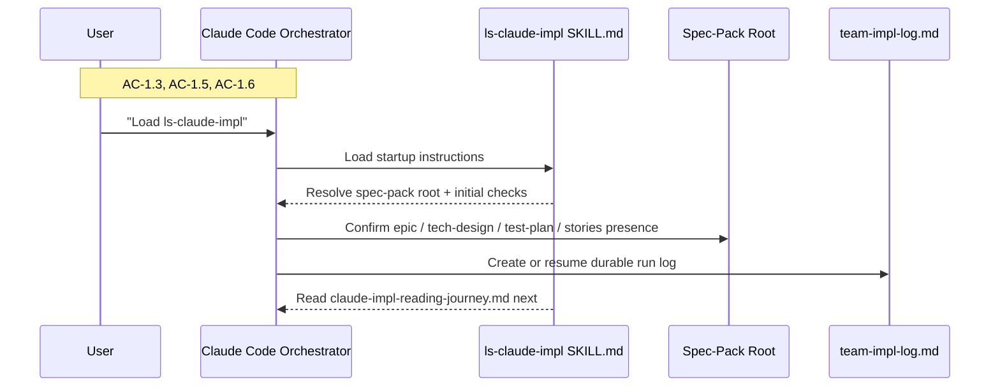
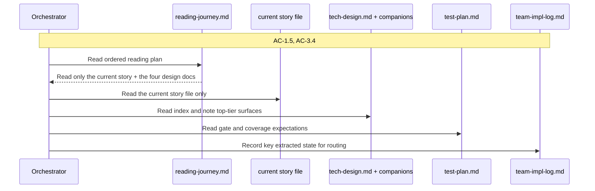
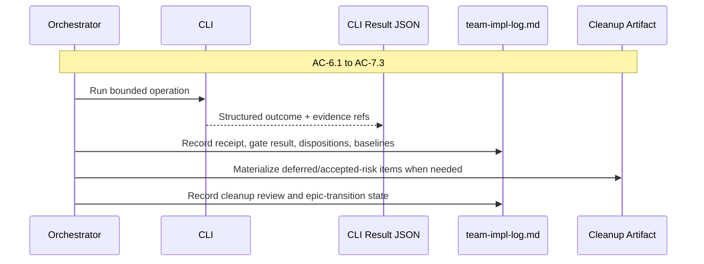
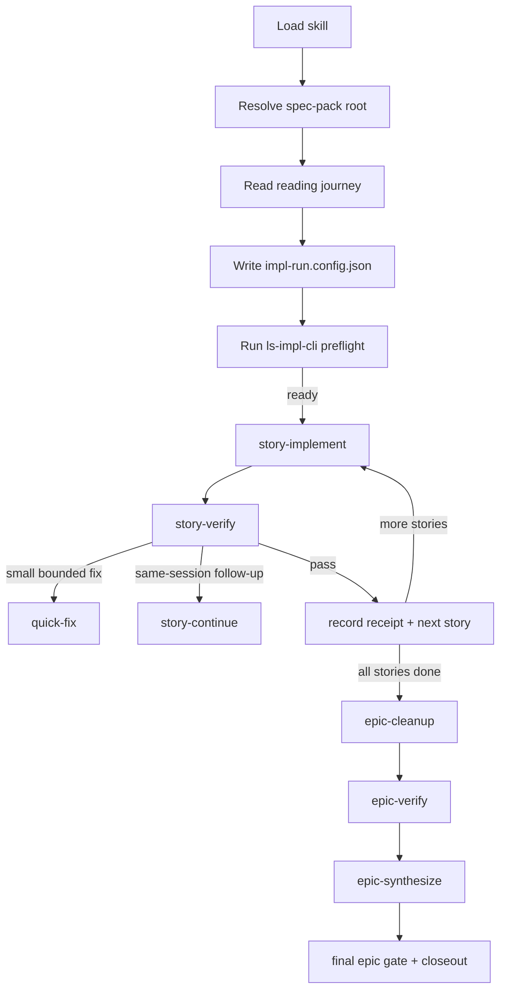

# Technical Design Companion: Skill and Process Surface

## Purpose

This companion covers the orchestrator-facing side of `ls-claude-impl`: the markdown skill entrypoint, the progressive-disclosure references, the orchestrator-owned state artifacts, and the process playbook that tells Claude Code what to do and when to use the CLI. The goal of this surface is not to execute work directly. Its job is to minimize cognitive load for the orchestrator while still giving the orchestrator enough understanding to supervise the implementation process critically.

The orchestrator should never have to reverse-engineer the process from CLI help text or scattered repository notes. The skill surface should answer five questions cleanly:

1. What artifacts must exist before a run can begin?
2. What should the orchestrator read first, and what can wait?
3. What state does the orchestrator own and update?
4. Which CLI operation should be used next?
5. What evidence is required before the orchestrator can progress?

## Skill Surface Layout

The skill should not be a monolith. It should load in layers, with each deeper file answering the question raised by the previous layer.

| File | Role in the Workflow | Why It Exists |
|---|---|---|
| `src/phases/claude-impl.md` | Startup orientation and setup contract | Keeps initial context short and action-oriented |
| `src/references/claude-impl-reading-journey.md` | Post-setup reading order for the spec pack | Avoids loading the full artifact world before the orchestrator knows where to look |
| `src/references/claude-impl-process-playbook.md` | Stage-by-stage process rules | Gives the orchestrator one durable place to learn transitions, receipts, and escalation behavior |
| `src/references/claude-impl-cli-operations.md` | Public operation guide | Keeps command semantics explicit without bloating `SKILL.md` |
| `src/references/claude-impl-prompt-system.md` | Prompt architecture and insert explanation | Explains the runtime prompt model at the process level without exposing provider-specific implementation details inline |

The orchestrator starts with `SKILL.md`, resolves the spec-pack location, performs the minimum initial checks, and only then reads the reading-journey file. That file tells the orchestrator what to read from the spec pack and what to extract into durable state before deeper runtime work begins.

### Skill-Pack Layout in Dist Output

The packaged skill should land with this shape:

```text
dist/skills/ls-claude-impl/
├── SKILL.md
├── references/
│   ├── claude-impl-reading-journey.md
│   ├── claude-impl-process-playbook.md
│   ├── claude-impl-cli-operations.md
│   └── claude-impl-prompt-system.md
└── bin/
    └── ls-impl-cli.cjs
```

The runtime file lives beside the docs, but the docs remain the authoritative explanation of the process. The orchestrator should be able to succeed by reading the docs and then using the CLI. The CLI should not have to teach the methodology.

## Orchestrator-Owned Artifacts

The orchestrator is the state authority for a run. The CLI is not the owner of run lifecycle, progression, or recovery. That boundary is what keeps the future SDK/harness surface clean.

### `impl-run.config.json`

`impl-run.config.json` is the machine-readable declaration of the intended run shape. The orchestrator authors it or updates it during initialization. The CLI validates it before any provider-backed work begins.

```json
{
  "version": 1,
  "primary_harness": "claude-code",
  "story_implementor": {
    "secondary_harness": "codex",
    "model": "gpt-5.4",
    "reasoning_effort": "high"
  },
  "quick_fixer": {
    "secondary_harness": "codex",
    "model": "gpt-5.4",
    "reasoning_effort": "medium"
  },
  "story_verifier_1": {
    "secondary_harness": "codex",
    "model": "gpt-5.4",
    "reasoning_effort": "xhigh"
  },
  "story_verifier_2": {
    "secondary_harness": "none",
    "model": "claude-sonnet",
    "reasoning_effort": "high"
  },
  "self_review": {
    "passes": 3
  },
  "epic_verifiers": [
    {
      "label": "epic-verifier-1",
      "secondary_harness": "codex",
      "model": "gpt-5.4",
      "reasoning_effort": "xhigh"
    },
    {
      "label": "epic-verifier-2",
      "secondary_harness": "none",
      "model": "claude-sonnet",
      "reasoning_effort": "high"
    }
  ],
  "epic_synthesizer": {
    "secondary_harness": "codex",
    "model": "gpt-5.4",
    "reasoning_effort": "xhigh"
  }
}
```

The key simplicity rule is that the file should only say what the orchestrator actually needs to decide: the primary harness, the per-role secondary harness, the model selection, and the self-review pass count. It should not carry derived values, convenience aliases, or runtime details that the orchestrator does not need to reason about.

### Default Resolution Algorithm

The orchestrator owns the config file, but it should not invent defaults ad hoc. The skill surface should teach one deterministic default-generation algorithm:

1. Set `primary_harness` to `claude-code`.
2. Probe secondary harness availability in this order:
   - Codex available
   - else Copilot available
   - else no secondary harness
3. If Codex is available, use Codex as the default secondary harness for all GPT-lane roles:
   - story implementor: `codex`, `gpt-5.4`, `high`
   - quick fixer: `codex`, `gpt-5.4`, `medium`
   - story verifier 1: `codex`, `gpt-5.4`, `xhigh`
   - story verifier 2: `none`, `claude-sonnet`, `high`
   - epic verifier 1: `codex`, `gpt-5.4`, `xhigh`
   - epic verifier 2: `none`, `claude-sonnet`, `high`
   - epic synthesizer: `codex`, `gpt-5.4`, `xhigh`
4. If Codex is unavailable but Copilot is available, use Copilot only for fresh-session roles:
   - story implementor: `none`, `claude-sonnet`, `high`
   - quick fixer: `copilot`, `gpt-5.4`, `medium`
   - story verifier 1: `copilot`, `gpt-5.4`, `xhigh`
   - story verifier 2: `none`, `claude-sonnet`, `high`
   - epic verifier 1: `copilot`, `gpt-5.4`, `xhigh`
   - epic verifier 2: `none`, `claude-sonnet`, `high`
   - epic synthesizer: `copilot`, `gpt-5.4`, `xhigh`
   Story implementor still falls back to `secondary_harness: "none"` because v1 retained implementor continuation is not defined for Copilot.
5. If no GPT secondary harness is available, switch all roles to `secondary_harness: "none"` and record a degraded-diversity condition in `team-impl-log.md`.

This keeps config authorship with the orchestrator while still satisfying the epic’s requirement that defaults and fallback behavior be resolved deterministically before implementation begins.

### `team-impl-log.md`

`team-impl-log.md` is the durable orchestration record. It is the primary run-state artifact, not a narrative afterthought. The orchestrator updates it after setup, after each command result, at every story transition, and before epic closeout.

No subagent reads or writes `team-impl-log.md`. The orchestrator is the sole reader and author. Implementor, verifier, quick-fixer, epic-verifier, and epic-synthesizer prompts must not instruct the subagent to consult it, summarize it, or append to it.

Required sections:

| Section | Purpose |
|---|---|
| Run Overview | spec-pack root, current status, current story, current phase |
| Run Configuration | snapshot of the validated `impl-run.config.json` choices |
| Verification Gates | story and epic gate commands discovered from project policy |
| Story Sequence | full story list and current position |
| Receipts | pre-acceptance evidence and dispositions by story |
| Cumulative Baselines | test-count expectations and regression checks |
| Cleanup / Epic Verification | deferred items, cleanup status, final verification state |
| Open Risks / Accepted Risks | explicit unresolved or accepted-risk items |

The log remains markdown because it is both human-facing and agent-facing. The orchestrator needs to read and update it directly. A second support file can be added later if highly structured state becomes necessary, but the v1 feature should keep the required surface small.

### State Enum

The log should carry one explicit current-state field using this enum:

| State | Meaning |
|---|---|
| `SETUP` | skill loaded, spec-pack root being resolved, config/log initialization not complete |
| `BETWEEN_STORIES` | ready to start the next story |
| `STORY_ACTIVE` | implementation / verification / fix routing in progress for one story |
| `PRE_EPIC_VERIFY` | all stories accepted, cleanup and epic closeout not yet complete |
| `EPIC_VERIFY_ACTIVE` | cleanup, epic verifier batch, or synthesis is in progress |
| `COMPLETE` | run complete |
| `FAILED` | blocked or failed terminally pending human decision |

### `team-impl-log.md` Template

The exact text can evolve, but the heading contract should be fixed.

```markdown
# Team Implementation Log

## Run Overview
- State: BETWEEN_STORIES
- Spec Pack Root: /abs/path
- Current Story: story-03
- Current Phase: story-verify

## Run Configuration
- Primary Harness: claude-code
- Story Implementor: codex / gpt-5.4 / high
- Quick Fixer: codex / gpt-5.4 / medium
- Story Verifier 1: codex / gpt-5.4 / xhigh
- Story Verifier 2: none / claude-sonnet / high
- Self Review Passes: 3
- Degraded Diversity: false

## Verification Gates
- Story Gate: bun run green-verify
- Epic Gate: bun run verify-all
- Gate Discovery Source: package.json scripts

## Story Sequence
- story-00-foundation
- story-01-run-setup
- story-02-prompt-composition

## Current Continuation Handles
- Story Implementor:
  - Story: story-03
  - Provider: codex
  - Session ID: abc123

## Story Receipts
### story-02
- Implementor Evidence Ref: artifacts/story-02/implement-result.json
- Verifier Evidence Refs:
  - artifacts/story-02/verify-primary.json
  - artifacts/story-02/verify-secondary.json
- Gate Result: pass
- Dispositions:
  - FIX-1: fixed
  - RISK-2: accepted-risk
- Open Risks:
  - none

## Cumulative Baselines
- Baseline Before Current Story: 48
- Expected After Current Story: 56
- Latest Actual Total: 56

## Cleanup / Epic Verification
- Cleanup Artifact: artifacts/cleanup/cleanup-batch.md
- Cleanup Status: not-started
- Epic Verification Status: not-started

## Open Risks / Accepted Risks
- none
```

The orchestrator can add prose beneath these headings, but these sections and labels should be present so recovery is deterministic.

### Story Receipt Contract

Each accepted story should record:

- story id and title
- implementor result path
- verifier result paths
- final story gate command + pass/fail outcome
- dispositions for each unresolved finding (`fixed`, `accepted-risk`, `defer`)
- cumulative test baseline before and after the story
- any active continuation handles that remain relevant

## Verification Gate Discovery

Gate discovery must follow a fixed precedence order so the orchestrator does not improvise.

1. Explicit CLI flags supplied for the current run
2. Explicit entries in `impl-run.config.json` if later added
3. package scripts in the repo root
4. repository policy docs (`AGENTS.md`, `README`, related process docs)
5. CI configuration as supporting evidence
6. if still ambiguous: pause with `needs-user-decision`

The playbook should teach the orchestrator to record:

- the chosen story gate command
- the chosen epic gate command
- the source from which each was derived
- any ambiguity note that required human confirmation

## Flow 1: Skill Load, Startup Orientation, and Basic Setup

**Covers:** AC-1.3, AC-1.5, AC-1.6, AC-2.4, AC-6.3

This flow starts when the user explicitly asks Claude Code to load `ls-claude-impl`. The skill’s job at this stage is to orient the orchestrator quickly, resolve the spec-pack root, confirm the minimum required files exist, initialize the orchestrator-owned artifacts, and tell the orchestrator what to read next. The skill should not dump the full methodology immediately. It should get the orchestrator onto the rails with minimal context cost.

The first pass is intentionally shallow. It asks: “Do we have the right folder? Can we initialize durable state? What should the orchestrator read next?” The second pass, driven by the reading journey and CLI preflight, asks the deeper question: “Is the run actually executable?”



### Deliverables Created in This Flow

| What | Where | Purpose |
|---|---|---|
| Skill entrypoint | `src/phases/claude-impl.md` | Startup orientation + next-step dispatch |
| Reading-journey reference | `src/references/claude-impl-reading-journey.md` | Controlled next read after setup |
| `impl-run.config.json` | spec-pack root | Run configuration owned by orchestrator |
| `team-impl-log.md` | spec-pack root | Durable orchestration state and receipts |

### TC Mapping for This Flow

| TC | Tests | Module | Setup | Assert |
|---|---|---|---|---|
| TC-1.3a | initializes new run log when absent | `inspect` + skill build tests | fixture spec pack without log | skill/setup path creates `team-impl-log.md` guidance and CLI reports ready for new run |
| TC-1.3b | resumes existing run log | `inspect` + fixture tests | fixture spec pack with existing log | setup path reports resume behavior and does not restart from scratch |
| TC-1.5a | full story inventory recorded before start | `inspect` contract tests | multiple stories in fixture | story order is returned and intended for log recording |
| TC-1.6a | verification gates discovered and recorded | reading-journey/playbook tests | repo fixture with policy docs/scripts | skill guidance and initialization flow require gate capture before implementation |
| TC-1.6b | ambiguous gate policy pauses setup | playbook tests | fixture with missing/ambiguous gate commands | skill surface directs user-resolution pause before execution |
| TC-2.4a | run configuration recorded | skill + CLI integration tests | valid config + preflight result | orchestrator guidance records validated configuration in log |
| TC-6.3a | resume after interruption | process-playbook tests | pre-existing log and config files | skill surface resumes from durable artifacts |
| TC-6.3b | resume after context stripping | process-playbook tests | no prior conversation context | guidance relies only on files on disk |

## Flow 2: Progressive Reading Journey

**Covers:** AC-1.5, AC-3.4

Once the spec-pack root is known and the basic files are present, the orchestrator needs a deliberate reading path. The reading journey exists to prevent both under-reading and over-reading. If the orchestrator reads everything up front, it burns context and weakens later attention. If it reads too little, it makes routing decisions without understanding the feature.

The reading-journey reference should therefore do three things. It should define the read order. It should say what to extract into durable state after each read. And it should explicitly delay lower-value reads until they are needed. The orchestrator should come out of the journey with a stable mental model of the story queue, the tech-design shape, the verification gates, and the current run configuration.



### Reading Journey Contract

For the story implementor, the reading scope is intentionally bounded. The implementor reads only:

1. the current story file
2. `tech-design.md`
3. `tech-design-skill-process.md`
4. `tech-design-cli-runtime.md`
5. `test-plan.md`

The implementor must not be told to read `CLAUDE.md`, prior story files, or `team-impl-log.md`.

The reading-journey reference should tell the orchestrator to extract and record:

- story order and dependency notes
- story ids using the canonical filename-derived convention
- whether the tech design is a 2-doc or 4-doc pack
- the presence of prompt insert files
- project verification commands
- any current blockers or ambiguous prerequisites

It should not ask the orchestrator to load provider-specific invocation details at this stage. Those belong in the CLI operations and prompt-system references and are only needed once initialization has succeeded.

### TC Mapping for This Flow

| TC | Tests | Module | Setup | Assert |
|---|---|---|---|---|
| TC-1.5a | reading journey reads all stories before start | reference doc tests | fixture with multiple stories | guide requires full story inventory before Story 0/1 |
| TC-3.4a | implementor reading journey defined | prompt-system + reading-journey tests | skill reference files | implementor journey includes story, tech-design set, bounded reflection behavior |
| TC-3.4b | verifier reading journey defined | prompt-system + reading-journey tests | skill reference files | verifier journey includes evidence-focused read instructions |
| TC-3.4c | quick-fix handoff omits story reading journey | prompt-system tests | quick-fix section | quick fixer is story-agnostic and receives no reading journey |

## Flow 3: Orchestrator State Ownership, Progression, and Recovery

**Covers:** AC-6.1, AC-6.2, AC-6.3, AC-7.1, AC-7.2, AC-7.3

The orchestrator is responsible for durable state, not just command dispatch. That means the skill surface must explicitly teach when to write receipts, when to update baselines, when to materialize cleanup items, and how to resume after interruption. If that behavior is not written into the skill clearly, the orchestrator will improvise, and the run will drift.

This feature’s recovery model is intentionally boring. The orchestrator resumes from disk, not from memory. It reads `team-impl-log.md`, `impl-run.config.json`, and any command result artifacts that the CLI previously returned. That is the full contract. No hidden runtime state in the CLI should be required to understand what story is active, what verification round is current, or what cleanup remains.



### Durable Artifact Rules

| Artifact | Owner | Required Use |
|---|---|---|
| `impl-run.config.json` | orchestrator | declare run shape before preflight |
| `team-impl-log.md` | orchestrator | record state transitions, receipts, baselines, and cleanup |
| command result JSON | CLI | return explicit outcome and evidence for the orchestrator to persist |
| cleanup artifact | orchestrator | materialize deferred/accepted-risk items before epic verification |

### TC Mapping for This Flow

| TC | Tests | Module | Setup | Assert |
|---|---|---|---|---|
| TC-6.1a | pre-acceptance receipt required | process-playbook tests | simulated accepted story result | log contract requires evidence, gate results, dispositions, risks |
| TC-6.2a | cumulative progression uses durable artifacts | process-playbook tests | prior accepted story + log state | next-story preparation uses codebase/log/story order, not memory |
| TC-6.2b | test-count regression blocks progression | process-playbook tests | lower-than-expected cumulative total | orchestrator guidance blocks acceptance until resolved |
| TC-6.3a | resume after interruption from files | recovery tests | interrupted run fixture | skill resumes from log + config + result files |
| TC-6.3b | resume without conversation context | recovery tests | fresh session with same files | progression remains possible from disk only |
| TC-7.1a | cleanup list materialized before epic verification | cleanup tests | completed stories with deferred items | cleanup artifact is required before epic verification |
| TC-7.2a | human review of cleanup batch required | process-playbook tests | cleanup artifact present | skill requires review before dispatch |
| TC-7.3a | cleanup verified before epic verification | cleanup tests | approved cleanup fixes | process requires cleanup verification before epic verifier launch |

## Flow 4: Process Playbook and Command Routing

**Covers:** AC-4.1 to AC-5.5, AC-8.1 to AC-8.4

The orchestrator does not need to know internal provider-invocation mechanics, but it does need a clear operational map: which command corresponds to which process stage, what each one expects, and what to do after it returns. That is the purpose of the process playbook and CLI-operations references.

The mapping should feel obvious:

- use `inspect` for structural discovery
- use `preflight` when the reading journey is complete and the run config exists
- use `story-implement` to start a story
- use `story-continue` only when the existing implementation session should continue
- use `story-verify` for fresh verifier batches
- use `quick-fix` for bounded corrections
- use `epic-cleanup`, `epic-verify`, and `epic-synthesize` at closeout

The playbook should also teach the orchestrator what *not* to do. It should not rewrite code directly, skip final gates, or silently downgrade missing provider lanes. If the CLI returns `needs-user-decision` or `blocked`, the playbook should say exactly what kind of pause is required and what evidence to review.

Acceptance is orchestrator-owned and autonomous when the story is clean: gates pass, verifier dispositions are resolved, the mock/shim audit is clean, and no verifier disagreement remains that would affect code. Human review is surfaced only for blocking ambiguity, design rulings, or scope decisions.

Re-verification is proportional to fix substance. For substantial fixes, dispatch fresh verifier sessions again. For small, nit, or cleanup fixes, the orchestrator may spot-check the change and rerun the gate locally without another verifier dispatch.

### Process Map



### Process Playbook Responsibilities

| Stage | Orchestrator Responsibility |
|---|---|
| Setup | locate spec pack, initialize config/log, read first references |
| Preflight | validate readiness before any provider-backed work starts |
| Story implementation | choose the story, run implementation, preserve continuation handles |
| Story verification | launch fresh verification, interpret findings, route fixes |
| Story progression | record receipts, update cumulative baselines, move to next story |
| Cleanup / epic verification | materialize deferred items, review cleanup, run epic verifier and synthesizer workflows |

### TC Mapping for This Flow

| TC | Tests | Module | Setup | Assert |
|---|---|---|---|---|
| TC-4.1a | process playbook routes story start to `story-implement` | CLI operation guide tests | story ready to start | skill maps stage to correct command |
| TC-5.5a | final story gate remains orchestrator-owned | process-playbook tests | verification appears complete | playbook requires orchestrator-run acceptance gate |
| TC-8.1a | multi-story epic requires epic-level verification | process-playbook tests | all stories accepted | playbook routes to epic verification instead of closeout |
| TC-8.1b | no skip path for epic verification | playbook tests | epic ready to close | documentation exposes no skip route |
| TC-8.2a | synthesis required every run | playbook tests | epic verifier results available | playbook requires synthesis before closeout |
| TC-8.4a | final epic gate remains orchestrator-owned | playbook tests | synthesis complete | skill requires final gate by orchestrator |

## Document Contracts for This Domain

### `src/phases/claude-impl.md`

The skill entrypoint should contain only:

- short startup orientation
- minimum artifact expectations
- initialization steps
- state ownership rules
- explicit “read this next” instructions

It should not inline:

- every CLI command detail
- every stage rule
- every prompt-system detail

Those belong in references so the orchestrator loads them only when the process reaches the relevant depth.

### `src/references/claude-impl-process-playbook.md`

The process playbook should be the orchestrator’s main reference after setup. It should include:

- stage map
- command routing
- receipt requirements
- progression rules
- recovery rules
- cleanup and closeout rules

### `src/references/claude-impl-cli-operations.md`

This file should present each CLI command from the orchestrator’s perspective:

- when to use it
- what files or inputs it expects
- what the outcome states mean
- what the orchestrator should do next

The emphasis should be on legibility, not implementation detail.

## Related Sections

- Cross-cutting architecture and dependency choices: `tech-design.md`
- CLI/runtime command model, prompt assets, and provider adapters: `tech-design-cli-runtime.md`
- TC-to-test coverage and fixture strategy: `test-plan.md`
