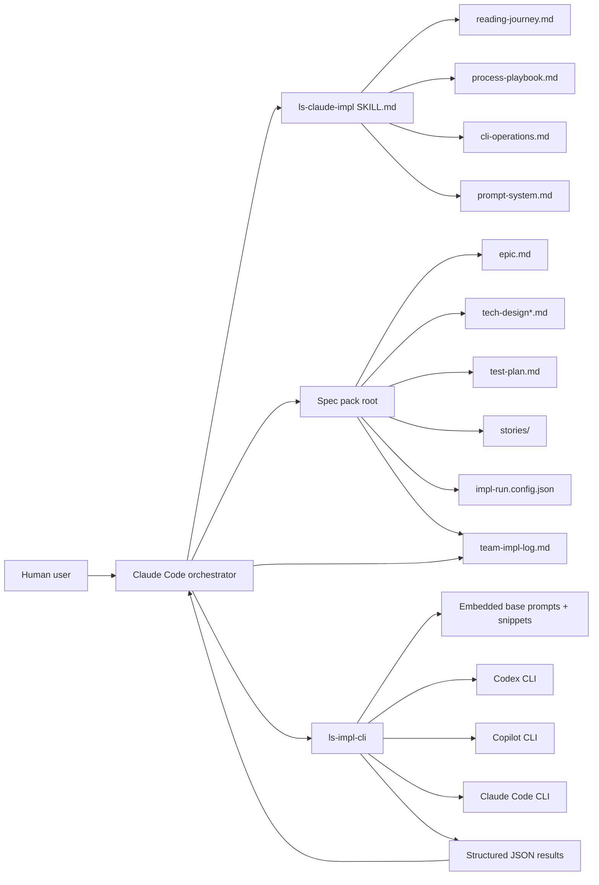
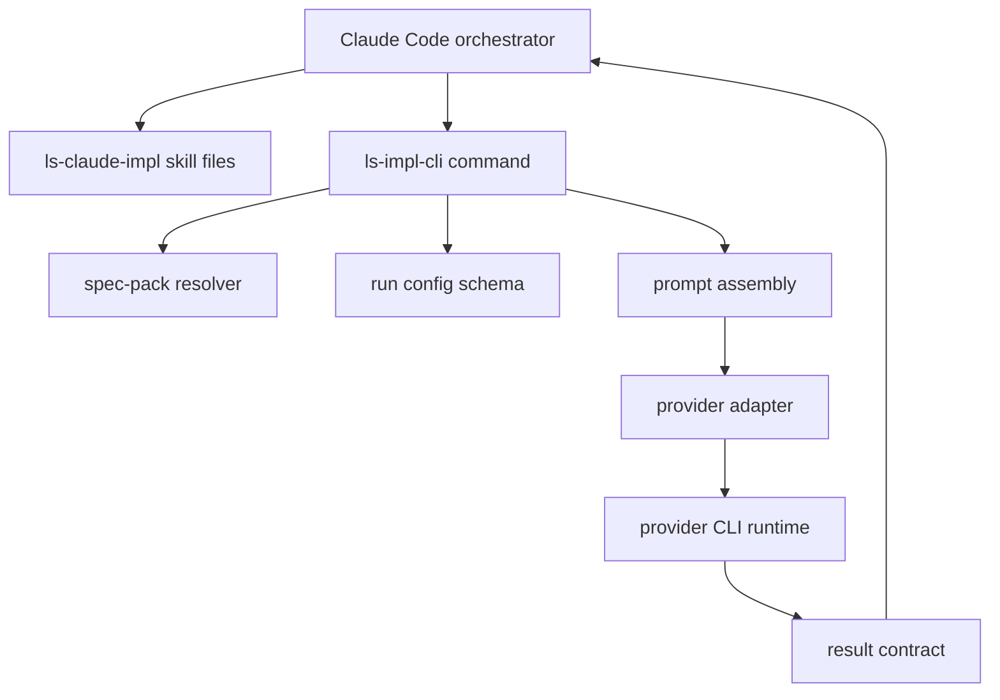

# Technical Design: ls-claude-impl

## Purpose

This design translates the `ls-claude-impl` epic into an implementable architecture for a new Claude Code orchestration skill plus a Node-compatible implementation CLI. The feature has two dense domains that need different levels of treatment: the orchestrator-facing skill surface and the CLI/runtime surface that executes bounded operations for multiple secondary harnesses. For that reason this design uses **Config B**:

| Document | Purpose |
|---|---|
| `tech-design.md` | Decision record, context, system view, top-tier surfaces, module architecture overview, dependency and packaging decisions, work breakdown |
| `tech-design-skill-process.md` | The orchestrator-facing skill surface: progressive disclosure docs, reading journey, state ownership, process playbook, stage transitions |
| `tech-design-cli-runtime.md` | The CLI/runtime surface: command model, config schemas, prompt asset system, provider adapters, operation contracts, packaging |
| `test-plan.md` | TC-to-test mapping, mock strategy, fixture strategy, test counts, and story-level TDD plan |

The index stays small enough to be navigable while still recording the cross-cutting decisions that both companion docs inherit. The companion split follows the real boundary in this feature: one side teaches the orchestrator how the process works, the other side executes the process through a clean agent-first CLI.

## Spec Validation

The epic is designable. Its major flows, ACs, and TCs describe a coherent system with clear public seams: spec-pack discovery, run configuration, prompt assembly, retained implementation sessions, fresh verification, cleanup, and epic closeout. The epic is unusually detailed for a skill feature, but the added specificity is appropriate because the feature is not just a prose skill; it is a skill plus a runtime helper plus a prompt system plus a result-contract surface.

The design does make three clarifications that should be recorded explicitly before implementation begins. None of them block design, but each one turns an implied behavior into a concrete contract the implementation can build around.

| Issue | Spec Location | Resolution | Status |
|---|---|---|---|
| The epic requires the orchestrator to record role defaults and run choices, but it does not name a dedicated machine-readable run config file. | AC-2.4, Data Contracts, `team-impl-log.md` requirements | Introduce `impl-run.config.json` at the spec-pack root as the orchestrator-owned run configuration. `team-impl-log.md` remains the durable narrative/state record. | Resolved — clarified |
| The epic distinguishes Codex/Copilot-backed GPT lanes from Claude-only fallback, but the harness terminology needs to preserve Claude Code as the always-present primary harness. | AC-2.2, AC-2.3, Role Model Matrix | Use `primary_harness: "claude-code"` plus per-role `secondary_harness: "codex" | "copilot" | "none"`. `none` means the role uses the primary harness only. | Resolved — clarified |
| The epic says the CLI should be stateless across calls, but story implementation also requires retained implementor continuity. | Constraint C3, AC-4.2, AC-6.3 | Keep orchestration state outside the CLI. The CLI may emit continuation/session handles for provider sessions, but the orchestrator owns persistence, routing, and recovery through `team-impl-log.md`, `impl-run.config.json`, and any future orchestrator-managed support files. | Resolved — clarified |
| The epic allows Copilot as the generic GPT fallback, but v1 Copilot support is limited to fresh-session roles while story implementation requires retained continuation. | AC-2.2, AC-4.2, Role Model Matrix | In v1, disallow Copilot for `story_implementor`. Retained implementor fallback order is Codex -> Claude Code primary harness. Copilot remains valid for fresh verifier, quick-fix, and synthesis roles. | Resolved — deviated |
| The epic requires the packaged skill to include the CLI, but the current build surface only composes markdown skill outputs and bundled references. | Feature overview, CLI responsibilities implied by scope | Add a build step that bundles the modular CLI source into a single Node-compatible JS file and copies that file into the packaged skill output. | Resolved — deviated |

### Tech Design Question Coverage

The epic’s Tech Design Questions are answered by this pack as follows:

| Question | Primary Answer Location |
|---|---|
| Public CLI commands, arguments, exit codes, result formats | `tech-design-cli-runtime.md` — Command Surface, Result Contracts |
| Prompt assets storage and assembly | `tech-design-cli-runtime.md` — Prompt Asset System |
| Three self-review passes | `tech-design-cli-runtime.md` — Story Implementation Flow |
| Model matrix and harness fallback | `tech-design-cli-runtime.md` — Run Config + Provider Adapters |
| Continuation identifiers | `tech-design-cli-runtime.md` — Session Continuation Contracts |
| Exact result fields and serialization | `tech-design-cli-runtime.md` — Result Contracts |
| `team-impl-log.md` state model | `tech-design-skill-process.md` — Orchestrator State and Durable Artifacts |
| How orchestrator consumes CLI results | `tech-design-skill-process.md` — Process Playbook and Stage Transitions |
| Verification-gate hardening | `tech-design.md` — Verification Scripts; `tech-design-skill-process.md` — Initialization Flow |
| Companion tech-design naming convention | This index — document structure and companion naming |
| Implementor replacement vs continuation | `tech-design-cli-runtime.md` — Story Continue Rules |
| Quick-fix narrow contract | `tech-design-cli-runtime.md` — Quick Fix Workflow |
| Pre-epic cleanup artifacts | `tech-design-skill-process.md` and `tech-design-cli-runtime.md` — Epic Cleanup |
| Self-review prompt evolution and stop rules | `tech-design-cli-runtime.md` — Story Implementation Flow |

## Context

`liminal-spec` is primarily a content-and-build repository, not a general application runtime. Most skills in the repo are markdown-first artifacts composed from `src/` and packaged into installable skill folders or standalone markdown files. That matters because `ls-claude-impl` is not a normal addition to the pack. It introduces a second kind of deliverable inside the same repo: a bundled runtime helper that must ship inside the packaged skill while still fitting the repository’s content-composition workflow.

The problem being solved is reliability of implementation orchestration, not lack of methodology. Existing implementation skill surfaces carry useful process ideas, but they rely on too much live runtime improvisation and too many layers between the orchestrator and the actual work. The new design narrows the system to three stable public surfaces. First, the skill teaches the orchestrator the process and the reading journey. Second, the orchestrator owns state and decision-making. Third, the CLI executes bounded operations and returns disciplined machine-readable results. The center of gravity shifts away from “agent teams all the way down” and toward “one orchestrator with explicit process docs and a legible execution surface.”

The future direction also matters now. The CLI is not just a local helper for this skill. It is an early public execution surface that is expected to map cleanly into a later SDK and then into web-app harness tools. That creates strong pressure toward explicit inputs, outputs, and outcome states. Hidden orchestration state inside the CLI would make later extraction harder. For the same reason, the skill should own the explanation of the process while the CLI owns execution. The orchestrator needs to understand what is happening at the process level without carrying implementation detail that belongs inside the runtime.

A second pressure comes from prompt architecture. This feature does not only need CLI commands; it needs stable role prompts, reusable snippets, public insert hooks, and role-fit reading journeys. Those prompt assets are implementation-critical. They are not just docs, and they are not just helper strings. They are part of the runtime contract. The design therefore treats the prompt system as a first-class architectural surface rather than as glue hidden inside an implementation file.

Finally, the repo’s existing build pipeline constrains how the feature lands. The current build emits markdown skill directories plus standalone markdown packs. It does not yet package executable runtime files into skill outputs. The design therefore includes build-system changes as part of the feature instead of leaving them to Story 0 discovery. The packaged skill must contain everything the orchestrator needs at runtime: markdown guidance plus a single bundled Node-compatible CLI file.

## System View

There is no separate technical architecture document for this work. The top-tier surfaces below are therefore locally derived from the epic, nearby design notes, the existing `codex-impl` runtime, and the current repository layout.

### Top-Tier Surfaces

| Surface | Source | This Epic's Role |
|---|---|---|
| Skill Surface | Locally derived | `ls-claude-impl` markdown entrypoint and progressive-disclosure references that onboard the orchestrator and teach the process |
| Runtime Surface | Locally derived | `ls-impl-cli` command surface, result contracts, provider adapters, prompt assembly, and packaging |
| Build Surface | Locally derived | Manifest/build integration that composes the skill and embeds the bundled CLI artifact into packaged outputs |

### System Context Diagram



### External Contracts

The external contracts are narrower than the whole feature. They are the fixed points the orchestrator and CLI must agree on before implementation begins.

#### Incoming Contracts

| Input | Required | Source | Purpose |
|---|---|---|---|
| `epic.md` | yes | spec-pack root | Functional source of truth |
| `tech-design.md` | yes | spec-pack root | Design index consumed by the orchestrator and some CLI operations |
| `test-plan.md` | yes | spec-pack root | TC→test mapping and verification strategy |
| `tech-design-*.md` companions | conditional | spec-pack root | Required only when the tech-design config is 4-doc |
| `stories/` | yes | spec-pack root | Ordered story slices for implementation |
| `impl-run.config.json` | yes | orchestrator-authored | Role/harness/model configuration for runtime operations |
| `custom-story-impl-prompt-insert.md` | no | spec-pack root | Optional public insert for implementor prompt assembly |
| `custom-story-verifier-prompt-insert.md` | no | spec-pack root | Optional public insert for verifier prompt assembly |

#### Outgoing Contracts

| Output | Producer | Destination | Purpose |
|---|---|---|---|
| `team-impl-log.md` updates | orchestrator | spec-pack root | Durable orchestration record and recovery state |
| Structured command result JSON | CLI | stdout / orchestrator ingest | Machine-readable completion surface for each operation |
| Prompt-ready execution payloads | CLI | secondary harnesses | Stable provider-facing prompt contract |
| Bundled CLI artifact | build surface | packaged skill output | Runtime executable shipped with the skill |

#### Outcome States

The CLI should use explicit outcome states instead of ambiguous free-text status messages.

| Operation Class | Allowed Outcome States |
|---|---|
| `inspect`, `preflight` | `ready`, `needs-user-decision`, `blocked` |
| implementation / quick-fix operations | `ready-for-verification`, `needs-followup-fix`, `needs-human-ruling`, `blocked` |
| verifier batches | `pass`, `revise`, `block` |
| cleanup operations | `cleaned`, `needs-more-cleanup`, `blocked` |
| synthesis operations | `ready-for-closeout`, `needs-fixes`, `needs-more-verification`, `blocked` |

#### Runtime Prerequisites

| Prerequisite | Where Needed | How to Verify |
|---|---|---|
| Bun 1.3.x+ | local development, build, tests | `bun --version` |
| Node-compatible runtime | packaged CLI execution | `node -v` |
| Git repository root | CLI commands that inspect repo/worktree context | `git rev-parse --show-toplevel` |
| `codex` CLI | only when a role uses `secondary_harness: "codex"` | `codex --version` plus auth/smoke command |
| `copilot` CLI | only when a role uses `secondary_harness: "copilot"` | `copilot --version` plus auth/smoke command |
| `claude` CLI | always, because primary harness is Claude Code | `claude --version` plus auth/smoke command |

## Module Architecture

This feature needs changes in three repository areas: skill content, runtime process code, and build/packaging glue. The layout below keeps those responsibilities separated while making the packaged skill self-contained.

```text
src/
├── phases/
│   └── claude-impl.md                         # NEW: orchestration skill entrypoint
├── references/
│   ├── claude-impl-reading-journey.md         # NEW: post-setup reading journey
│   ├── claude-impl-process-playbook.md        # NEW: full stage-by-stage process guide
│   ├── claude-impl-cli-operations.md          # NEW: public CLI usage reference
│   └── claude-impl-prompt-system.md           # NEW: prompt-system guide for orchestrator understanding
└── README-pack.md / README-markdown-pack.md   # MODIFIED: new skill listed in pack docs

processes/
└── impl-cli/
    ├── cli.ts                                 # NEW: citty entrypoint
    ├── commands/
    │   ├── inspect.ts
    │   ├── preflight.ts
    │   ├── story-implement.ts
    │   ├── story-continue.ts
    │   ├── story-verify.ts
    │   ├── quick-fix.ts
    │   ├── epic-cleanup.ts
    │   ├── epic-verify.ts
    │   └── epic-synthesize.ts
    ├── core/
    │   ├── config-schema.ts
    │   ├── spec-pack.ts
    │   ├── story-order.ts
    │   ├── prompt-assets.ts
    │   ├── prompt-assembly.ts
    │   ├── provider-checks.ts
    │   ├── provider-adapters/
    │   │   ├── claude-code.ts
    │   │   ├── codex.ts
    │   │   └── copilot.ts
    │   ├── result-contracts.ts
    │   ├── status-codes.ts
    │   └── embedded-assets.generated.ts
    ├── prompts/
    │   ├── base/
    │   └── snippets/
    └── tests/

scripts/
├── sync-impl-cli-assets.ts                    # NEW: embed prompt assets into generated TS
├── build.ts                                   # MODIFIED: bundle/copy CLI artifact into packaged skill
└── validate.ts                                # MODIFIED: validate packaged CLI artifact presence

manifest.json                                  # MODIFIED: add ls-claude-impl skill and bundled artifact metadata
```

### Module Responsibility Matrix

| Module | Status | Responsibility | Dependencies | ACs Covered |
|---|---|---|---|---|
| `src/phases/claude-impl.md` | NEW | Initial orchestrator onboarding, setup flow, state ownership rules, progressive disclosure entrypoint | references, packaged CLI path contract | AC-1.3 to AC-1.6, AC-2.4, AC-6.1 to AC-6.3 |
| `src/references/claude-impl-reading-journey.md` | NEW | Role-fit reading journey after spec-pack discovery | spec-pack contracts, process playbook | AC-1.5, AC-3.4 |
| `src/references/claude-impl-process-playbook.md` | NEW | Stage-by-stage orchestration rules, receipts, escalation, progression, recovery | run config, CLI operations | AC-4 through AC-8 |
| `src/references/claude-impl-cli-operations.md` | NEW | Public explanation of each CLI operation and outcome state | CLI command surface | AC-1.1 to AC-1.6, AC-4.1, AC-5.1, AC-8.1 to AC-8.4 |
| `src/references/claude-impl-prompt-system.md` | NEW | Orchestrator-visible explanation of prompt primitives, inserts, and reading journeys | embedded prompt assets | AC-3.1 to AC-3.4 |
| `processes/impl-cli/cli.ts` | NEW | Top-level citty command entrypoint and subcommand registration | command modules | AC-4.1, AC-5.1, AC-8.1 to AC-8.4 |
| `processes/impl-cli/core/config-schema.ts` | NEW | Parse and validate `impl-run.config.json` | `c12`, `zod` | AC-2.2 to AC-2.4 |
| `processes/impl-cli/core/spec-pack.ts` | NEW | Resolve spec-pack files, story inventory, insert files, tech-design shape | filesystem | AC-1.1 to AC-1.6 |
| `processes/impl-cli/core/prompt-assets.ts` + `prompt-assembly.ts` | NEW | Load embedded prompt assets and assemble role prompts deterministically | generated asset module, public inserts | AC-3.1 to AC-3.4, AC-4.3 |
| `processes/impl-cli/core/provider-checks.ts` + `provider-adapters/*` | NEW | Detect harness availability, invoke provider CLIs, resume sessions, normalize outputs | child process, provider CLIs | AC-2.1 to AC-2.4, AC-4.2, AC-5.1, AC-8.1 |
| `processes/impl-cli/core/result-contracts.ts` | NEW | Shared result schemas and markdown/report contracts for all operations | `zod` | AC-4.5, AC-5.2, AC-7.1, AC-8.2 to AC-8.4 |
| `scripts/sync-impl-cli-assets.ts` | NEW | Generate embedded prompt-asset module from markdown prompt sources | prompt files | AC-3.1 to AC-3.4 |
| `scripts/build.ts` and `manifest.json` | MODIFIED | Bundle the CLI into a single Node-compatible JS file and include it in packaged skill output | Bun bundler, manifest metadata | AC-1.1, AC-3.1, packaging support for full feature |

### Component Interaction Diagram



The key boundary is that the orchestrator uses the skill to understand what should happen, then uses the CLI to make one bounded thing happen, then writes the result into its own durable state. The CLI does not own orchestration lifecycle between calls.

### Manifest and Build Metadata

The build surface needs one new manifest-level concept: a bundled runtime artifact that belongs inside the packaged skill even though it does not belong inside the composed markdown body.

Proposed shape:

```json
{
  "skills": {
    "ls-claude-impl": {
      "name": "ls-claude-impl",
      "phases": ["claude-impl"],
      "references": [
        "claude-impl-reading-journey",
        "claude-impl-process-playbook",
        "claude-impl-cli-operations",
        "claude-impl-prompt-system"
      ],
      "bundledArtifacts": [
        {
          "source": "dist/generated/ls-impl-cli.cjs",
          "destination": "bin/ls-impl-cli.cjs"
        }
      ]
    }
  }
}
```

The manifest key name can change, but the build contract should not: one explicit source artifact copied into one explicit destination inside the packaged skill.

## Dependency and Version Grounding

The runtime should stay intentionally small. The command surface needs argument parsing and subcommands. The config layer needs explicit file loading and schema validation. Everything else can start with built-in Node/Bun APIs until a real pain point justifies another abstraction.

### Stack Additions

| Package | Version | Purpose | Research Confirmed |
|---|---:|---|---|
| `citty` | `0.2.2` | CLI builder with subcommands, help generation, and lazy command loading | Yes — current latest stable on npm and aligns well with this feature’s command model |
| `c12` | `3.3.4` | Explicit config-file loading for orchestrator-owned JSON config | Yes — pin the latest stable 3.x line for v1; npm `latest` currently points at `4.0.0-beta.4`, which is intentionally avoided |
| `zod` | `4.3.6` | Schema validation for run config and operation results | Yes — current latest stable on npm |
| `typescript` | `6.0.3` | Typecheck/runtime authoring for process code and build scripts | Yes — current latest stable on npm |
| `@types/node` | `22.19.17` | Node-compatible type surface aligned with the chosen runtime floor | Yes — pinned to the Node 22 target line instead of the latest current line |

### Packages Considered and Rejected

| Package | Decision | Rationale |
|---|---|---|
| `c12@4.0.0-beta.4` | Rejected for v1 | Beta release. Stable 3.x is sufficient for one explicit config file. |
| `execa@9.6.1` | Deferred | Helpful API, but not necessary until raw child-process management becomes painful. |
| `tinyexec@1.1.1` | Deferred | Nice minimal wrapper, but built-in Node APIs are sufficient for initial provider adapters. |
| `tsup@8.5.0` | Rejected for v1 | Bun bundler already supports Node target and single-file bundling needs for the packaged artifact. |

### Runtime and Packaging Decisions

- **Authoring runtime:** TypeScript in `processes/impl-cli/`
- **Distribution target:** Node-compatible bundled JS
- **Minimum Node runtime:** `>=22`
- **Minimum Bun runtime:** `>=1.3.12`
- **Build tool:** Bun bundler
- **Bundled asset strategy:** prompt markdown assets embedded into a generated TS module before bundle time
- **Config format:** explicit `impl-run.config.json` at the spec-pack root
- **`package.json` engines:** add `"node": ">=22"` and a matching Bun expectation in developer docs/CI

## Verification Scripts

This repo already uses `bun run verify` as its primary project gate. The new runtime feature adds implementation code, so the project needs explicit verification tiers before story work begins.

| Script | Purpose | When Used | Composition |
|---|---|---|---|
| `red-verify` | Red-phase gate | after writing tests, before Green | `bunx tsc --noEmit && bun run build && bun run validate` |
| `verify` | Standard development gate | routine implementation | `bun run red-verify && bun test` |
| `green-verify` | Green-phase gate | after implementation is green | `bun run verify && bun run guard:no-test-changes` |
| `verify-all` | Deep verification and release gate | story completion, pre-release | `bun run green-verify && bun run smoke:impl-cli` |

### Canonical Gate Mapping

For this repo, the default mapping should be:

| Gate | Command |
|---|---|
| Story gate | `bun run green-verify` |
| Epic gate | `bun run verify-all` |

If a project-specific override exists, preflight should surface it explicitly with source metadata. If not, these are the defaults the orchestrator records.

Supporting scripts to add:

- `typecheck`: `tsc --noEmit`
- `guard:no-test-changes`: fail if test files changed during Green
- `smoke:impl-cli`: run a bundled-CLI smoke test against a minimal fixture spec pack

If no deeper integration smoke exists yet, `smoke:impl-cli` may emit a visible skip notice in its earliest version, but it must not silently pass as if a real smoke already ran.

## Work Breakdown Summary

The implementation work is organized by story. The story is the unit of work, ownership, and acceptance; the design should not add a second chunk abstraction on top of the published story breakdown.

| Story | Scope | ACs Covered |
|---|---|---|
| Story 0 | Foundation: config schema, result contracts, prompt asset embedding, packaged CLI build path, fixture skeletons | supports all downstream stories |
| Story 1 | Skill surface: `SKILL.md`, progressive disclosure references, manifest/build integration for packaged runtime | AC-1.3 to AC-1.6, AC-3.4, AC-6.1 to AC-6.3 |
| Story 2 | Spec-pack inspection and preflight: layout validation, run-config validation, provider availability checks, insert detection | AC-1.1 to AC-1.6, AC-2.1 to AC-2.4 |
| Story 3 | Prompt system and story implementation runtime: prompt assembly, implementor launch, continuation, self-review loop, implementor result schema | AC-3.1 to AC-3.4, AC-4.1 to AC-4.5 |
| Story 4 | Story verification and fix routing: verifier batch, quick fix, disagreement handling, story gate support | AC-5.1 to AC-5.5, AC-6.1 to AC-6.3 |
| Story 5 | Epic cleanup, verification, synthesis, and packaged runtime smoke | AC-7.1 to AC-7.3, AC-8.1 to AC-8.4 |

Story sequencing and AC ownership are already tracked in the published story files and `stories/coverage.md`, so this section stays as a concise implementation summary rather than introducing a parallel chunk dependency model.

## Resolved Decisions

| Decision | Resolution |
|---|---|
| Packaged runtime artifact format | Ship CommonJS in v1 at `bin/ls-impl-cli.cjs` |
| Copilot `--npx` fallback | Defer from v1; support directly available Copilot CLI only |

## Deferred Items

| Item | Related AC | Reason Deferred | Future Work |
|---|---|---|---|
| Full `ls-team-impl-cc` style Claude-only fallback behaviors | AC-2.2, AC-2.3 | Epic explicitly allows a narrower Claude-only fallback for v1 | later Claude-only enhancement epic |
| SDK extraction of `ls-impl-cli` | AC-4 through AC-8 | The public contract should support future extraction, but extraction itself is not part of this feature | future SDK epic |
| Web app harness tools using the same operation contracts | AC-4 through AC-8 | Future consumer, not current deliverable | future harness epic |

## Self-Review Notes

This revision closes the major open contract seams that were still too interpretive in the earlier draft:

- Copilot is no longer treated as a retained implementor fallback in v1.
- gate mapping is now explicit
- envelope status/outcome/exit-code routing is now explicit
- cleanup result and artifact persistence contracts are explicit
- companion discovery and story ordering rules are explicit

## Open Questions

| # | Question | Owner | Blocks | Resolution |
|---|---|---|---|---|
| None | No unresolved design-time questions remain after this revision pass. | — | — | Closed |

## Related Documentation

- Epic: `01-claude-impl-cli-skill-epic.md`
- Companion design: `tech-design-skill-process.md`
- Companion design: `tech-design-cli-runtime.md`
- Test plan: `test-plan.md`
- Existing design notes: `docs/ls-claude-impl-design-notes.md`
- Existing reference runtime: `processes/codex-impl/`
