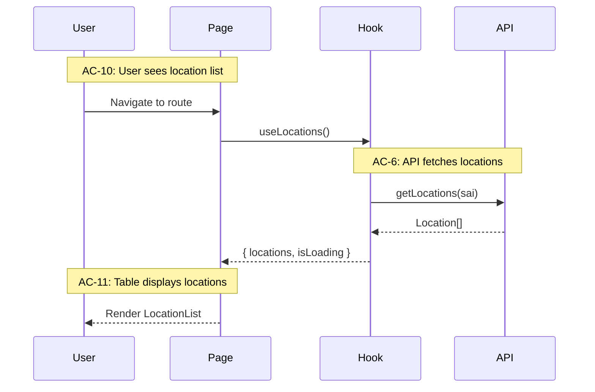
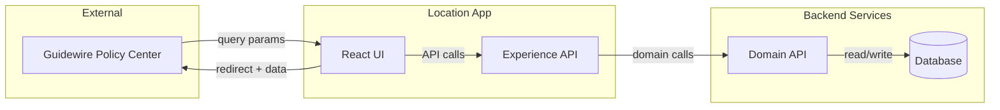
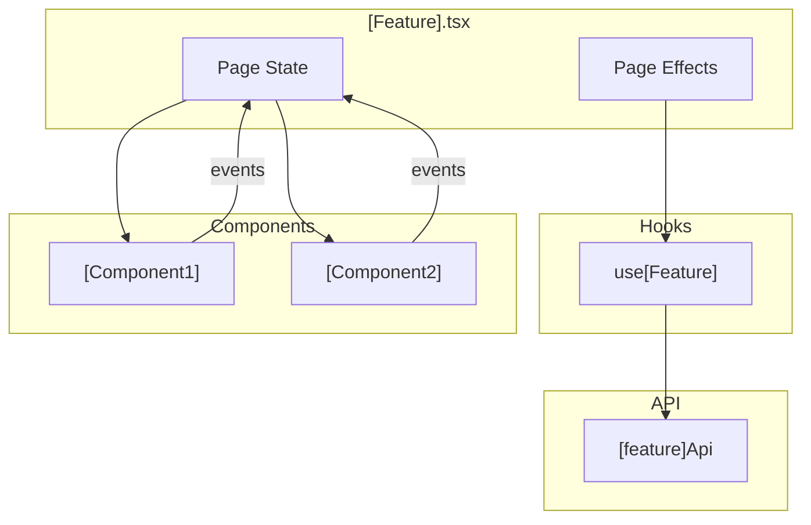
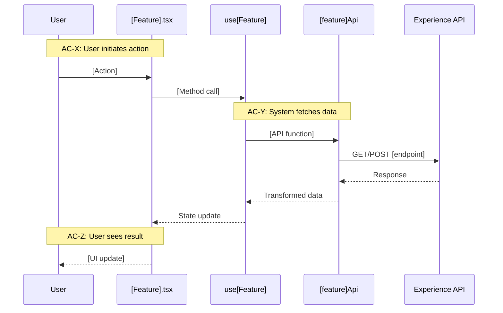

# Tech Design

**Purpose:** Transform Epic into Tech Design with architecture, interfaces, and test mapping.

**This phase is the downstream consumer of the Epic.** If you can't design from it, the spec isn't ready. Validation is part of the quality gate.

## Output Structure

The tech design always produces at least two documents:

**Config A: 2 docs (default)**
- `tech-design.md` — Index: decisions, context, system view, module architecture, work breakdown
- `test-plan.md` — TC→test mapping, mock strategy, fixtures, chunk breakdown with test counts

Everything lives in the index. Works when the design fits comfortably under ~1200-1500 lines. Typical for single-domain projects — a CLI, a backend service, a focused frontend feature.

**Config B: 4 docs (when the index gets dense)**
- `tech-design.md` — Index: decisions, context, system view, module architecture overview, work breakdown
- `tech-design-[domain-a].md` — Implementation depth for one domain (e.g., frontend, client, UI)
- `tech-design-[domain-b].md` — Implementation depth for the other domain (e.g., backend, server, API)
- `test-plan.md` — TC→test mapping, mock strategy, fixtures, chunk breakdown with test counts

The trigger is index density — when the index is approaching ~1200-1500 lines, split implementation depth into companion docs. Name companions by the project's actual domain boundaries (frontend/backend, client/server, renderer/engine — whatever fits the project). The index stays as the decision record and whole-system map. Companion docs carry the implementation detail.

**Never go 3.** You don't add just one companion doc. It's either everything in the index, or the index plus both companions. Two configurations, not a continuum.

The test plan is always its own document. If the work doesn't justify a separate test plan with TC traceability, this skill isn't the right tool — downshift to plan mode.

Companion docs maintain requirement traceability — they reference ACs and TCs so you can navigate from the companion back to the index and the epic.

## Dual Role: Designer and Validator

### As Validator

Before designing, validate the Epic:
- Can you map every AC to implementation?
- Are data contracts complete and realistic?
- Are there technical constraints the BA missed?
- Do the flows make sense from an implementation perspective?
- **Answer every question in the Epic's "Tech Design Questions" section.** These are legitimate technical questions raised during spec writing or validation that the spec intentionally deferred to this phase.

If issues found → return to BA for revision. Don't design from a broken spec.

### As Designer

Once validated, produce:
- Architecture decisions
- Module breakdown
- Interface definitions
- Test architecture
- Work plan (phases/stories)

---

## The Altitude Model

Design from high to low. Don't skip levels. The template structures sections from system view down to interface definitions — use the altitude model to calibrate your depth at each level, but don't surface altitude labels in your output headings.

### High Altitude (30,000 ft) — System Context

```markdown
## System Context

### External Systems
- **Backend API:** REST endpoints at `/api/v1/*`
- **Guidewire:** Embedded iframe, URL parameter communication
- **Auth:** JWT tokens from parent application

### Entry Points
- Route: `/locations/add`
- Triggered by: Guidewire "Add Location" button

### Data Flow Overview
Guidewire → Embed with params → Fetch locations → User selects → Return data → Guidewire
```

### Medium Altitude (10,000 ft) — Module Architecture

```markdown
## Module Architecture

src/features/add-location/
├── pages/
│   └── AddLocation.tsx        # Route entry
├── components/
│   ├── LocationList.tsx       # List display
│   └── LocationForm.tsx       # Create form
├── hooks/
│   ├── useLocations.ts        # Data fetching
│   └── useLocationSelection.ts # Selection state
├── api/
│   └── locationApi.ts         # API client
└── types/
    └── location.types.ts      # Shared types

### Module Responsibilities

| Module | Responsibility | ACs Covered |
|--------|----------------|-------------|
| AddLocation | Route, layout, flow control | AC-1 to AC-5 |
| LocationList | Display, filter, select | AC-10 to AC-20 |
| useLocations | Fetch, cache | AC-6 to AC-9 |
```

### Low Altitude (Ground Level) — Interface Definitions

```typescript
// types/location.types.ts
export interface Location {
  locRefId: string;
  locRefVerNbr: number;
  address: string;
  city: string;
  state: string;
  postalCode: string;
}

// hooks/useLocations.ts
interface UseLocationsReturn {
  locations: Location[] | undefined;
  isLoading: boolean;
  isError: boolean;
  error: Error | null;
}

// components/LocationList.tsx
interface LocationListProps {
  locations: Location[];
  selectedIds: Set<string>;
  onToggleSelection: (id: string) => void;
  onAddToPolicy: () => void;
}
```

---

## Weaving Functional to Technical

At each altitude, connect back to ACs and TCs:



---

## Tech Design Writing Style: Rich, Layered Context

**Tech designs are verbose and intentionally rich.**

This is NOT about being minimal. Build a sophisticated web of context.

### The Spiral Pattern

- **Functional ↔ Technical** — Repeatedly connect requirements to implementation. Don't just list interfaces — show how they fulfill ACs.
- **High level ↔ Low level** — Spiral through abstraction layers. Go high → low → back to high → lower. Not a linear descent.
- **Back and forth** — Revisit topics from different angles. Mention the same concept in system context, in module breakdown, in interface definitions.
- **Redundant connections** — Rich, layered, multiple paths to the same information.

### Why This Works

The goal is **redundant connections** — multiple paths through the material so the model (and humans) can navigate complexity.

**A web of weights around the material, not a thin thread.**

If someone enters the design at the interface section, they should still understand why this interface exists (AC reference). If they enter at the module section, they should still see how data flows (sequence connection).

### Anti-Pattern: Thin Linear Design

```markdown
## Bad: Linear descent, minimal context
- System: calls API
- Module: LocationList
- Interface: LocationListProps
```

### Pattern: Woven Context

```markdown
## Better: Rich connections

At 30,000 ft: "The system needs to display account locations (AC-10).
This requires a fetch from the XAPI..."

At 10,000 ft: "LocationList handles AC-10 through AC-20. It receives
locations from useLocations (established in system context above) and
displays them with selection capability (supporting the return flow
we'll detail at ground level)..."

At ground level: "LocationListProps includes selectedIds (supporting
AC-20 selection requirement) and onAddToPolicy (the return trigger
from our sequence diagram)..."
```

---

## Test Architecture

### Mock Strategy: API Boundary

**Mock at the API layer, not hooks.**

```typescript
// ✅ CORRECT
jest.mock('@/features/add-location/api/locationApi');

// ❌ WRONG
jest.mock('@/features/add-location/hooks/useLocations');
```

**Why API boundary:** Tests the real integration (Component → Hook → React Query → mock). Catches hook wiring bugs.

### TC to Test Mapping (Critical)

The test plan must explicitly map every TC from the Epic to a test. This is the Confidence Chain in action: AC → TC → Test → Implementation.

**Test plan table format:**

| TC | Test File | Test Description | Status |
|----|-----------|------------------|--------|
| TC-6a | AddLocation.test.tsx | shows loading during fetch | Planned |
| TC-6b | AddLocation.test.tsx | hides loading after fetch | Planned |
| TC-10a | LocationList.test.tsx | renders location rows | Planned |

**Rules:**
- Every TC from Epic must appear in this table
- TC ID must be visible in table OR in the test name/comment (for traceability)
- If you can't map a TC to a test, either the TC is untestable (return to spec) or you're missing a test boundary
- Group by test file for clarity; the TC column is what matters for traceability

→ See the Testing reference section in this skill for test code organization patterns.

---

## Work Plan: Chunking for Stories

Break work into manageable pieces. Each chunk becomes a story or set of stories. The chunk is the Tech Lead's unit of decomposition; chunks inform how stories are organized when the epic is published (usually 1:1, sometimes a chunk splits into multiple stories or merges with another).

### Chunks vs. Phases

**Chunks** are vertical slices (by functionality):
- Chunk 0: Infrastructure (types, fixtures, error classes)
- Chunk 1: Initial Load flow (ACs X-Y)
- Chunk 2: Selection flow (ACs Z-W)

**Phases** are horizontal stages (by workflow):
- Skeleton: Stubs that compile but throw
- TDD Red: Tests that run but fail
- TDD Green: Implementation that passes

The relationship: each chunk goes through all phases.

```
Chunk 0 (Skeleton) → Chunk 0 (Red) → Chunk 0 (Green) →
Chunk 1 (Skeleton) → Chunk 1 (Red) → Chunk 1 (Green) → ...
```

Some teams prefer completing all skeletons first (all Chunk Skeletons, then all Chunk Reds). Choose based on team preference and dependency structure. The default is vertical: complete each chunk fully before starting the next.

### Chunk 0: Infrastructure (Always First)

- Types and interfaces
- Test fixtures
- Test utilities
- Error classes (`NotImplementedError`)

### Subsequent Chunks

```markdown
## Chunk 1: Initial Load

**Scope:** Page component, data fetching, loading/error states
**ACs:** AC-1 to AC-9
**TCs:** TC-1a through TC-9b

**Files:**
- src/features/add-location/pages/AddLocation.tsx
- src/features/add-location/hooks/useLocations.ts
- src/features/add-location/api/locationApi.ts

**Relevant Tech Design Sections:** §System Context — Data Flow,
§Module Architecture — AddLocation Page, §Low Altitude — useLocations Hook,
§Flow 1: Initial Load Sequence, §Testing Strategy — Initial Load Tests

**Non-TC Decided Tests:** Empty state render (no locations), loading
skeleton timing assertion (Tech Design §Testing Strategy)

**Test Count:** 12 tests + 2 non-TC
**Running Total:** 14 tests
```

The "Relevant Tech Design Sections" field lists which headings from this tech design are relevant to the chunk. This directly supports story creation: when publishing the epic, these references help select which tech design content is relevant to each story's Technical Design section.

The "Non-TC Decided Tests" field lists tests this chunk needs that aren't 1:1 with a TC -- edge cases, collision tests, defensive tests. These must be carried forward into stories during technical enrichment so they aren't lost.

### Chunk Dependencies

```
Chunk 0 → Chunk 1 → Chunk 2
              ↘      ↗
               Chunk 3
```

---

## Dependency and Version Grounding

Dependency and version choices must be grounded by current web research, not training data. This is especially important for fast-moving ecosystems (build tools, frameworks, runtimes, packaging tools). Training data goes stale; the npm registry and GitHub releases don't.

Before pinning any version, research the current ecosystem status: latest stable version, known breaking changes, compatibility with the project's existing stack, and whether the package is actively maintained. Document your findings in a Stack Additions table:

| Package | Version | Purpose | Research Confirmed |
|---------|---------|---------|-------------------|
| [package] | [version] | [why this package] | Yes — [key finding from research] |

Also document packages considered and rejected, with rationale. This prevents future designers from re-evaluating the same alternatives.

---

## Verification Scripts

The tech design defines the project's verification gates before implementation begins. These become the quality gates that story technical sections reference — getting them right here prevents ad-hoc discovery during implementation.

Every project needs at least four verification tiers: `red-verify` (everything except tests — for TDD Red exit when stubs throw), `verify` (standard development gate), `green-verify` (verify + test immutability guard — for TDD Green exit), and `verify-all` (deep verification including integration and e2e suites). Define the specific commands for each tier in the tech design so stories can reference them consistently.

---

## Test Count Reconciliation

Test counts drift between documents. This is a known trap — the index work breakdown says one number, the test plan per-chunk totals say another, the per-file totals say a third. Each fix round can introduce new inconsistencies.

After completing the test plan, do a single mechanical reconciliation pass: per-file test counts sum to per-chunk totals, per-chunk totals sum to the index work breakdown summary. One pass, three cross-checks. If anything doesn't add up, fix it before self-review. This catches arithmetic drift in one pass instead of burning multiple verification rounds on it.

---

## Validation Before Handoff

**Before handing off:**

- [ ] Every TC mapped to test file
- [ ] All interfaces defined
- [ ] Module boundaries clear
- [ ] Chunk breakdown complete with relevant tech design section references per chunk
- [ ] Non-TC decided tests identified and assigned to chunks
- [ ] Test counts estimated (TC tests + non-TC tests)
- [ ] No circular dependencies

**Self-review (CRITICAL):**
- Read your own design critically
- Is the spiral pattern present?
- Are there redundant connections or just thin threads?

**The BA/SM validates by confirming they can derive stories from the design. The Tech Lead validates by confirming they can add story-level technical sections from the design.** If either can't, the design isn't ready.

→ Verification prompt: `examples/tech-design-verification-prompt.md` — Ready-to-use prompt for external validation before handoff

---

## Output: Tech Design

The tech design expands significantly from the epic — typically 6-7x. The design includes:
- System context (external systems, data flow)
- Module architecture (files, responsibilities, AC mapping)
- Sequence diagrams (per flow)
- Interface definitions (types, props, signatures)
- TC-to-test mapping
- Chunk breakdown with test counts

The verbose, spiral style is intentional. It creates the redundant connections that help both humans and models navigate the complexity.

---

## Reference: confidence-chain

## The Confidence Chain

Every line of code traces back through a chain:

```
AC (requirement) → TC (test condition) → Test (code) → Implementation
```

**Validation rule:** Can't write a TC? The AC is too vague. Can't write a test? The TC is too vague.

This chain is what makes the methodology traceable. When something breaks, you can trace from the failing test back to the TC, back to the AC, back to the requirement.

---

## Reference: Verification: The Scrutiny Gradient

# Verification: The Scrutiny Gradient

**Upstream = more scrutiny. Errors compound downward.**

The epic gets the most attention because if it's on track, everything else follows. If it's off, everything downstream is off.

## The Gradient

```
Epic:  #################### Every line
Tech Design:   #############....... Detailed review
Stories:       ########............ Key things + shape
Implementation:####................ Spot checks + tests
```

## Epic Verification (MOST SCRUTINY)

This is the linchpin. Read and verify EVERY LINE.

### Verification Steps

1. **BA self-review** -- Critical review of own work. Fresh eyes on what was just written.

2. **Tech Lead validation** -- Fresh context. The Tech Lead validates the spec is properly laid out for tech design work:
   - Can I map every AC to implementation?
   - Are data contracts complete and realistic?
   - Are there technical constraints the BA missed?
   - Do flows make sense from implementation perspective?

3. **Additional model validation** -- Another perspective (different model, different strengths):
   - Different model, different strengths
   - Adversarial/diverse perspectives catch different issues

4. **Fix all issues, not just blockers** -- Severity tiers (Critical/Major/Minor) set fix priority order, not skip criteria. Address all issues before handoff. Minors at the spec level compound downstream -- zero debt before code exists.

5. **Validation rounds** -- Run validation until no substantive changes are introduced, typically 1-3 rounds. The Tech Lead also validates before designing -- a built-in final gate. Number of rounds is at the user's discretion.

6. **Human review (CRITICAL)** -- Read and parse EVERY LINE:
   - Can you explain why each AC matters?
   - No "AI wrote this and I didn't read it" items
   - This is the document that matters most

## Tech Design Verification

Still detailed review, but less line-by-line than epic.

### What to Check

- Structure matches methodology expectations
- TC-to-test mapping is complete
- Interface definitions are clear
- Phase breakdown makes sense
- No circular dependencies

### Who Validates

- **Tech Lead self-review** -- Critical review of own work
- **BA/SM validation** -- Can I shard stories from this? Can I identify coherent AC groupings?
- **Tech Lead re-validation** -- Can I add story-level technical sections from this?

## Story Verification

Stories go through a two-phase validation reflecting their two-phase authoring.

### Functional Stories (after BA/SM sharding)

Less line-by-line, more shape and completeness:

- Coverage gate: every AC/TC assigned to a story
- Integration path trace: no cross-story seam gaps
- Each story coherent and independently acceptable
- Tech Lead confirms they can add technical sections

### Technically Enriched Stories (after Tech Lead enrichment)

Story contract compliance check:

1. **Tech design shard present** -- substantial, story-scoped tech design content in Architecture Context and Interfaces
2. **TC-to-test mapping present** -- every TC mapped to a test approach with file names and approaches from the tech design
3. **Non-TC decided tests present** -- edge/integration tests from tech design carried forward or explicitly noted as absent
4. **Technical DoD present** -- specific verification commands
5. **Spec deviation field present with citations** -- checked tech design sections listed, even when no deviations
6. **Targets, not steps** -- technical sections describe what, not how

Consumer gate: could an engineer implement from this story alone, without reading the full tech design?

## Implementation Verification

Spot checks + automated tests.

### What to Check

- Tests pass (full suite)
- Types check clean
- Lint passes
- Spot check implementation against tech design
- Gorilla testing catches "feels wrong" moments

---

## Multi-Agent Validation Pattern

Liminal Spec uses this pattern throughout:

| Artifact | Author Reviews | Consumer Reviews |
|----------|---------------|------------------|
| Epic | BA self-review | Tech Lead (needs it for design) |
| Tech Design | Tech Lead self-review | BA/SM (needs it for story derivation) + Tech Lead (needs it for technical sections) |
| Published Stories | BA/SM self-review | Engineer (needs them for implementation) |

### Why This Works

1. **Author review** -- Catches obvious issues, forces author to re-read
2. **Consumer review** -- Downstream consumer knows what they need from the artifact
3. **Different model** -- Different strengths catch different issues. Use adversarial/diverse perspectives for complementary coverage.
4. **Fresh context** -- No negotiation baggage, reads artifact cold

### The Key Pattern: Author + Downstream Consumer

If the Tech Lead can't build a design from the epic -> spec isn't ready.
If the BA/SM can't derive stories from the epic -> epic isn't ready.
If the Engineer can't implement from published stories + tech design -> artifacts aren't ready.

**The downstream consumer is the ultimate validator.**

---

## Orchestration

**How to run validation passes is left to the practitioner.** This skill describes:
- **WHAT to validate** -- Which artifacts, which aspects
- **WHEN to validate** -- Checkpoints in the flow

Leaves flexible:
- **HOW to validate** -- Which models, how many passes
- **Specific orchestration** -- Based on your setup and preferences

---

## Checkpoints

### Before Tech Design

- [ ] Epic complete
- [ ] BA self-review done
- [ ] Model validation complete
- [ ] All issues addressed (Critical, Major, and Minor)
- [ ] Validation rounds complete
- [ ] Tech Lead validated: can design from this
- [ ] Human reviewed every line

### Before Publishing Epic

- [ ] Tech Design complete (all altitudes: system context, modules, interfaces)
- [ ] Tech Lead self-review done (completeness, richness, writing quality, readiness)
- [ ] Model validation complete (different model for diverse perspective)
- [ ] All issues addressed (Critical, Major, and Minor)
- [ ] Validation rounds complete (no substantive changes remaining)
- [ ] TC -> Test mapping complete (every TC from epic maps to a test)
- [ ] Human reviewed structure and coverage

### Before Implementation

- [ ] Functional stories complete (all ACs/TCs assigned, integration path traced)
- [ ] Technical enrichment complete (all six story contract requirements met)
- [ ] Consumer gate passed: engineer can implement from stories
- [ ] Different model reviewed stories (if high-stakes)

### Before Ship

- [ ] All tests pass
- [ ] Gorilla testing complete
- [ ] Verification checklist passes
- [ ] Human has seen it work

---

## Reference: Writing Style Reference

# Writing Style Reference

*Deep-dive guide for documentation that serves both humans and AI agents. Load when writing Epics and Tech Designs.*

---

## Quick Navigation (If You're Stuck Mid-Doc)

| Problem | Jump to |
|---------|---------|
| Everything feels flat / equal weight | [Branches, Leaves, Landmarks](#branches-leaves-and-landmarks) • [Before/After #1](#example-1-flat-list--rich-context) |
| Altitude jump / reader lost | [The Smooth Descent](#the-smooth-descent) • [Extended Example](#extended-example-tracing-through-altitudes) |
| Functional ↔ technical drift | [The Weave](#functional-and-technical-the-weave) • [Before/After #3](#example-3-separated--woven) |
| Unsure how deep to go | [Bespoke Depth](#bespoke-depth-signal-optimization) • [Scoring Rubric](#scoring-rubric) |
| Complex diagram overwhelming | [Progressive Construction](#progressive-construction-the-whiteboard-phenomenon) |
| Fast final-pass check | [Quick Diagnostic](#quick-diagnostic) |

---

## The Core Insight: Documentation Has Three Dimensions

Most technical documentation uses one dimension: hierarchy. Categories, subcategories, sections. This works for reference lookup but fails for understanding. Good documentation uses three dimensions—and the third is what makes it work.

**Dimension 1: Hierarchy** — Parent/child relationships. What contains what.

**Dimension 2: Network** — Cross-references. What connects to what.

**Dimension 3: Narrative** — Temporal and causal flow. What leads to what, and why.

The third dimension is where context lives. Not just *what* things are, but *how* they connect, *why* they exist, and *what happens when* you use them.

This matters for AI agents because LLMs trained on internet text—50TB of messy, narrative, temporal human writing—encode knowledge using narrative substrate. When you conform to that structure, you get efficient encoding and better retrieval almost for free. The relationships you'd otherwise need to enumerate explicitly are encoded in the temporal flow.

### Why Narrative Is Compression

Consider two ways to express the same information:

**Enumerated (explicit relationships):**
```
- ConversationManager exists
- Session exists  
- ConversationManager creates Session
- Session handles messages
- Relationship: ConversationManager owns Session
```

**Narrative (implicit relationships):**
```
When a user starts chatting, ConversationManager creates a Session to handle
the conversation. The Session manages message history and coordinates with
external services. The manager holds the session reference throughout the
conversation lifecycle.
```

Both encode the same facts. The narrative version is shorter because relationships emerge from temporal flow ("when... creates... manages... throughout"). You don't enumerate "Relationship: A owns B"—the ownership is implicit in "manager holds the session reference."

For LLMs, narrative structure activates learned patterns from training data. For humans, narrative matches how we naturally think. We remember journeys better than lists.

---

## Branches, Leaves, and Landmarks

Think of your document as a tree. Prose paragraphs establish **branches**—the structural limbs that hold everything together. Bullet lists hang **leaves**—specific details attached to their branch. Diagrams create **landmarks**—spatial anchors that help readers navigate.

This creates attentional hierarchy. When all information has equal visual weight (flat bullets, uniform paragraphs), readers and models spread attention evenly. Key insights get lost in noise.

### The Branch: Prose Paragraphs

Prose establishes context, importance, and relationships. It tells the reader *why* something matters before presenting *what* specifically exists. Two to five sentences. One clear point per paragraph.

### The Leaves: Bullet Lists

Lists enumerate specifics *after* context is established. They hang from the branch that prose creates. Never more than two levels deep in any single section.

**Good list usage:**
```
OAuth tokens are retrieved from keyring storage where other CLI tools have 
already obtained and stored them. We're not implementing OAuth flows—just 
reading tokens.

Token locations:
- ChatGPT: ~/.codex/auth/chatgpt-token
- Claude: ~/.claude/config
```

**Poor list usage:**
```
Authentication:
- API keys supported
- OAuth supported
- ChatGPT tokens
- Claude tokens
- Token refresh
```

The second example forces readers to infer all relationships. The cognitive load is on the reader instead of the writer.

### The Landmarks: Diagrams

Diagrams encode spatial relationships that prose can't express efficiently. They create memory anchors through visual variation.

```
User Command → AuthManager → Check method
                  ↓
            API Key ──→ Config → Headers
                  ↓
            OAuth ──→ Keyring → Token → Headers
```

The same information in prose would take 3-4 sentences and lose the spatial relationship. Diagrams are compression.

### The Ratio: A Compass, Not a Rule

Most well-structured sections land around:

- **~70% prose** — Paragraphs establishing context, relationships, purpose
- **~25% lists** — Specifics, enumerations, steps
- **~5% diagrams** — Spatial relationships, architecture, flow

This isn't prescription. Some sections need more diagrams (architecture overviews). Some need more lists (API references). The ratio is a compass: if you're at 90% bullets, you're probably missing branches. If you're at 100% prose, you're probably missing scannable specifics.

When a section feels off, check the ratio. Monotonous structure often explains the problem.

### Putting It Together

```markdown
## Session Management

Conversations persist through the Session abstraction. When a user starts 
chatting, ConversationManager creates a Session to hold conversation state—
message history, active provider, pending tool calls.

Sessions coordinate between three subsystems:

    Session
    ├── MessageHistory (stores conversation)
    ├── ModelClient (sends to LLM)
    └── ToolRouter (handles tool calls)

Key methods:
- `sendMessage(content)` — Format, send, process response, update history
- `getHistory()` — Return full message history for context
- `processToolCall(call)` — Route to executor, await result, append

The separation between Session and ConversationManager matters for testing.
Sessions test with mocked clients. Managers test lifecycle without message flow.
```

Five elements: branch paragraph, diagram landmark, detail leaves, closing branch. Complete concept.

---

## The Altitude Metaphor

Documentation exists at different altitudes. Higher = broader view, less detail. Lower = narrower focus, more specifics.

```
25,000 ft   PRD: "The system enables collaborative AI conversations"
    ↓
15,000 ft   Tech Approach: "ConversationManager orchestrates Sessions"
    ↓
10,000 ft   Phase README: "Session.sendMessage() formats per provider spec"
    ↓
5,000 ft    Checklist: "Task 3: Wire Session to ModelClient with retry"
    ↓
1,000 ft    Code: const response = await client.send(formatted, { retries: 3 })
```

The failure mode isn't being at the wrong altitude—it's **jumping altitudes without bridges**.

### The Smooth Descent

Each document should bridge levels, not exist at one. Start higher than you'll finish. Descend gradually. Each level answers questions raised by the level above.

**PRD says:** "User can authenticate with ChatGPT OAuth"
**Reader asks:** How does that work technically?

**Tech Design says:** "Read token from ~/.codex keyring"
**Reader asks:** What's the implementation approach?

**Phase Doc says:** "Use keyring-store module, mock filesystem in tests"
**Reader asks:** What are the specific tasks?

**Checklist says:** "1. Import keyring-store  2. Add getToken() wrapper  3. Create mock"

No gaps. Each level makes sense in context of the previous one.

### The Consistency Ladder

The same capability should be visible at every altitude level:

| Altitude | Example |
|----------|---------|
| 25K (PRD) | User can start a conversation and receive a response |
| 15K (Approach) | ConversationManager wires CLI → Codex → ModelClient |
| 10K (Phase) | Implement createConversation(), wire CLI command, mock ModelClient |
| 5K (Checklist) | 1) Add CLI command 2) Implement createConversation 3) Write mocked test |

If a capability appears at one level but not another, something is missing. The ladder is the alignment test.

### Extended Example: Tracing Through Altitudes

**Epic (25K feet):**
> Users can execute tools (read files, run commands) through the AI assistant. The assistant requests permission before executing.

Reader understands: what capability exists, who controls it.
Reader wonders: how does this work technically?

**Tech Design - Overview (15K feet):**
> Tool execution flows through three components. Session detects when the model requests a tool call. ToolRouter matches the request to an executor. The CLI presents approval before execution proceeds.

Reader understands: which components, how they connect.
Reader wonders: what are the specific interfaces?

**Tech Design - Details (10K feet):**
> Session.processResponse() checks for tool_calls in model output. When found, it extracts the tool name and arguments, then calls ToolRouter.route(toolCall). Before execution, Session emits a 'tool_request' event that the CLI handler intercepts.

Reader understands: specific methods, data flow, event mechanism.
Reader wonders: what are my implementation tasks?

**Implementation Checklist (5K feet):**
> 1. Add tool_calls detection to Session.processResponse()
> 2. Implement ToolRouter.route() with executor registry
> 3. Wire CLI approval handler to 'tool_request' event

**Each level answered the question raised by the previous level.** That's the smooth descent.

---

## Functional and Technical: The Weave

Traditional process separates functional requirements ("user can chat") from technical design ("WebSocket with JSON-RPC"). Product writes the PRD, throws it over the wall, engineering writes the tech spec. The gap that opens between them is where projects fail.

Better: weave functional and technical together at every altitude level.

**In high-level docs (mostly functional, touch technical):**
- User outcome: "User can resume saved conversations"
- Technical grounding: "Verify by loading JSONL, continuing from last message"

**In technical docs (mostly technical, ground in functional):**
- Architecture: "Session coordinates ModelClient and ToolRouter"
- Functional anchor: "This enables users to review tool actions before execution"

**In implementation docs (deep technical, verify via functional):**
- Task: "Implement resumeConversation() method"
- Functional test: "User can continue conversation where they left off"

The weave prevents drift. When functional and technical stay interlocked, you can't over-engineer (functional bounds what's needed) and you can't under-deliver (technical serves functional outcomes).

### Functional Verification Grounds Testing

Technical tests without functional grounding:
"Test that ConversationManager.createConversation() returns Conversation object"

This can pass while the user *still can't chat*. The test verified mechanism, not outcome.

Functional test criteria:
"User can start conversation, send message, receive response"

The test name describes the user capability. The test implementation exercises the technical path. The assertion verifies functional success. This is the weave in action.

---

## Bespoke Depth: Signal Optimization

The anti-pattern: uniform depth across all topics. Everything documented to the same depth means nothing stands out.

Better: go deep where it matters, stay shallow where it doesn't.

### The Four Questions

Before diving into any topic, ask:

| Question | Deep if... | Shallow if... |
|----------|-----------|--------------|
| Is this complex or simple? | Complex | Simple |
| Is this new or already done? | Novel | Existing |
| Is this critical or optional? | Critical | Optional |
| Will implementers struggle here? | High risk | Low risk |

### Scoring Rubric

Score each topic 1-5 on four dimensions, then sum:

- **Complexity:** How many moving parts?
- **Novelty:** Is this new or already implemented?
- **Criticality:** Does the project fail if this is wrong?
- **Risk:** How likely is confusion or error?

| Score | Depth |
|-------|-------|
| 4-8 | Shallow (one paragraph, maybe a link) |
| 9-13 | Medium (2-3 paragraphs, small list) |
| 14-20 | Deep (multi-paragraph, diagram, examples) |

**Example:**
- OAuth token retrieval: 4+5+5+4 = 18 → Deep
- Config file parsing: 2+1+2+2 = 7 → Shallow

### Token Budget Thinking

Instead of 10 topics × 500 tokens = 5,000 tokens of uniform depth:

- 2 critical topics × 1,500 tokens = 3,000 tokens of real depth
- 8 simple topics × 100 tokens = 800 tokens of appropriate brevity
- Total: 3,800 tokens, higher signal-to-noise

The critical topics got the depth they need. The simple topics didn't waste tokens.

---

## Progressive Construction: The Whiteboard Phenomenon

There's a difference between seeing a complex diagram and *building* one. People who build understand deeply. People who receive are overwhelmed.

When you whiteboard a system, you add one box at a time, connect it, then add the next. Each step scaffolds the next. Documentation should mimic that process.

### Build Diagrams in Stages

Instead of dropping a 20-component diagram:

```
Step 1: System has three layers.
    CLI → Library → External

Step 2: Library entry point is ConversationManager.
    CLI → ConversationManager → External

Step 3: Manager coordinates Codex and Session.
    CLI → ConversationManager → Codex → Session → External

Step 4: Session routes to ModelClient and ToolRouter.
    CLI → ConversationManager → Codex → Session → ModelClient
                                       ↘ ToolRouter
```

By the final diagram, readers have *constructed* the understanding.

### Conceptual Spiral

Progressive construction applies to concepts, not just diagrams. Revisit from multiple angles, each pass adding detail:

- Pass 1: "Phase 2 adds tool execution to the conversation flow."
- Pass 2: "Session detects tool calls and routes them to ToolRouter."
- Pass 3: "ToolRouter executes the tool, returns results, Session resumes the model call."
- Pass 4: "Here is the sequence diagram of that cycle."

Each pass deepens without forcing a leap. The spiral guides into complexity without drowning.

---

## Before/After Transformations

### Example 1: Flat List → Rich Context

**Before:**
```
CLI Features:
- Interactive REPL
- One-shot command mode  
- JSON output flag
- Provider switching
```

**After:**
```
The CLI supports three interaction modes for different audiences. Interactive 
REPL serves humans who want conversational flow. One-shot commands serve 
automation and testing. JSON output serves programmatic consumption.

Modes available:
- Interactive: `codex` → enters REPL, `quit` to exit
- One-shot: `codex chat "message"` → execute and exit
- JSON output: Add `--json` flag for structured response
```

The prose establishes *why* (the branch). The bullets enumerate *what* (the leaves).

### Example 2: Altitude Jump → Smooth Descent

**Before:**
```
## Tool Execution
The system enables AI-assisted tool execution.

const result = await executor.run(tool, args, { timeout: 30000 });
```

**After:**
```
## Tool Execution
The system enables AI-assisted tool execution, where the model can request 
actions like reading files, running commands, or making API calls.

Tool execution follows a request-approve-execute cycle. The model requests 
a tool call, the system presents it for approval, execution runs sandboxed, 
and results return to the model.

    Model Request → Approval Gate → Executor → Result → Model

const result = await executor.run(tool, args, { timeout: 30000 });
```

Three altitudes (concept → mechanism → implementation), smooth descent between each.

### Example 3: Separated → Woven

**Before:**
```
## Authentication Implementation
AuthManager reads from config.toml or keyring. API keys use ConfigReader.
OAuth tokens use KeyringStore.

Implementation:
- ConfigReader.get('api_key')
- KeyringStore.retrieve(provider)
```

**After:**
```
## Authentication Implementation
Users authenticate through two paths: API keys (for personal accounts) and
OAuth tokens (for reusing existing ChatGPT or Claude subscriptions).

AuthManager abstracts this choice. When a user starts a conversation, the 
manager checks the configured auth method. For API keys, it reads from config.
For OAuth, it retrieves tokens from keyring.

This abstraction enables provider switching without re-authentication—users
configure once, the system handles the rest.

Technical components:
- ConfigReader: Load from config.toml or environment
- KeyringStore: Retrieve OAuth tokens (path varies by provider)
```

Opens with functional context. Shows mechanism. Grounds in benefit. Then enumerates components.

---

## Common Failure Modes

### Bullet Soup
**Symptom:** Every section is bullets. No paragraphs. Lists all the way down.
**Fix:** Add prose branches. Explain why the list matters before presenting it.

### Wall of Text
**Symptom:** Dense paragraphs. No lists. No diagrams. No variation.
**Fix:** Break up with lists for enumerations, diagrams for spatial relationships.

### Altitude Yoyo
**Symptom:** Document bounces between vision and implementation randomly.
**Fix:** Pick an altitude and stay there, or descend smoothly. Don't yoyo.

### All Technical, No Functional
**Symptom:** Describes mechanisms without purpose.
**Fix:** Ground in functional outcome. "When a user sends a message, ConversationManager... This enables users to..."

### Premature Depth
**Symptom:** Edge cases before establishing normal path.
**Fix:** Normal path first, edge cases second.

### Orphaned Diagrams
**Symptom:** Diagram appears without prose context.
**Fix:** Introduce diagrams with prose, then reference them. The diagram confirms; prose explains.

---

## Writing for Agents

This reference will be loaded by AI agents writing Epics and Tech Designs. Understanding how agents read—and fail to read—makes the difference between documentation that works and documentation that wastes context.

### How Agents Read Differently

Humans skim, backtrack, ask questions, fill gaps with intuition. Agents process sequentially, can't ask clarifying questions, and treat ambiguity as noise rather than invitation.

**Human reading:** Scan headings → jump to relevant section → skim for keywords → read closely when relevant → ask if confused.

**Agent reading:** Load document into context → process sequentially → attempt task → fail or succeed based on what was explicit.

This means:
- Gaps that humans bridge intuitively become blockers for agents
- Implied relationships that humans infer need to be stated
- "Obviously" is never obvious—if it matters, write it

### Context Window Economics

Every token of documentation is a token not available for reasoning or code generation. Agents operate under hard context limits. This creates pressure for compression—but compression mustn't sacrifice clarity.

The solution is *signal density*: every token earns its place.

**Low signal density:**
```
The configuration system is designed to be flexible and extensible. 
It supports multiple configuration sources and can be extended by 
implementing the IConfigSource interface.
```

**High signal density:**
```
Configuration loads from config.toml. Extend via IConfigSource interface.
See /src/config/ for implementation.
```

Same information, half the tokens. Strip:
- Obvious filler ("designed to be flexible")
- Vague claims without specifics ("can be extended"—*how*?)
- Redundant phrasing

### What Agents Need Explicitly

| Implicit for Humans | Explicit for Agents |
|---------------------|---------------------|
| "Handle errors appropriately" | "Catch ConfigError, log message, return null" |
| "Test this thoroughly" | "Write tests for: valid input, empty input, malformed input" |
| "Wire up the components" | "Import X from Y, instantiate with config, pass to Z constructor" |
| "Follow the pattern from Phase 1" | "Copy the approach from Session.sendMessage(): validate → transform → execute → handle result" |

### The Explicit Stack

For any task, agents need these layers explicit:

1. **Scope** — What to do, what NOT to do
2. **Inputs** — What exists, where to find it
3. **Outputs** — What to produce, where to put it
4. **Sequence** — What order, what depends on what
5. **Verification** — How to confirm success

**Before (human-readable):**
```
Implement the auth flow. Make sure it works with both API keys and OAuth.
```

**After (agent-executable):**
```
Implement AuthManager.authenticate():

Scope:
- Implement API key and OAuth paths
- Do NOT implement token refresh (out of scope for Phase 1)

Inputs:
- AuthConfig from config.toml (method: 'api_key' | 'oauth', credentials)
- Existing KeyringStore for OAuth token retrieval

Outputs:
- Returns AuthToken { token: string, expiresAt: Date }
- Throws AuthError on failure

Sequence:
1. Read config.method
2. Branch: API key → read from config, OAuth → read from keyring
3. Validate token format
4. Return AuthToken

Verification:
- Test: API key path returns token from config
- Test: OAuth path retrieves from keyring mock
- Test: Invalid config throws AuthError
```

The second version is longer but executable. An agent can complete it without asking questions.

### The Isolation Test

Agents often read documents in isolation—loaded into fresh context without the conversation history that produced them. The document must stand alone.

**Test:** Cover the rest of the document. Read only this section. Could you complete the work described?

If yes: section is self-contained.
If no: identify what's missing and add it.

### Progressive Loading Strategy

For large specifications, don't load everything into every context. Instead:

1. **Core context** (always loaded): Architecture overview, key patterns, current phase
2. **Task context** (loaded for specific work): Relevant phase spec, related component docs
3. **Reference context** (linked, not loaded): API docs, style guides, examples

This mirrors bespoke depth at the document level. Load what matters for this task; link to the rest. Mention what exists even if you don't include it—agents can request additional context if they know it exists.

---

## Quick Diagnostic

When a section feels wrong but you can't identify why:

1. **Altitude check:** Am I jumping levels without bridges?
2. **Branch check:** Do lists have prose context, or are they orphaned?
3. **Depth check:** Am I going deep everywhere, or allocating based on importance?
4. **Weave check:** Is functional purpose present, or is this pure mechanism?
5. **Variation check:** Is the structure monotonous?
6. **Narrative check:** Does this read as a journey, or as disconnected facts?

### The Writing Loop (Mid-Doc Recalibration)

When you drift—and you will—run through:

1. Check altitude: Where am I? 25k, 15k, 10k, 5k?
2. Check bridge: Did I explain why the next level exists?
3. Check weave: Does each technical detail map to a functional outcome?
4. Check depth: Did I go deep where complex and shallow where simple?
5. Check structure: Did I vary form to distribute attention?

If any answer is "no," rewrite that paragraph or section. This loop is the fast path to high-signal documentation.

---

## The Meta-Test

This document should demonstrate what it teaches:

- ✓ Opens with core insight, builds from there
- ✓ Spirals through ideas with increasing depth
- ✓ Mixes structural forms (prose, lists, diagrams, tables, code)
- ✓ Creates attentional weight through variation
- ✓ Includes before/after transformations
- ✓ Weaves functional with technical
- ✓ Uses progressive disclosure

If this document is comprehensible and useful, the principles work.

---

*Remember: You're not following rules. You're thinking about how information encodes and transmits. The patterns are heuristics that usually work. When they don't fit, understand why and adapt.*

---

## Reference: Testing Reference

# Testing Reference

## Philosophy: Service Mocks

**Service mocks** are in-process tests at public entry points. They test as close to where external calls enter your code as possible, exercise all internal pathways, and mock only at external boundaries. Not unit tests (too fine-grained, mock internal modules). Not end-to-end tests (too slow, require deployed systems). Service mocks hit the sweet spot.

### Core Principle

Test at the entry point. Exercise the full component. Mock only what you must.

```
Your Code
┌─────────────────────────────────────────────────────┐
│  Entry Point (API handler, exported function, etc.) │ ← Test here
│         ↓                                           │
│  Internal logic, state, transformations             │ ← Exercised, not mocked
│         ↓                                           │
│  External boundary (network, DB, filesystem)        │ ← Mock here
└─────────────────────────────────────────────────────┘
```

### Why Service Mocks Work

Traditional unit tests mock at module/class boundaries — testing `UserService` by mocking `UserRepository`. This hides integration bugs between your own components.

Service mocks push the mock boundary outward to where your code ends and external systems begin. You test real integration between your modules while keeping tests fast and deterministic.

**The insight:** Your code is one unit. External systems are the boundary.

### Mock Strategy

| Boundary | Mock? | Why |
|----------|-------|-----|
| **Off-machine** (network, external APIs, services) | Always | Speed, reliability, no external dependencies |
| **On-machine, out-of-process** (local database, Redis) | Usually | Speed; judgment call based on setup complexity |
| **In-process** (your code, your modules) | Never | That's what you're testing |

### The Two Test Layers

Coverage comes from two complementary layers:

**Layer 1: Service mocks (primary)**
- Many tests, fast, in-process
- This is where TDD lives
- Coverage goals met here
- Run on every save, every CI build

**Layer 2: Wide integration tests (secondary)**
- Few tests, slower, require deployed environment
- Verify deployed pieces work together
- Catch configuration and wiring issues
- Run locally before merge, post-CD as verification — NOT on CI

```
┌──────────────────────────────────────────────────┐
│  Service Mocks (many, fast, in-process)         │  ← TDD lives here
│  Coverage goals met here                         │
└──────────────────────────────────────────────────┘
                        +
┌──────────────────────────────────────────────────┐
│  Wide Integration Tests (few, slower, deployed)  │  ← Smoke tests, critical paths
│  Run locally + post-CD, not CI                   │
└──────────────────────────────────────────────────┘
```

### Confidence Distribution

Service mocks provide high confidence for logic and behavior. Wide integration tests provide confidence for deployment and wiring. Together they cover most failure modes.

**What they can't cover:** Visual correctness, UX feel, edge cases you didn't anticipate. That's what gorilla testing is for.

---

## API Testing (Deepest Section)

API testing is the cleanest application of service mocks. The entry point is obvious (the HTTP handler), the boundaries are clear (external services), and the response is easily asserted. This is the pattern to internalize — UI testing adapts it with more friction.

### Pattern: Test the Route Handler

Get as close to the HTTP handler as possible. Use your framework's test injection (Fastify's `inject()`, Express's supertest, etc.) to send requests without network overhead.

```typescript
// Service mock test for POST /api/prompts
describe("POST /api/prompts", () => {
  let app: FastifyInstance;

  beforeEach(async () => {
    app = buildApp();  // Your app factory
    await app.ready();
  });

  afterEach(async () => {
    await app.close();
  });

  describe("authentication", () => {
    // TC-1: requires authentication
    test("returns 401 without auth token", async () => {
      const response = await app.inject({
        method: "POST",
        url: "/api/prompts",
        payload: { prompts: [] },
      });

      expect(response.statusCode).toBe(401);
    });
  });

  describe("validation", () => {
    // TC-2: validates input
    test("returns 400 with invalid slug format", async () => {
      const response = await app.inject({
        method: "POST",
        url: "/api/prompts",
        headers: { authorization: `Bearer ${testToken()}` },
        payload: {
          prompts: [{ slug: "Invalid:Slug", name: "Test", content: "Test" }],
        },
      });

      expect(response.statusCode).toBe(400);
      expect(response.json().error).toMatch(/slug/i);
    });
  });

  describe("success paths", () => {
    // TC-3: creates prompt and returns ID
    test("persists to database and returns created ID", async () => {
      mockDb.insert.mockResolvedValue({ id: "prompt_123" });

      const response = await app.inject({
        method: "POST",
        url: "/api/prompts",
        headers: { authorization: `Bearer ${testToken({ sub: "user_1" })}` },
        payload: {
          prompts: [{ slug: "my-prompt", name: "My Prompt", content: "Content" }],
        },
      });

      expect(response.statusCode).toBe(201);
      expect(response.json().ids).toContain("prompt_123");
      expect(mockDb.insert).toHaveBeenCalledWith(
        expect.objectContaining({ slug: "my-prompt", userId: "user_1" })
      );
    });
  });

  describe("error handling", () => {
    // TC-4: handles database errors gracefully
    test("returns 500 when database fails", async () => {
      mockDb.insert.mockRejectedValue(new Error("Connection lost"));

      const response = await app.inject({
        method: "POST",
        url: "/api/prompts",
        headers: { authorization: `Bearer ${testToken()}` },
        payload: { prompts: [{ slug: "test", name: "Test", content: "Test" }] },
      });

      expect(response.statusCode).toBe(500);
      expect(response.json().error).toMatch(/internal/i);
    });
  });
});
```

### Setting Up Mocks

Mock external dependencies before importing the code under test. The pattern is framework-agnostic:

```typescript
// Mock external boundaries — database, auth service, config
const mockDb = {
  insert: vi.fn(),
  query: vi.fn(),
  delete: vi.fn(),
};
vi.mock("../lib/database", () => ({ db: mockDb }));

vi.mock("../lib/auth", () => ({
  validateToken: vi.fn(async (token) => {
    if (token === "valid") return { valid: true, userId: "user_1" };
    return { valid: false };
  }),
}));

// Reset between tests
beforeEach(() => {
  vi.clearAllMocks();
});
```

### What Makes a Good API Service Mock Test

1. **Tests one behavior** — authentication, validation, success path, or error handling
2. **Uses real request/response** — not calling internal functions directly
3. **Mocks only external boundaries** — database, auth service, external APIs
4. **Asserts on observable behavior** — status code, response body, side effects
5. **Traces to a TC** — comment links back to spec

### Wide Integration Tests for APIs

After service mocks verify logic, wide integration tests verify the deployed system works:

```typescript
// Integration test — runs against deployed staging
describe("Prompts API Integration", () => {
  const baseUrl = process.env.TEST_API_URL;
  let authToken: string;

  beforeAll(async () => {
    authToken = await getTestAuth();
  });

  test("create and retrieve prompt round trip", async () => {
    const slug = `test-${Date.now()}`;

    // Create
    const createRes = await fetch(`${baseUrl}/api/prompts`, {
      method: "POST",
      headers: { Authorization: `Bearer ${authToken}`, "Content-Type": "application/json" },
      body: JSON.stringify({ prompts: [{ slug, name: "Test", content: "Test" }] }),
    });
    expect(createRes.status).toBe(201);

    // Retrieve
    const getRes = await fetch(`${baseUrl}/api/prompts/${slug}`, {
      headers: { Authorization: `Bearer ${authToken}` },
    });
    expect(getRes.status).toBe(200);
    expect((await getRes.json()).slug).toBe(slug);

    // Cleanup
    await fetch(`${baseUrl}/api/prompts/${slug}`, {
      method: "DELETE",
      headers: { Authorization: `Bearer ${authToken}` },
    });
  });
});
```

**When to run:**
- Locally before merge
- Post-CD as deployment verification
- NOT on CI (too slow, requires deployed environment)

---

## UI Testing (Lighter Section)

UI testing follows the same service mock philosophy but with more friction. The "entry point" is less clear, browser APIs complicate mocking, and visual/UX correctness can't be verified programmatically.

**Same ideals, messier execution.** UI tests can't match API test confidence. Aim for behavioral coverage, then rely on gorilla testing for visual/UX verification.

### The Principle Applied to UI

Mock at the API layer (fetch calls, API client). Let UI framework internals (state, hooks, DOM updates) run for real. Test user interactions and their effects.

```
UI Code
┌─────────────────────────────────────────────────────┐
│  User Interaction (click, type, submit)             │ ← Simulate here
│         ↓                                           │
│  Component logic, state, framework internals        │ ← Runs for real
│         ↓                                           │
│  API calls (fetch, client library)                  │ ← Mock here
└─────────────────────────────────────────────────────┘
```

### HTML/JS (No Framework)

For plain HTML with JavaScript, use jsdom to load templates and test behavior:

```typescript
import { JSDOM } from "jsdom";

describe("Prompt Editor", () => {
  let dom: JSDOM;
  let fetchMock: vi.Mock;

  beforeEach(async () => {
    dom = await JSDOM.fromFile("src/prompt-editor.html", { runScripts: "dangerously" });
    fetchMock = vi.fn(() => Promise.resolve({ ok: true, json: () => ({ id: "new_id" }) }));
    dom.window.fetch = fetchMock;
  });

  // TC-3: Submit valid form creates prompt
  test("submitting form calls POST /api/prompts", async () => {
    const doc = dom.window.document;
    doc.getElementById("slug").value = "new-prompt";
    doc.getElementById("name").value = "New Prompt";
    doc.getElementById("prompt-form").dispatchEvent(new dom.window.Event("submit"));

    await new Promise((r) => setTimeout(r, 50));

    expect(fetchMock).toHaveBeenCalledWith("/api/prompts", expect.objectContaining({ method: "POST" }));
  });
});
```

### React / Component Frameworks

Same principle — mock API layer, let framework run for real:

```typescript
import { render, screen, waitFor } from "@testing-library/react";
import userEvent from "@testing-library/user-event";

// Mock API layer, NOT hooks or components
vi.mock("@/api/promptApi");

describe("PromptList", () => {
  // TC-7: displays prompts when loaded
  test("renders prompt list from API", async () => {
    mockPromptApi.getAll.mockResolvedValue([{ id: "1", name: "Prompt 1" }]);

    render(<PromptList />);

    await waitFor(() => {
      expect(screen.getByText("Prompt 1")).toBeInTheDocument();
    });
  });

  // TC-8: shows error on failure
  test("displays error when API fails", async () => {
    mockPromptApi.getAll.mockRejectedValue(new Error("Failed"));

    render(<PromptList />);

    await waitFor(() => {
      expect(screen.getByText(/error/i)).toBeInTheDocument();
    });
  });
});
```

### E2E for Critical Paths (Playwright)

E2E tests serve as wide integration for UI — verify the full deployed stack works:

```typescript
test("user can create and view prompt", async ({ page }) => {
  await page.goto("/prompts");
  await page.click('[data-testid="new-prompt-button"]');
  await page.fill('[data-testid="slug-input"]', "e2e-test");
  await page.fill('[data-testid="name-input"]', "E2E Test");
  await page.click('[data-testid="submit-button"]');

  await expect(page).toHaveURL(/\/prompts\/e2e-test/);
  await expect(page.getByText("E2E Test")).toBeVisible();
});
```

Run locally and post-CD, not on CI.

### UI Testing Limitations

**Acknowledge the gap:** UI testing cannot match API testing confidence. Visual correctness, UX polish, interaction feel — not verifiable programmatically.

Plan for more gorilla testing. Plan for iterative polish. The GORILLA phase exists partly for this.

---

## CLI Testing

For CLI tools, the entry point is the command handler. The same service mock principle applies: test at the entry point, exercise internal modules through it, mock only at external boundaries (filesystem, network, child processes).

### The Principle Applied to CLI

```
CLI Code
┌─────────────────────────────────────────────────────┐
│  Command handler (yargs, commander, etc.)           │ ← Test here
│         ↓                                           │
│  Internal orchestration (executors, managers)        │ ← Exercised, not mocked
│         ↓                                           │
│  Pure algorithms (parsing, transforming)             │ ← Can test directly (no mocks needed)
│         ↓                                           │
│  Filesystem / network / child processes             │ ← Mock here
└─────────────────────────────────────────────────────┘
```

| Layer | Mock? | Why |
|-------|-------|-----|
| Command handler | Test here | Entry point |
| Internal orchestration (executors, managers) | Don't mock | Exercise through command |
| Pure algorithms (no IO) | Can test directly | No mocking needed, supplemental coverage |
| Filesystem / network / child processes | Mock | External boundary |

### Correct Structure

```
tests/
├── commands/              # Entry point tests (primary coverage)
│   ├── edit-command.test.ts    # Full edit flow, mocks filesystem
│   ├── clone-command.test.ts   # Full clone flow, mocks filesystem
│   └── list-command.test.ts    # Full list flow, mocks filesystem
└── algorithms/            # Pure function tests (supplemental)
    └── tool-call-remover.test.ts  # No mocks, edge case coverage
```

### Anti-Pattern

```
tests/
├── edit-operation-executor.test.ts  # ❌ Internal module with mocked fs
├── backup-manager.test.ts           # ❌ Internal module with mocked fs
├── tool-call-remover.test.ts        # ✓ Pure algorithm, ok
└── edit-command.test.ts             # ✓ Entry point, ok
```

The anti-pattern tests internal modules in isolation with mocked dependencies. This hides integration bugs between your own components — exactly what service mocks avoid. An agent seeing API and UI examples ("test the route handler," "test the component") will pattern-match to "test the executor, test the manager" unless given explicit CLI guidance.

---

## Convex Testing

Convex functions are serverless handlers. Same service mock principle — mock external boundaries, test the function directly:

```typescript
describe("withApiKeyAuth wrapper", () => {
  beforeEach(() => {
    process.env.CONVEX_API_KEY = "test_key";
  });

  test("validates API key and calls handler", async () => {
    const handler = vi.fn(async (ctx, args) => ({ userId: args.userId }));
    const wrapped = withApiKeyAuth(handler);

    const result = await wrapped({}, { apiKey: "test_key", userId: "user_1" });

    expect(result.userId).toBe("user_1");
    expect(handler).toHaveBeenCalled();
  });

  test("rejects invalid API key", async () => {
    const wrapped = withApiKeyAuth(vi.fn());

    await expect(wrapped({}, { apiKey: "wrong", userId: "user_1" })).rejects.toThrow("Invalid");
  });
});
```

---

## TC Traceability

Every test must trace to a Test Condition from the Epic. This is the Confidence Chain in action.

### In Test Code

```typescript
describe("POST /api/prompts", () => {
  // TC-1: requires authentication
  test("returns 401 without auth token", async () => { ... });

  // TC-2: validates slug format
  test("returns 400 with invalid slug", async () => { ... });
});
```

### In Test Plan

| TC ID | Test File | Test Name | Status |
|-------|-----------|-----------|--------|
| TC-1 | createPrompts.test.ts | returns 401 without auth token | Passing |
| TC-2 | createPrompts.test.ts | returns 400 with invalid slug | Passing |

**Rules:**
- TC ID in comment or test name
- Every TC from spec must have at least one test
- Can't write a test? TC is too vague — return to spec

---

## Anti-Patterns

### Asserting on NotImplementedError

```typescript
// ❌ Passes before AND after implementation
it("throws not implemented", () => {
  expect(() => createPrompt(data)).toThrow(NotImplementedError);
});

// ✅ Tests actual behavior
it("creates prompt and returns ID", async () => {
  const result = await createPrompt(data);
  expect(result.id).toBeDefined();
});
```

### Over-Mocking

```typescript
// ❌ Mocking your own code hides bugs
vi.mock("../hooks/useFeature");
vi.mock("../components/FeatureList");

// ✅ Mock only external boundaries
vi.mock("../api/featureApi");
```

### Testing Implementation Details

```typescript
// ❌ Internal state
expect(component.state.isLoading).toBe(true);

// ✅ Observable behavior
expect(screen.getByTestId("loading")).toBeInTheDocument();
```

---

## Test Organization

```
tests/
├── service/           # Service mock tests (primary)
│   ├── api/
│   │   └── prompts.test.ts
│   └── ui/
│       └── prompt-editor.test.ts
├── integration/       # Wide integration tests
│   ├── api.test.ts
│   └── ui.test.ts
└── fixtures/
    └── prompts.ts
```

Track running totals across stories. Previous tests must keep passing — regression = stop and fix.

---

## Template

# Technical Design: [Feature Name]

## Purpose

This document translates feature requirements into implementable architecture. It serves three audiences:

| Audience | Value |
|----------|-------|
| Reviewers | Validate design before code is written |
| Developers | Clear blueprint for implementation |
| Story Tech Sections | Source of implementation targets, interfaces, and test mappings |

**Prerequisite:** The epic must be complete (all ACs have TCs) before starting this document.

**Expected Length:** A complete tech design expands significantly from the epic — typically 6-7×. The richness comes from redundant connections: the same concepts appearing at multiple altitudes, woven through functional and technical perspectives. Shorter usually means insufficient depth. Longer usually means scope creep.

**Output structure — choose one:**

| Config | Documents | When |
|--------|-----------|------|
| **A: 2 docs** | `tech-design.md` (index) + `test-plan.md` | Index fits comfortably under ~1200-1500 lines. Single-domain projects (CLI, backend service, focused frontend feature). |
| **B: 4 docs** | `tech-design.md` (index) + `tech-design-[domain-a].md` + `tech-design-[domain-b].md` + `test-plan.md` | Index approaching ~1200-1500 lines. Multi-domain projects (frontend + backend, client + server). |

Never go 3 — don't add just one companion. Either everything lives in the index, or split both domain companions out at the same time. Name companions by the project's actual domain boundaries (frontend/backend, client/server, API/UI — whatever fits).

The index remains the decision record and whole-system map regardless of configuration. In Config B, the index retains: purpose, spec validation, context, tech design Q answers, system view, module architecture overview, dependency map, work breakdown summary, deferred items. Companion docs carry implementation depth and maintain requirement traceability (AC/TC references, cross-links back to the index).

The test plan is always its own document. If the work doesn't justify a separate test plan with TC traceability, this skill isn't the right tool.

---

**⚠️ About this template — guidance vs. output.** This template contains inline methodology commentary (marked with ✏️ or explaining why the template is structured a certain way). That commentary is instruction to you about how to write — it is not content for the output document. Do not reproduce methodology labels, altitude references, spiral pattern mentions, or "this repetition is intentional" explanations in your tech design. Your headings should be descriptive ("System Context", "Module Architecture"), not methodology-labeled ("High Altitude: System Context"). Write the weave — don't announce it.

---

## Spec Validation

Before designing, validate the Epic is implementation-ready. You are the downstream consumer—if you can't design from it, the spec isn't ready.

**Validation Checklist:**
- [ ] Every AC maps to clear implementation work
- [ ] Data contracts are complete and realistic
- [ ] Edge cases have TCs, not just happy path
- [ ] No technical constraints the BA missed
- [ ] Flows make sense from implementation perspective

**Issues Found:**

This table serves two purposes. First, it captures pre-design validation issues — problems with the spec that need resolution before design begins. Second, it captures design-time deviations — places where the tech design intentionally diverges from the epic because implementation reality demands a different approach. Both are expected. Deviations without documented rationale look like bugs to verifiers; deviations with rationale are accepted as design decisions and reduce verification churn significantly.

| Issue | Spec Location | Resolution | Status |
|-------|---------------|------------|--------|
| [Pre-design issue — spec problem] | AC-X | [Fix needed or applied] | Resolved |
| [Design-time deviation — different approach chosen] | AC-Y, Data Contracts | [What the epic says, what the design does instead, and why] | Resolved — deviated |
| [Clarification — spec is ambiguous, design makes it concrete] | AC-Z, A3 | [What was ambiguous, how the design interprets it] | Resolved — clarified |

If blocking pre-design issues exist, return to BA for revision. Don't design from a broken spec. Document what you found — even minor issues — so there's a record of spec evolution.

Design-time deviations are different: the spec may be correct but the implementation reality demands a different approach. Document the deviation, explain the rationale, and keep designing. The epic is the requirements source of truth; the tech design is the implementation source of truth. When they diverge, the deviation table is where that divergence is made explicit.

---

## Context

This section establishes the "why" behind architectural choices. Write 3-5 paragraphs covering the landscape that shaped this design. Someone entering this document without prior conversation should understand:

- **What triggered this feature?** Business driver, user need, or technical debt that created the work.
- **What constraints shaped the design?** Existing systems that can't change, timeline pressure, risk tolerance, team capabilities.
- **What major decisions were made early?** Technology choices, boundary decisions, trade-offs accepted.
- **How does this connect to adjacent work?** Related features, future phases, dependencies on other teams.

The goal is rich context that survives isolated reading. Don't summarize—immerse the reader in the problem space so architectural choices feel inevitable rather than arbitrary.

*Example (note the paragraph depth):*

This feature addresses Guidewire users who need to add multiple locations to commercial policies during the quoting process. Currently, users exit Guidewire entirely, navigate to the legacy location system, and manually re-enter policy context. The round-trip takes 8-12 minutes and is the #2 complaint in broker feedback surveys.

The primary constraint is iframe embedding—Guidewire's extension framework prohibits navigation or popups. All data must flow through URL parameters (in) and redirect URLs (out). This limits payload size to roughly 2KB encoded, which influenced our decision to return location IDs rather than full location objects. The parent application will re-fetch details as needed.

We chose to isolate this feature under the `/locations` namespace, creating a parallel implementation rather than extending v1 flows. This increases some code duplication (shared components will be extracted in Phase 2) but eliminates integration risk during the policy renewal window in Q4. The v1 system handles 40% of premium volume; we cannot risk destabilization.

The design assumes the XAPI team delivers their location search endpoint by Sprint 23. If delayed, Chunk 2 (search functionality) slides but Chunk 1 (browse existing locations) can proceed independently.

---

## System View

*✏️ Highest altitude — broadest view, external boundaries. Establish the full picture before descending into modules. Config B: this section stays in the index.*

Start at the highest level. How does this feature fit into the broader system? What crosses the application boundary?

### System Context Diagram

Show external actors and systems. For complex integrations, consider building the diagram progressively—start with core actors, then add external systems, then show the full picture. This helps readers construct understanding rather than absorb a complete diagram all at once.



### External Contracts

What crosses the boundary? This section connects to the epic's Data Contracts and establishes what the implementation must honor. These contracts become the fixed points around which internal architecture flexes.

**Incoming (from Guidewire):**

Describe what arrives and why. The table enumerates; the prose contextualizes.

| Parameter | Required | Source | Purpose |
|-----------|----------|--------|---------|
| param1 | Yes | Query string | Description |

**Outgoing (to Guidewire):**

Describe what returns and the format constraints. Note any size limits, encoding requirements, or ordering expectations.

| Data | Format | Destination | Purpose |
|------|--------|-------------|---------|
| Location data | Base64 JSON | Redirect URL | Return selected/created locations |

**Error Responses:**

Errors are part of the contract. Define shapes so tests can mock realistic failures and UI can handle them gracefully. These error shapes should appear again in the testing section—that redundancy is intentional, creating multiple paths to the same information.

| Source | Status | Code | Shape | Client Handling |
|--------|--------|------|-------|-----------------|
| XAPI | 400 | `VALIDATION_FAILED` | `{ status: 'ERROR', code: string, messages: [...] }` | Show validation message |
| XAPI | 500 | `INTERNAL_ERROR` | `{ status: 'ERROR', code: string, messages: [...] }` | Show generic error |
| Network | — | `NETWORK_ERROR` | `TypeError: Failed to fetch` | Show connection error |

Stable error codes are the machine-readable contract clients program against. Shapes may evolve; codes should not. Clients switch on codes, not on message strings or HTTP status alone.

**Runtime Prerequisites:**

What must be installed, running, or configured for this feature to work — locally and in CI. Documenting this here prevents Story 0 from discovering missing prerequisites mid-execution.

| Prerequisite | Where Needed | How to Verify |
|---|---|---|
| [Runtime/tool] v[X.Y]+ | Local + CI | `[command] --version` |
| [Service] running | Local dev | `curl [health endpoint]` |
| [Env var] | All environments | Defined in `.env.example` |

---

*✏️ Connection Check — before moving to module boundaries, verify you've established:*
- External systems and their integration patterns
- Data that crosses the boundary (in and out)
- Error contracts that tests will mock

These external contracts constrain everything below. Module boundaries exist to fulfill these contracts. Interface definitions implement them. If an external contract is unclear here, it will haunt every subsequent section.

---

## Module Boundaries

*✏️ Mid-level altitude — zoom into the application. What modules exist and how do they divide responsibility? Config B: the module architecture overview and responsibility matrix stay in the index. Detailed module design moves to companion docs.*

The module breakdown creates the skeleton that Phase 1 will implement. Each module listed here becomes a stub file. Think carefully about boundaries—they're expensive to change once tests are written against them.

### Module Architecture

Show the file structure with annotations. Mark what exists vs. what's new. This becomes the implementation checklist for skeleton phase. Adapt the structure to your stack — the principle is the same: group by responsibility, mark mock boundaries, trace to ACs.

**React/UI example:**

```
src/
├── errors.ts                           # EXISTS: Add NotImplementedError if missing
├── types/
│   └── [Feature].ts                    # NEW: Type definitions for this feature
├── pages/
│   └── [feature]/
│       ├── [Feature].tsx               # NEW: Main page component
│       └── [feature].module.scss       # NEW: Page styles
├── components/
│   └── [ComponentName]/
│       ├── [ComponentName].tsx         # NEW: Reusable component
│       └── [ComponentName].module.scss # NEW: Component styles
├── hooks/
│   └── use[Feature].ts                 # NEW: Custom hook encapsulating logic
└── api/
    └── [feature]Api.ts                 # NEW: API functions (mock boundary)
```

**API service / CLI example:**

```
src/
├── errors.ts                           # EXISTS: Add NotImplementedError if missing
├── types/
│   └── [feature].types.ts              # NEW: Request/response types, domain models
├── commands/                            # or routes/, handlers/
│   └── [feature].command.ts            # NEW: Entry point (command handler or route handler)
├── services/
│   └── [feature].service.ts            # NEW: Business logic, orchestration
├── clients/
│   └── [external].client.ts            # NEW: External API/DB client (mock boundary)
└── utils/
    └── [feature].utils.ts              # NEW: Pure transformations (testable without mocks)
```

### Module Responsibility Matrix

Define what each module does, what it depends on, and which ACs it serves. This matrix is the rosetta stone connecting functional requirements to code locations. When someone asks "where is AC-15 implemented?"—this table answers.

Include both new modules and existing modules being modified. The matrix must account for all code that changes, not just new code.

| Module | Status | Responsibility | Dependencies | ACs Covered |
|--------|--------|----------------|--------------|-------------|
| `[entrypoint]` | NEW | Entry point, request/response orchestration | services, components | AC-1 to AC-5 |
| `[service/hook]` | NEW | Business logic, data fetching, state | clients, api | AC-6 to AC-10 |
| `[existing-module]` | MODIFIED | [What changes and why] | [updated deps] | AC-11 to AC-13 |
| `[component/formatter]` | NEW | Renders/formats results | types | AC-14 to AC-15 |
| `[client/api]` | NEW | External calls (mock boundary) | network/fs | (supports above) |

*✏️ ACs appear here after appearing in the Context section and before appearing in Flow-by-Flow. This repetition creates multiple paths through the material — don't remove it, but don't explain it in your output either.*

### Component Interaction Diagram

Show runtime communication between modules. This diagram should feel like a zoomed-in view of the System Context diagram—same actors at different magnification.



---

*✏️ Connection Check — the modules above should clearly map to:*
- *External contracts (System View) — Which module handles incoming params? Which prepares outgoing data?*
- *ACs from the epic — Every AC should have a home in the responsibility matrix*
- *Interface definitions (coming next) — Each module will need types, props, or signatures*

*If a module exists but you can't trace it to an AC, question whether it's needed. If an AC exists but no module owns it, you've found a gap.*

---

## Flow-by-Flow Design

*✏️ Still mid-level altitude — this section weaves functional (ACs/TCs) with technical (modules/methods), showing how the architecture fulfills requirements. Config B: flow-by-flow design moves to the appropriate companion doc(s) based on which domain each flow primarily touches.*

For each major flow, provide a sequence diagram and connect to functional requirements.

Each flow should reference ACs covered, show the sequence of module interactions, list what skeleton phase must create, and map TCs to test approaches. This is the densest section—and intentionally so. It's where functional and technical interlock.

### Flow 1: [Flow Name]

**Covers:** AC-X through AC-Y

Begin with prose describing this flow's purpose, when it executes, and why it matters to users. Connect to the problem established in Context. Two to three sentences minimum—don't jump straight to the diagram.



**Skeleton Requirements:**

This flow requires the following stubs. Each row becomes a file created in skeleton phase with a `NotImplementedError` body. The signature column is copy-paste ready.

| What | Where | Stub Signature |
|------|-------|----------------|
| Page component | `src/pages/[feature]/[Feature].tsx` | `export const [Feature] = () => { throw new NotImplementedError('[Feature]') }` |
| Hook | `src/hooks/use[Feature].ts` | `export const use[Feature] = () => { throw new NotImplementedError('use[Feature]') }` |
| API function | `src/api/[feature]Api.ts` | `export const [apiFunction] = async () => { throw new NotImplementedError('[apiFunction]') }` |

**TC Mapping for this Flow:**

How do we verify this flow works? Each TC from the epic maps to a test. The test file, setup, and assertion approach are specified here—TDD Red phase will implement exactly these tests.

| TC | Tests | Module | Setup | Assert |
|----|-------|--------|-------|--------|
| TC-XX | [What behavior] | `use[Feature]` | Mock API returns data | Hook returns transformed data |
| TC-YY | [What behavior] | `[Feature].tsx` | Render with mocked hook | Shows expected UI |

---

### Flow 2: [Flow Name]

**Covers:** AC-X through AC-Y

*Repeat the same structure: context prose → sequence diagram with AC annotations → skeleton requirements → TC mapping*

The repetition of structure isn't monotony—it's navigability. Someone looking for "how does selection work?" can scan flow headings. Someone looking for "where is TC-25 tested?" can scan TC mapping tables. Multiple entry points to the same information.

---

*✏️ Connection Check — each flow should trace to:*
- *Context (why this flow matters to users/business)*
- *Module Responsibility Matrix (which modules participate)*
- *External Contracts (what data crosses boundaries)*
- *Interface definitions (what methods/types enable it)*

*If you can't draw these connections, the design has gaps. Fill them before proceeding.*

---

## Interface Definitions

*✏️ Lowest altitude before code. This section should feel like the inevitable conclusion of everything above — the types exist because the flows need them, the method signatures fulfill the module responsibilities. Config B: interface definitions move to companion docs alongside the flows they serve. Shared types that cross domain boundaries may stay in the index or appear in both companions.*

Specific types, method signatures, and implementation contracts. These become copy-paste ready for skeleton phase and serve as the source of truth for what gets built. Adapt to your stack — the examples below use TypeScript but the pattern (types → service signatures → boundary contracts → entry point signatures) applies to any language.

### Types

Types establish the vocabulary of the feature. Define them with JSDoc comments that reference their purpose—where they come from, where they're used, which ACs they support.

```typescript
/**
 * Represents a [domain concept] in the V2 location flow.
 *
 * Used by: use[Feature] hook, [Feature].tsx page
 * Supports: AC-X (display), AC-Y (selection)
 *
 * Note: V2 types are NEW interfaces for this feature.
 * Do not modify existing types in other files.
 */
export interface [TypeName]V2 {
  /** Unique identifier from backend */
  id: string;

  /** [Field description - what it represents, where it comes from] */
  fieldName: string;

  /** [Optional field description] */
  optionalField?: string;
}
```

### Service / Hook Interface

Services (or hooks in React) encapsulate business logic and data fetching. Define the return type contract—this is what entry points and consumers program against.

```typescript
/**
 * Manages [feature] data and operations.
 *
 * Covers: TC-XX (loading state), TC-YY (data fetch), TC-ZZ (error handling)
 * Depends on: [feature]Api for data fetching
 * Used by: [Feature].tsx page component
 */
export interface Use[Feature]Return {
  /** Current data state - null until first fetch completes */
  data: [TypeName]V2[] | null;

  /** True while fetch is in flight */
  isLoading: boolean;

  /** Error from most recent failed fetch, null if successful */
  error: Error | null;

  /**
   * [Action method description]
   * Triggers: [what happens when called]
   * Covers: AC-X
   */
  performAction: (param: string) => void;
}

export const use[Feature] = (): Use[Feature]Return => {
  throw new NotImplementedError('use[Feature]');
};
```

### API Functions

API functions are the mock boundary. Tests mock these; hooks call these. Define request/response contracts precisely.

```typescript
/**
 * Fetches [data description] from XAPI.
 *
 * Endpoint: GET /api/[endpoint]
 * Covers: TC-XX (success), TC-XY (error handling)
 * Called by: use[Feature] hook
 *
 * @param param - [parameter description]
 * @returns [return description]
 * @throws {Error} When network fails or response is not OK
 */
export const fetch[Data] = async (param: string): Promise<[ResponseType]> => {
  throw new NotImplementedError('fetch[Data]');
};

/**
 * Submits [data description] to XAPI.
 *
 * Endpoint: POST /api/[endpoint]
 * Covers: TC-YY (success), TC-YZ (validation error)
 * Called by: use[Feature] hook
 */
export const submit[Data] = async (data: [RequestType]): Promise<[ResponseType]> => {
  throw new NotImplementedError('submit[Data]');
};
```

### Entry Point / Component Interface

Entry points (route handlers, command handlers, component props) define the contract at the top of your call stack. Include parameter types and document what triggers each entry.

```typescript
/**
 * Props for [ComponentName] component.
 *
 * Renders: [what the component displays]
 * Used in: [Feature].tsx
 * Supports: AC-XX (display), AC-YY (interaction)
 */
export interface [ComponentName]Props {
  /** [Prop description - what it contains, where it comes from] */
  propName: string;

  /**
   * Called when user [action description].
   * Parent should: [expected parent response]
   */
  onAction: (value: string) => void;
}
```

---

## Functional-to-Technical Traceability

*✏️ Config B: this section moves to test-plan.md. The functional-to-technical mapping is the explicit bridge between requirements and execution — it's what gives the TDD chain its value as a high-signal mechanism.*

Complete mapping from Test Conditions to implementation. This table drives TDD Red phase—every row becomes a test. The grouping by test file makes implementation straightforward: open file, write listed tests.

This section synthesizes everything above. Each TC traces back through:
- Low Altitude (interface being tested)
- Flow-by-Flow (sequence it validates)
- Module Responsibility (component under test)
- Epic (AC it verifies)

### By Module

Group by test file to show what each module is responsible for testing.

#### `[Feature].test.tsx`

Page-level integration tests. Tests the assembled component with mocked APIs (not mocked hooks—see Testing Strategy). These tests verify the page orchestrates correctly.

| TC | Test Name | Setup | Action | Assert |
|----|-----------|-------|--------|--------|
| TC-XX | TC-XX: [user-visible behavior] | Render with query params | [user action or wait] | [expected outcome] |

#### `use[Feature].test.ts`

Hook unit tests. Tests business logic in isolation with mocked API functions. Focus on data transformation, state management, error handling.

| TC | Test Name | Setup | Action | Assert |
|----|-----------|-------|--------|--------|
| TC-YY | TC-YY: [behavior description] | Mock API response | Call hook method | Returns expected shape |

#### `[ComponentName].test.tsx`

Component tests. Tests rendering and user interaction. Mock only what's passed via props.

| TC | Test Name | Setup | Action | Assert |
|----|-----------|-------|--------|--------|
| TC-ZZ | TC-ZZ: [behavior description] | Render with props | [user interaction] | [expected render/callback] |

---

## Testing Strategy

*✏️ Testing architecture (mock boundaries, test pyramid, what gets mocked) stays in the index — these are design decisions. Config B: detailed test tables and manual verification checklist may move to test-plan.md.*

> **Reference:** See the Testing reference section in this skill for full methodology, mock strategy, and test patterns.

### Test Pyramid for This Feature

The pyramid visualizes where tests live. More tests at the bottom (fast, isolated), fewer at the top (slow, integrated). Adapt labels to your stack.

```
         /\
        /  \  Manual / Gorilla testing
       /----\  - Full flow end-to-end
      /      \
     /--------\  Entry point tests (handler, page, command)
    /          \  - Full request/response or user flow
   /------------\  Module tests (service, component)
  /              \  - Business logic with mocked boundaries
 /----------------\  Pure logic (utils, algorithms)
/                  \  - No mocks needed, edge case coverage
```

### The Critical Mocking Rule

**Mock at the external boundary, never at internal module boundaries.**

This rule preserves integration between your own modules. Mock where your code ends and external systems begin (network, database, filesystem). Mocking internal modules hides wiring bugs between your own components.

```typescript
// ✅ CORRECT: Mock at external boundary
// (Examples use Vitest syntax; pattern applies to any mock framework)
vi.mock('@/clients/[external]Client', () => ({
  getData: vi.fn(() => Promise.resolve(mockData)),
}));

// ✅ OK: Mock config/environment injection
vi.mock('@/config', () => ({
  getConfig: vi.fn(() => testConfig),
}));

// ❌ WRONG: Never mock your own business logic modules
// This hides integration bugs between your own code
vi.mock('@/services/[feature]Service');  // Don't do this
```

### What Gets Mocked

*✏️ This table repeats information from External Contracts — the repetition creates multiple entry points into the same information. Keep both instances in your output but don't explain why you're repeating.*

Adapt to your stack — the principle is consistent: mock external, exercise internal.

| Layer | Mock? | Why |
|-------|-------|-----|
| External API clients / DB | Yes | External boundary — control responses |
| Filesystem / network / child processes | Yes | External boundary — determinism |
| Config / environment injection | Yes | No business logic, just setup |
| Your services / business logic | **No** | That's what you're testing |
| Framework internals (React Query, Express middleware) | **No** | Preserve real behavior |

### Dev Server Mocks (UI projects — optional)

For UI projects, dev server mock handlers (MSW or similar) provide mock responses for manual testing. Test files use `vi.mock()` (or equivalent) instead — dev mocks are for humans, test mocks are for tests. Skip this section for API/CLI projects.

```typescript
// src/services/[feature]/handlers.ts (for dev server)
http.get('*/api/[endpoint]', () => {
  return HttpResponse.json(mockSuccessResponse);
}),
http.post('*/api/[endpoint]', () => {
  return HttpResponse.json(mockSubmitResponse);
}),
```

### Manual Verification Checklist

After TDD Green, verify manually. Automated tests catch regressions; manual testing catches "it works but feels wrong."

1. [ ] Start dev server: `npm run dev:start`
2. [ ] Open launcher: `http://localhost:3000/[feature]/launcher.html`
3. [ ] Select "[Feature]" preset (or configure parameters)
4. [ ] [Specific action to test]
5. [ ] Verify [expected outcome]
6. [ ] Check redirect contains expected data
7. [ ] Test error states (disconnect network, use error preset)

---

## Verification Scripts

Define the project's verification commands before story execution begins. These become the quality gates that story technical sections reference — getting them right here prevents ad-hoc discovery during implementation.

### Required Definitions

Every project must define at least these four verification tiers:

| Script | Purpose | When Used | Composition |
|--------|---------|-----------|-------------|
| `red-verify` | Quality gate for TDD Red exit | After writing tests, before Green | Everything *except* tests (format + lint + typecheck) |
| `verify` | Standard development verification | Continuous during implementation | Format + lint + typecheck + primary test suites |
| `green-verify` | Quality gate for TDD Green exit | After implementation passes tests | `verify` + test-immutability guard |
| `verify-all` | Deep verification for integration and release | Story completion, pre-release | `verify` + integration + e2e suites |

`red-verify` exists because tests are expected to fail during Red (stubs throw). The full `verify` pipeline includes tests, so it can't be used at Red exit. `red-verify` runs everything else — catching lint, format, and type errors before they cascade into Green.

`green-verify` exists because Red tests are the behavioral contract for Green. Test files should not be modified during Green implementation. `green-verify` runs the standard verification pipeline then checks that no test files were changed.

If integration or e2e suites don't exist yet, `verify-all` should still exist as a wirable command from day one. The placeholder should output a clear notice that the suite isn't implemented yet (e.g., "SKIP: integration suite not yet implemented") and exit successfully so CI doesn't break — but never silently pass as if verification occurred.

### Example (TypeScript / Bun)

```json
{
  "scripts": {
    "red-verify": "bun run format:check && bun run lint && bun run typecheck",
    "verify": "bun run format:check && bun run lint && bun run typecheck && bun run test",
    "green-verify": "bun run verify && bun run guard:no-test-changes",
    "verify-all": "bun run verify && bun run test:integration && bun run test:e2e"
  }
}
```

The specific commands vary by stack. The principle is consistent: `red-verify` = everything except tests, `verify` = standard gate, `green-verify` = verify + test immutability, `verify-all` = verify + deep suites.

---

## Work Breakdown: Chunks and Phases

*✏️ Config B: work breakdown summary stays in the index. Chunk-level TDD details (Red/Green tables) may move to test-plan.md alongside the TC→test mapping.*

Work breaks along two axes:

**Vertical Chunks** (story-sized functionality):
- Chunk 0: Infrastructure — Types, fixtures, error classes (always first)
- Chunk 1: [First capability] — ACs X-Y
- Chunk 2: [Second capability] — ACs Z-W

**Horizontal Phases** (per-chunk workflow):
- Skeleton — Stubs that compile but throw `NotImplementedError`
- TDD Red — Tests that run but fail (stubs throw)
- TDD Green — Implementation that passes all tests

Each chunk typically goes through all three phases before the next chunk starts. This keeps work vertically integrated—each chunk delivers testable, working functionality.

### Chunk 0: Infrastructure (Always First)

Creates shared foundation that all subsequent chunks build on. No user-facing functionality, no stubs, no TDD cycle — pure setup. Component/hook/API stubs come in Chunk 1+ skeleton phases.

| Deliverable | Path | What It Contains |
|-------------|------|------------------|
| Error class | `src/errors.ts` | `NotImplementedError` if not present |
| Types | `src/types/[Feature].ts` | All interfaces from Low Altitude section |
| Test fixtures | `src/test/fixtures/[feature].ts` | Mock data matching data contracts |
| Test utilities | `src/test/utils/[feature].ts` | Shared test helpers, factory functions |
| Error classes | `src/errors/[feature].ts` | Feature-specific errors from tech design |
| Project config | — | Test config, path aliases, setup files if needed |

**Exit Criteria:** `npm run typecheck` passes. No tests yet (types and fixtures don't need TDD).

### Chunk 1: [First Capability Name]

**Scope:** [What this chunk delivers]
**ACs:** AC-X through AC-Y
**TCs:** TC-Xa through TC-Yb
**Relevant Tech Design Sections:** [List the headings from this tech design that are relevant to this chunk -- helps identify which tech design content is relevant to each story]
**Non-TC Decided Tests:** [Tests this chunk needs beyond TC mappings -- edge cases, collision tests, defensive tests. "None" if all tests are TC-mapped.]

#### Skeleton (if not covered in Chunk 0)

Additional stubs specific to this chunk's flows.

#### TDD Red

Creates tests that assert real behavior. Tests ERROR because stubs throw.

| Test File | # Tests | TCs Covered |
|-----------|---------|-------------|
| `[Feature].test.tsx` | X | TC-XX through TC-YY |
| `use[Feature].test.ts` | Y | TC-AA through TC-BB |

**Exit Criteria:** `red-verify` passes (format + lint + typecheck — no tests). New tests ERROR (NotImplementedError). Existing tests PASS. Commit checkpoint created before Green.

#### TDD Green

Implements real logic. Tests PASS.

| Module | Implementation Notes |
|--------|---------------------|
| `use[Feature].ts` | [Key logic points, edge cases to handle] |
| `[Feature].tsx` | [Key UI points, state management approach] |

**Exit Criteria:** `green-verify` passes (all tests PASS + no test files modified). Manual verification for this chunk complete.

### Chunk Dependencies

```
Chunk 0 (Infrastructure)
    ↓
Chunk 1 ([First Capability])
    ↓
Chunk 2 ([Second Capability])
```

For features with parallel chunks:

```
Chunk 0 → Chunk 1 → Chunk 3
              ↘      ↗
               Chunk 2
```

---

## Self-Review Checklist

Before handoff, verify quality. Read your own design critically—the BA/SM validates by confirming they can shard stories, and the Tech Lead validates by confirming they can create story technical sections. If they can't, the design isn't ready.

### Completeness

- [ ] Every TC from epic mapped to a test file
- [ ] All interfaces fully defined (types, props, hook returns, API signatures)
- [ ] Module boundaries clear—no ambiguity about what lives where
- [ ] Chunk breakdown includes test count estimates and relevant tech design section references
- [ ] Non-TC decided tests identified and assigned to chunks
- [ ] Skeleton stubs are copy-paste ready

### Richness (The Spiral Test)

- [ ] Context section is 3+ paragraphs establishing rich background
- [ ] External contracts from High Altitude appear again in Testing Strategy
- [ ] Module descriptions include AC coverage references
- [ ] Interface definitions include TC coverage references
- [ ] Flows reference Context (why) and Interfaces (how)
- [ ] Someone could enter at any section and navigate to related content

### Writing Quality

- [ ] More prose than tables (~70% prose target for explanatory sections)
- [ ] Lists and tables have paragraph context above them
- [ ] Diagrams are introduced with prose, not orphaned
- [ ] Sequence diagrams include AC annotations
- [ ] All ✏️ guidance prompts answered (and stripped from output — these are writer instructions, not output content)

### Agent Readiness

- [ ] File paths are exact and complete
- [ ] Stub signatures are copy-paste ready with correct throws
- [ ] Test names describe user-visible outcomes
- [ ] Each section standalone-readable (isolation test)

### Architecture Gate (Before Handoff)

Cross-cutting architecture decisions must be explicit before execution begins. Flow design quality doesn't compensate for implicit architecture controls — these cause late churn when discovered during implementation.

- [ ] Dependency decisions are informed by web research on current library versions and ecosystem status — not just "what I've used before"
- [ ] Verification scripts defined (`red-verify`, `verify`, `green-verify`, `verify-all`) with specific command composition
- [ ] Test segmentation strategy decided (unit / integration / e2e, runner architecture, where each suite lives)
- [ ] Error contract defined (machine-readable codes/shapes that clients rely on)
- [ ] Environment and runtime prerequisites documented (what's needed locally and in CI)

If any of these are missing, the design isn't ready for handoff. These decisions will be made one way or another — making them explicit here prevents ad-hoc discovery during execution.

---

## Open Questions

Unresolved questions that may affect implementation. Be explicit about what blocks which phase—this prevents work starting on shaky foundations.

| # | Question | Owner | Blocks | Resolution |
|---|----------|-------|--------|------------|
| Q1 | [Question] | [Name] | Chunk N | Pending |

---

## Deferred Items

Items identified during design that are out of scope. Document them so they're not lost and so reviewers know they were considered, not missed.

| Item | Related AC | Reason Deferred | Future Work |
|------|-----------|-----------------|-------------|
| [Item] | AC-XX | [Why out of scope] | [Where to track—ticket, phase 2, etc.] |

---

## Related Documentation

- Epic: `[epic filename]`
- Stories: `stories/`
- Testing Reference: [Testing section in this skill]
- Methodology: `SKILL.md`

---

## Verification Prompt

# Tech Design Verification Prompt

Use this prompt template to have an agent critically review a Tech Design before handing off to the next phase.

---

## Prompt Template

**Critical Review: [Feature Name] Tech Design**

You are reviewing a Tech Design document for [brief description]. This is Phase 3 (Tech Design) of a Liminal Spec pipeline. The downstream consumers are the BA/SM (who shard the epic into functional stories) and the Tech Lead (who adds technical implementation sections to stories).

**Step 1: Load liminal-spec Skill Context**

Read these files to understand the methodology and evaluation criteria:

1. **Core methodology:** `~/.claude/skills/liminal-spec/SKILL.md`
2. **Tech design guidance:** the Tech Design section inside `~/.claude/skills/liminal-spec/SKILL.md`
3. **Tech design template:** the Template section inside `~/.claude/skills/liminal-spec/SKILL.md`
4. **Testing reference:** the Testing reference section inside `~/.claude/skills/liminal-spec/SKILL.md`
5. **Writing style:** the writing-style guidance section inside `~/.claude/skills/liminal-spec/SKILL.md`

**Step 2: Review These Files**

1. **Tech Design (primary):** `[path to tech-design.md]`
2. **Epic (for alignment):** `[path to epic.md]`
3. **Codebase (for feasibility):** `[path to relevant source directories]`

**Important Boundary:** The design defines architecture and interfaces -- it does not need to specify story execution order or implementation sequence. If you identify story organization or implementation concerns, note them as recommendations, not as design blockers.

**Step 3: Evaluation Criteria**

Assess the tech design against these criteria:

1. **Epic Alignment**
   - Does every AC from the epic have a home in the module responsibility matrix?
   - Are data contracts from the spec reflected in interface definitions?
   - Do sequence diagrams cover all flows from the spec?
   - Were Tech Design Questions from the epic answered?
   - Any scope drift — things designed that weren't in the spec, or spec items missing from the design?

2. **TC → Test Mapping Completeness**
   - Does every TC from the epic map to a specific test file and test description?
   - Are test approaches appropriate for what's being verified (mock setup, assertion strategy)?
   - Are there TCs that can't be mapped? If so, is the TC untestable (spec issue) or is a test boundary missing (design issue)?

3. **Interface Completeness**
   - Are all types fully defined (not `any`, not `TODO`)?
   - Do hook/service return types cover all states (loading, error, success, empty)?
   - Are API function signatures complete with parameter types and return types?
   - Do component props / entry point parameters cover all interactions shown in sequence diagrams?

4. **Module Boundary Clarity**
   - Is it unambiguous which module owns each responsibility?
   - Is the mock boundary clearly identified (which modules get mocked in tests)?
   - Are there modules in the file tree that don't appear in the responsibility matrix, or vice versa?
   - Are dependencies between modules explicit?

5. **Altitude Coverage (The Spiral)**
   - Does High Altitude establish system context, external systems, and data flow?
   - Does Medium Altitude define module architecture with AC mapping and flow-by-flow design?
   - Does Low Altitude provide copy-paste ready interface definitions?
   - Are there redundant connections between altitudes (concepts appearing at multiple levels)?
   - Could someone enter at any section and navigate to related content?

6. **Chunk / Work Breakdown**
   - Is Chunk 0 (infrastructure) explicitly defined with types, fixtures, and error classes?
   - Does each subsequent chunk map to a coherent vertical slice of functionality?
   - Are chunk dependencies clear (what must complete before what)?
   - Are test count estimates provided per chunk?
   - Can a BA/SM shard stories from these chunks? Can a Tech Lead add technical sections?

7. **Mock Boundary Correctness**
   - Are mocks at external boundaries (network, DB, filesystem), not internal module boundaries?
   - Does the testing strategy section explicitly state what gets mocked and what doesn't?
   - Are error response shapes defined for mock setup?

8. **Engineer Readiness**
   - Are file paths exact and complete (not placeholder patterns)?
   - Are stub signatures copy-paste ready with `NotImplementedError` throws?
   - Could an engineer plan and implement from this document plus stories, without asking questions?
   - Are test file names and test descriptions specific enough for TDD Red phase?

9. **Writing Quality**
   - Is the Context section substantive (3+ paragraphs establishing rich background)?
   - Is there more prose than tables in explanatory sections?
   - Are diagrams introduced with prose context, not orphaned?
   - Do sequence diagrams include AC annotations?

**Step 4: Report Format**

Provide your review in this structure:

```
## Overall Assessment
[READY / NOT READY] for the next phase

## Strengths
[What the design does well]

## Issues

### Critical (Must fix before the next phase)
[Issues that would prevent a BA/SM from deriving stories or a Tech Lead from adding technical sections]

### Major (Should fix)
[Issues that would cause confusion or rework during execution]

### Minor (Fix before handoff)
[Polish items — address these too, not just blockers]

## Missing Elements
[Anything that should be present but isn't]

## Spec Alignment Gaps
[ACs or TCs from the epic not reflected in the design]

## Recommendations
[Specific fixes, in priority order]

## Questions for the Tech Lead
[Clarifying questions that would improve the design]
```

Be thorough and critical. The goal is to catch issues before they compound into bad stories and broken implementations.

**Step 5: TC → Test Traceability Table**

As part of your review, produce a traceability table mapping every TC from the epic to its test in the design:

```
| TC | Test File | Test Description | Coverage Notes |
|----|-----------|------------------|----------------|
| TC-1.1a | Feature.test.tsx | shows loading during fetch | Covered |
| TC-1.2a | Feature.test.tsx | displays error on fetch failure | Missing retry assertion |
| TC-2.1a | — | — | No test mapped |
```

This table makes gaps immediately visible. If a TC has no test mapped, or the test description doesn't adequately cover the TC, flag it.

---

## Usage Notes

- Run this with a verification-oriented model (GPT 5x recommended for thoroughness and precision)
- Can also run with multiple agents in parallel for diverse perspectives
- Compare the TC → Test traceability table against the epic's AC → TC table for full chain coverage
- Critical and Major issues should be addressed before the next phase handoff
- The BA/SM and Tech Lead will also validate implicitly during Phase 4 -- if they can't derive stories or add technical sections, the design goes back
