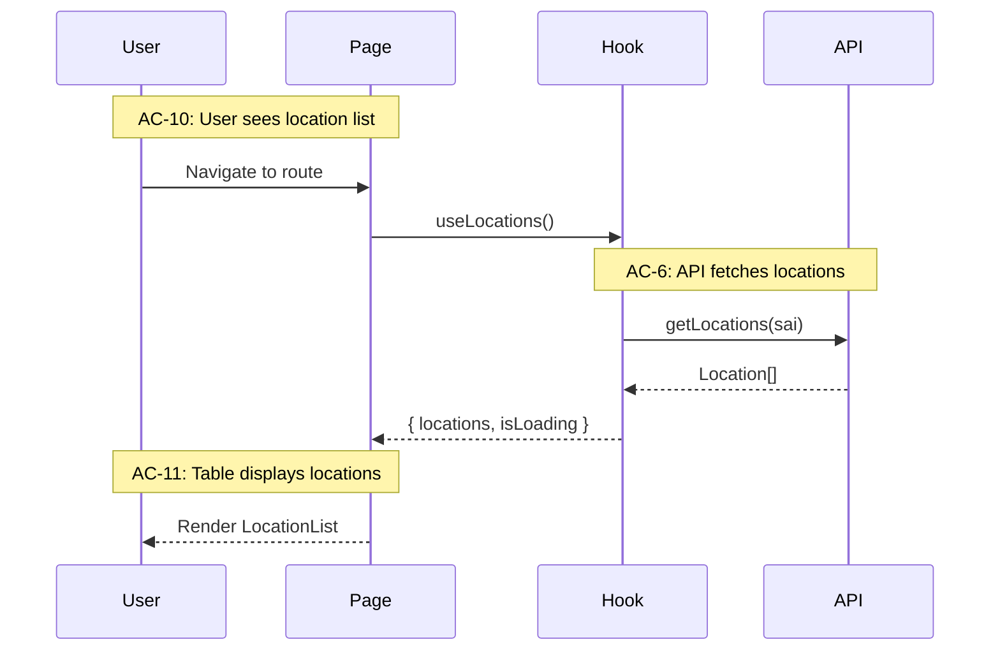

# Tech Design

**Purpose:** Transform Feature Spec into Tech Design with architecture, interfaces, and test mapping.

**This phase is the downstream consumer of the Feature Spec.** If you can't design from it, the spec isn't ready. Validation is part of the quality gate.

## Dual Role: Designer and Validator

### As Validator

Before designing, validate the Feature Spec:
- Can you map every AC to implementation?
- Are data contracts complete and realistic?
- Are there technical constraints the BA missed?
- Do the flows make sense from an implementation perspective?

If issues found → return to BA for revision. Don't design from a broken spec.

### As Designer

Once validated, produce:
- Architecture decisions
- Module breakdown
- Interface definitions
- Test architecture
- Work plan (phases/stories)

---

## The Altitude Model

Design from high to low. Don't skip levels. The template uses "High/Medium/Low Altitude" labels that map to these conceptual levels.

### High Altitude (30,000 ft) — System Context

```markdown
## System Context

### External Systems
- **Backend API:** REST endpoints at `/api/v1/*`
- **Guidewire:** Embedded iframe, URL parameter communication
- **Auth:** JWT tokens from parent application

### Entry Points
- Route: `/locations/add`
- Triggered by: Guidewire "Add Location" button

### Data Flow Overview
Guidewire → Embed with params → Fetch locations → User selects → Return data → Guidewire
```

### Medium Altitude (10,000 ft) — Module Architecture

```markdown
## Module Architecture

src/features/add-location/
├── pages/
│   └── AddLocation.tsx        # Route entry
├── components/
│   ├── LocationList.tsx       # List display
│   └── LocationForm.tsx       # Create form
├── hooks/
│   ├── useLocations.ts        # Data fetching
│   └── useLocationSelection.ts # Selection state
├── api/
│   └── locationApi.ts         # API client
└── types/
    └── location.types.ts      # Shared types

### Module Responsibilities

| Module | Responsibility | ACs Covered |
|--------|----------------|-------------|
| AddLocation | Route, layout, flow control | AC-1 to AC-5 |
| LocationList | Display, filter, select | AC-10 to AC-20 |
| useLocations | Fetch, cache | AC-6 to AC-9 |
```

### Low Altitude (Ground Level) — Interface Definitions

```typescript
// types/location.types.ts
export interface Location {
  locRefId: string;
  locRefVerNbr: number;
  address: string;
  city: string;
  state: string;
  postalCode: string;
}

// hooks/useLocations.ts
interface UseLocationsReturn {
  locations: Location[] | undefined;
  isLoading: boolean;
  isError: boolean;
  error: Error | null;
}

// components/LocationList.tsx
interface LocationListProps {
  locations: Location[];
  selectedIds: Set<string>;
  onToggleSelection: (id: string) => void;
  onAddToPolicy: () => void;
}
```

---

## Weaving Functional to Technical

At each altitude, connect back to ACs and TCs:



---

## Tech Design Writing Style: Rich, Layered Context

**Tech designs are verbose and intentionally rich.**

This is NOT about being minimal. Build a sophisticated web of context.

### The Spiral Pattern

- **Functional ↔ Technical** — Repeatedly connect requirements to implementation. Don't just list interfaces — show how they fulfill ACs.
- **High level ↔ Low level** — Spiral through abstraction layers. Go high → low → back to high → lower. Not a linear descent.
- **Back and forth** — Revisit topics from different angles. Mention the same concept in system context, in module breakdown, in interface definitions.
- **Redundant connections** — Rich, layered, multiple paths to the same information.

### Why This Works

The goal is **redundant connections** — multiple paths through the material so the model (and humans) can navigate complexity.

**A web of weights around the material, not a thin thread.**

If someone enters the design at the interface section, they should still understand why this interface exists (AC reference). If they enter at the module section, they should still see how data flows (sequence connection).

### Anti-Pattern: Thin Linear Design

```markdown
## Bad: Linear descent, minimal context
- System: calls API
- Module: LocationList
- Interface: LocationListProps
```

### Pattern: Woven Context

```markdown
## Better: Rich connections

At 30,000 ft: "The system needs to display account locations (AC-10). 
This requires a fetch from the XAPI..."

At 10,000 ft: "LocationList handles AC-10 through AC-20. It receives 
locations from useLocations (established in system context above) and 
displays them with selection capability (supporting the return flow 
we'll detail at ground level)..."

At ground level: "LocationListProps includes selectedIds (supporting 
AC-20 selection requirement) and onAddToPolicy (the return trigger 
from our sequence diagram)..."
```

---

## Test Architecture

### Mock Strategy: API Boundary

**Mock at the API layer, not hooks.**

```typescript
// ✅ CORRECT
jest.mock('@/features/add-location/api/locationApi');

// ❌ WRONG
jest.mock('@/features/add-location/hooks/useLocations');
```

**Why API boundary:** Tests the real integration (Component → Hook → React Query → mock). Catches hook wiring bugs.

### TC to Test Mapping (Critical)

The test plan must explicitly map every TC from the Feature Spec to a test. This is the Confidence Chain in action: AC → TC → Test → Implementation.

**Test plan table format:**

| TC | Test File | Test Description | Status |
|----|-----------|------------------|--------|
| TC-6a | AddLocation.test.tsx | shows loading during fetch | Planned |
| TC-6b | AddLocation.test.tsx | hides loading after fetch | Planned |
| TC-10a | LocationList.test.tsx | renders location rows | Planned |

**Rules:**
- Every TC from Feature Spec must appear in this table
- TC ID must be visible in table OR in the test name/comment (for traceability)
- If you can't map a TC to a test, either the TC is untestable (return to spec) or you're missing a test boundary
- Group by test file for clarity; the TC column is what matters for traceability

→ See `references/testing.md` for test code organization patterns

---

## Work Plan: Chunking for Stories

Break work into manageable pieces. Each chunk becomes a story or set of stories. The chunk is the Tech Lead's unit of decomposition; the Orchestrator maps chunks to stories during story sharding (usually 1:1, sometimes a chunk splits into multiple stories or merges with another).

### Chunks vs. Phases

**Chunks** are vertical slices (by functionality):
- Chunk 0: Infrastructure (types, fixtures, error classes)
- Chunk 1: Initial Load flow (ACs X-Y)
- Chunk 2: Selection flow (ACs Z-W)

**Phases** are horizontal stages (by workflow):
- Skeleton: Stubs that compile but throw
- TDD Red: Tests that run but fail
- TDD Green: Implementation that passes

The relationship: each chunk goes through all phases.

```
Chunk 0 (Skeleton) → Chunk 0 (Red) → Chunk 0 (Green) →
Chunk 1 (Skeleton) → Chunk 1 (Red) → Chunk 1 (Green) → ...
```

Some teams prefer completing all skeletons first (all Chunk Skeletons, then all Chunk Reds). Choose based on team preference and dependency structure. The default is vertical: complete each chunk fully before starting the next.

### Chunk 0: Infrastructure (Always First)

- Types and interfaces
- Test fixtures
- Test utilities
- Error classes (`NotImplementedError`)

### Subsequent Chunks

```markdown
## Chunk 1: Initial Load

**Scope:** Page component, data fetching, loading/error states
**ACs:** AC-1 to AC-9
**TCs:** TC-1a through TC-9b

**Files:**
- src/features/add-location/pages/AddLocation.tsx
- src/features/add-location/hooks/useLocations.ts
- src/features/add-location/api/locationApi.ts

**Test Count:** 12 tests
**Running Total:** 12 tests
```

### Chunk Dependencies

```
Chunk 0 → Chunk 1 → Chunk 2
              ↘      ↗
               Chunk 3
```

---

## Validation Before Handoff

**Before handing to Scrum Master:**

- [ ] Every TC mapped to test file
- [ ] All interfaces defined
- [ ] Module boundaries clear
- [ ] Chunk breakdown complete
- [ ] Test counts estimated
- [ ] No circular dependencies

**Self-review (CRITICAL):**
- Read your own design critically
- Is the spiral pattern present?
- Are there redundant connections or just thin threads?

**The Scrum Master validates by confirming they can derive stories from the design.** If they can't, the design isn't ready.

---

## Output: Tech Design (~2000 lines)

A complete tech design for a 300-line feature spec typically runs about 2000 lines.

This expansion ratio (6-7x) is normal. The design includes:
- System context (external systems, data flow)
- Module architecture (files, responsibilities, AC mapping)
- Sequence diagrams (per flow)
- Interface definitions (types, props, signatures)
- TC-to-test mapping
- Chunk breakdown with test counts

The verbose, spiral style is intentional. It creates the redundant connections that help both humans and models navigate the complexity.
