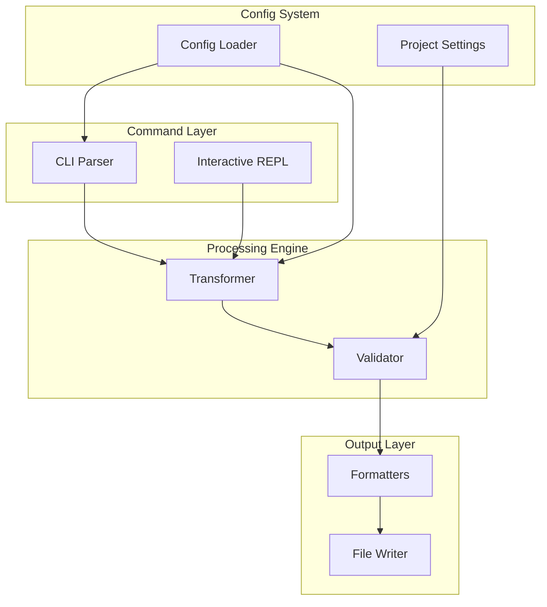
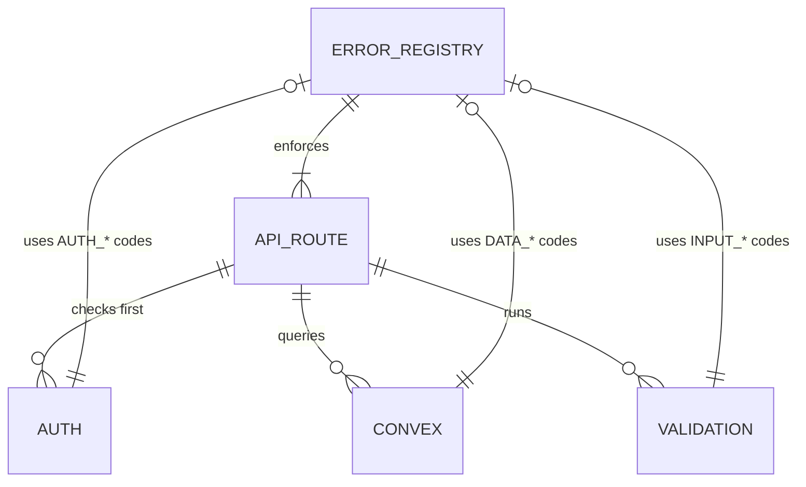
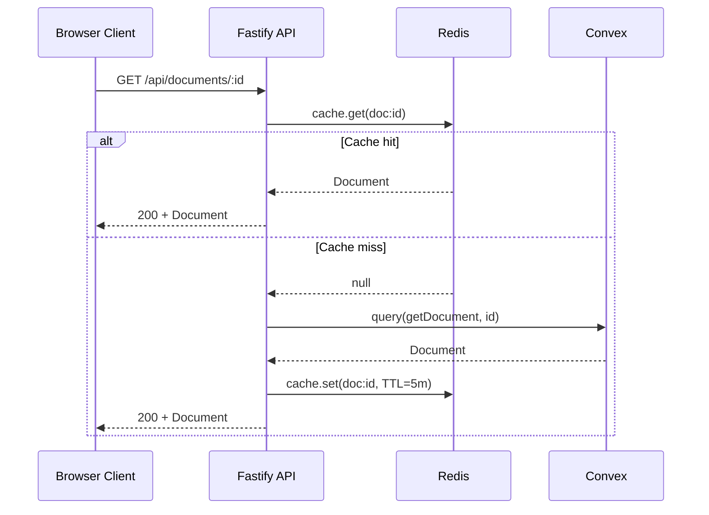

# Technical Architecture

**Purpose:** Settle foundational technical decisions across 3-8 epics so downstream tech designers inherit the technical world rather than re-derive it.

This is the human's front-loaded technical investment. Without it, the human participates in foundational technical decisions for every epic's tech design — stack choices, system shape, boundary design, auth model, error conventions. With a good tech arch, those decisions are inherited and the human's engagement shifts to epic-specific implementation questions. Together with the PRD, these two artifacts represent the human's full front-loaded investment before the automated pipeline takes over.

---

## On Load

This skill produces a **Technical Architecture document** — the companion to the PRD. The PRD establishes what to build and why; the tech arch establishes what technical world it gets built in.

Ask the user for context:

- **PRD exists** — use the product scope, feature boundaries, NFRs, and cross-cutting product decisions to inform architecture. The PRD is the natural companion input. Read it first.
- **Existing system** — the user already has a running system and needs the architecture documented so downstream epics inherit a shared technical world. Interview them about the current stack, boundaries, patterns, and any decisions they want to revisit. The tech arch can describe and refine what exists, not just propose something new.
- **Greenfield, no PRD** — interview the user: What are you building? What's the rough scope? What technical constraints exist? What ecosystem are you targeting? What's the team's stack familiarity? Get enough to make informed decisions — not guesses.

If a PRD exists, check whether its feature boundaries and scope suggest natural technical seams. Epic boundaries depend on technical seams, and architecture choices depend on product scope — surface any tension between product structure and technical structure early.

---

## Altitude and Boundaries

The tech arch operates at 50,000 ft → 20,000 ft. The exact depth varies by project — a complex system with intricate boundaries might go to 20k on boundary design while staying at 40k on internal patterns. A simpler system might stay at 35k throughout. Go as deep as the project needs to settle foundational decisions. Don't go deeper than necessary.

**What belongs here** (multi-epic decisions):
- Runtime, language, framework choices
- Major infrastructure (database, cache, auth, deployment)
- Core libraries that define the development pattern
- System shape, ownership, and communication patterns
- Cross-cutting decisions that affect multiple epics
- Technical constraints that affect product scoping

**What does NOT belong here** (epic-scoped decisions):
- Module decomposition and internal component design (ls-tech-design)
- Interface definitions, type signatures, component props (ls-tech-design)
- TC-to-test mapping, mock strategy, test architecture (ls-tech-design)
- Feature-specific library choices — adapters, parsers, connectors (ls-tech-design)
- Database schemas, query patterns, migration plans (ls-tech-design)
- Implementation sequences, chunk breakdowns (ls-tech-design)

**The boundary test:** Would changing this decision require rework in other epics? If yes, it belongs here. If no, it belongs in tech design. A framework choice (React 19) ripples across every epic. A form validation adapter (zod-fastify-connector) serves one feature. The first is tech arch; the second is tech design.

The boundary between tech arch and tech design has expected overlap at 25-30k ft. The tech design inherits what the tech arch established and extends it to implementation depth. The tech design meets the tech arch wherever it stopped. There's no fixed handoff altitude — it depends on where this document needed to go.

---

## Human-First Architecture

Design the system's primary organizing surface for human navigability, clear ownership, and stable seams. Agentic usability — the ability for AI agents to work effectively within the architecture — emerges from that. It does not require its own optimization pass.

### Why Human-First Works for Agents Too

The code ecosystem is human-designed. The naming conventions, architectural vocabulary, and patterns that models work within are all human-derived. When a model tries to optimize architecture for "model friendliness" directly, it drifts toward structures that feel systematic but are actually lower quality: over-segmentation, shallow abstractions, ceremonial wrappers, categories that sound neat but don't align with how behavior actually changes. Strong human abstractions produce clear seams, high-signal boundaries, and stable entry points that both humans and agents can navigate reliably.

### Top-Tier Surfaces

Every system should expose a deliberately curated, small set of top-tier surfaces — primary domains or responsibility zones from which everything else branches. These are the first thing a human (or agent) looks for when entering the codebase, and they define the vocabulary that every downstream epic and tech design will use.

Characteristics of good top-tier surfaces:

- **Curated, not exhaustive.** Typically 3-8, rarely more than 12. If you're above 12, you're under-curating. If you're at 1-2, you're over-consolidating or the system is genuinely simple.
- **Chosen for navigability and ownership, not structural purity.** The perfect shape of the underlying behavior graph is not always the best top-level architecture. You sometimes deliberately flatten or reshape natural complexity into a more useful organizing surface because clear entry points matter more than mirroring every runtime detail.
- **Each becomes a high-leverage testing seam.** A well-defined top-tier surface is a capability-like or service-like entry point from which you get broad test coverage with consistent input patterns. This testing leverage is a design outcome, not an accident.
- **Stable under feature growth.** New epics should typically nest within existing top-tier surfaces, not require new ones. A surface that splits every time a feature is added was drawn at the wrong level.

The tech arch identifies and names these top-tier surfaces. The tech design inherits them and decomposes within their boundaries. If a tech design needs a module that doesn't fit in any surface the tech arch defined, that's a signal — either the tech arch missed something (flag it as a deviation and surface upstream) or the epic is crossing boundaries it shouldn't.

### Not a Number Game

3-8 is a smell check, not a gate. A system with 10 well-defined surfaces is better than one with 6 that force two awkward merges. The principle is: a human should be able to hold the top-tier map in their head and know where to go for any capability. If they can't, there are too many. If half the system's functionality is jammed into one, there are too few.

---

## Research Grounding

Every stack and technology decision must be grounded in current research, not training data. This is non-negotiable.

Models have a strong bias toward making firm stack decisions based on training corpus frequency — recommending Express because it has 10x the training examples, not because it's the better choice. Pinning React 18 patterns because that's what most training data shows, even when React 19 is stable and changes available APIs. This bias is strongest on exactly the high-level decisions this document makes, and it cascades through every downstream epic and tech design. A stale framework choice multiplied across 3-8 tech designs is expensive to discover and painful to fix.

### What to Research

Before settling any major stack choice:

- **Current stable version** — what's released, what's the latest LTS if applicable
- **Breaking changes** — between the version you're considering and the previous major version. Are there migration concerns for existing code?
- **Compatibility** — does this version work with the other components you've chosen? Are there known conflicts?
- **Maintenance status** — is the package actively maintained? When was the last release? Is there a deprecation notice?
- **Ecosystem trajectory** — is the ecosystem growing, stable, or contracting? Are there signals of a successor or major shift?

### How to Document Findings

Document research inline with each decision, not in a separate appendix. The research finding should be visible alongside the choice it supports.

**Core Stack research schema:**

| Component | Choice | Version | Rationale | Checked | Compatibility Notes |
|-----------|--------|---------|-----------|---------|---------------------|
| [component] | [choice] | [version] | [why this — the actual reason] | [date] | [what was verified against other stack choices] |

**Rejected alternatives** (when they matter):

| Considered | Why Rejected |
|-----------|-------------|
| [alternative] | [specific reason — not "didn't fit," but what specifically didn't work] |

Document rejected alternatives when the choice isn't obvious. If someone downstream will ask "why not X?", answer it here. If the choice is uncontroversial (Vitest for a Bun project), a rejected-alternatives table isn't needed.

### Research Scope

Not every dependency needs deep research. Apply research depth proportional to cascade risk:

- **Core stack** (framework, runtime, data layer, auth): Full research. These decisions constrain everything downstream.
- **Infrastructure choices** (deployment, CI, caching): Moderate research. Verify current stable versions and compatibility.
- **Peripheral tools** (linter, formatter, build tool): Light research. Confirm they're maintained and compatible with the core stack.

---

## Writing Register

The tech arch has its own writing discipline — distinct from both the epic's subtractive plain description and the tech design's additive spiral weave.

### The Core Pattern

**Short prose → Diagram → Breakdown → Connective prose.**

Each major section follows this rhythm:
1. A heading and 1-3 sentences of prose description — reads as a short paragraph, not a wall of text
2. A mermaid diagram showing the structure, relationships, or flow
3. A table, bullet list, or numbered list breaking down what the diagram shows
4. Connective prose as needed to bridge to the next topic

Vary the representation format between sections. System shape might use a component diagram followed by a table of ownership. Boundaries might use a sequence diagram followed by a numbered flow. Cross-cutting decisions use prose with choice/rationale/consequence structure. The variation builds understanding through multiple lenses on the same system.

### Diagram Types and When to Use Them

- **System context / component diagrams** — for system shape, major boundaries, who owns what. Static structure.
- **Sequence diagrams** — for major request paths and communication flows between components. Dynamic behavior.
- **Entity/relationship diagrams** (UML-style) — for connective tissue between major components. Data ownership, cardinality, dependency direction.

The combination of static structure (entity/component diagrams) and dynamic behavior (sequence diagrams) covering the same connections from different angles is what builds understanding at this altitude. A component diagram shows *what connects to what*. A sequence diagram shows *in what order those connections fire*. Together they give the reader both the map and the journey.

Every diagram should be followed by a breakdown that says what downstream tech designers must inherit from it. Diagrams are part of the contract, not decoration.

### Functional-to-Technical Weave

The tech arch weaves between what the product needs (functional) and how the system is shaped to serve that (technical). This is not the tech design's altitude spiral (high → low → high → lower). The tech arch stays at its altitude band but alternates perspective:

- **Functional anchor:** "The product needs real-time collaboration across documents"
- **Technical response:** "Redis pub/sub handles cross-session messaging; Convex reactive queries handle document state"
- **Downstream consequence:** "Each epic that touches collaboration inherits this Redis + Convex split"

This weave prevents the tech arch from becoming either a dry technical inventory or an abstract capability list. Every technical decision should trace to a product need. Every product need should have a technical home.

### Advisory Tone

Use an advisory register throughout — "recommended," "should," "the expected shape." The decisions are real and downstream should inherit them, but the rationale is what makes them stick. Authoritative language ("must," "shall," "required") creates artificial rigidity that discourages downstream designers from flagging legitimate exceptions. The rationale, not the tone, is what prevents re-litigation.

### What This Is Not

- **Not subtractive plain description** (ls-epic style). Rationale is required, not ceremony to be stripped. Justification is the point, not a failure mode.
- **Not spiral-weave rich documentation** (ls-tech-design style). No altitude descent through implementation layers. No progressive construction of detailed diagrams from simple to complex. The tech arch stays at its altitude and covers breadth, not depth.
- **Not a spec.** No ACs, no TCs, no user flows, no test conditions. The tech arch creates the world that specs operate within.

---

## Core Sections

### Architecture Thesis

One paragraph. The anchor for the entire document. Captures the core architectural stance in plain language — what the system is, how it's shaped, who owns what. If someone reads only this paragraph and nothing else, they understand the fundamental shape.

```markdown
## Architecture Thesis

MD Viewer is a local-first client-server application. A single Fastify
process serves both the API and static frontend. The server owns the
filesystem; the client owns the interaction. Electron is an optional
thin wrapper, not a core dependency. All data stays local — no cloud
services, no accounts, no sync.
```

No diagram needed here. This is pure prose — the sharpest possible statement of what the system is.

### Core Stack

The decisions that constrain everything downstream. Not every dependency — the ones where the choice changes what patterns, APIs, and approaches are available. Research-grounded with the schema from the Research Grounding section.

| Component | Choice | Version | Rationale | Checked | Compatibility Notes |
|-----------|--------|---------|-----------|---------|---------------------|
| Runtime | Node | 24 LTS | Long-term support, native fetch, stable ESM | [date] | Bun 1.3.9+ for package management |
| Web framework | Fastify | 5 | Plugin ecosystem, local server pattern | [date] | v5 required for ESM-first |
| Frontend | Vanilla HTML/CSS/JS | — | No build step for client, minimal deps | [date] | Tailwind 4 CSS-native engine |
| Data layer | Convex | — | Reactive queries, serverless backend | [date] | SDK compatible with Node 24 |

Not all categories apply to every project. Include what's relevant. The version matters when it changes available APIs or patterns.

### System Shape

This is where the top-tier surfaces identified in the Human-First Architecture principle become concrete. What the system is, what the major runtime surfaces are, who owns what, and how the primary domains are organized.

This section should almost always include a component or context diagram. The pattern: prose description → component diagram → ownership table → connective prose.

**Identifying top-tier surfaces:** Start by asking: what are the 3-8 primary responsibility zones a human navigates when working in this system? These aren't just runtime boundaries (client, server) — they're the curated organizing surface from which everything branches. A server might have multiple top-tier surfaces within it (auth, data pipeline, export engine). A client might decompose into workspace management, document editing, and integrations. Name these surfaces. For each one: what it owns, what it depends on, and what boundary it creates for downstream epics.

```markdown
## System Shape

The system has three runtime surfaces and seven primary domains across
them. The Fastify server owns data access and processing. The browser
client owns rendering and interaction. Electron provides OS integration
when present.

Primary domains:

| Domain | Runtime Surface | Owns | Depends On |
|--------|----------------|------|------------|
| App shell | Client | Layout, navigation, menus, command wiring | Workspace, Documents |
| Workspace | Client | Session state, roots, recent files, preferences | App shell (rendering) |
| Documents | Client + Server | Tab lifecycle, loading, rendering, content processing | Workspace (context), Data pipeline |
| Packages | Client + Server | Package mode, manifest, create/extract workflows | Documents (viewer), Data pipeline |
| Exports | Client + Server | Export workflows, format options, output generation | Documents (source), Data pipeline |
| Integrations | Client | Electron shell, WebSocket sync, assistant overlay | App shell (UI surface) |
| Data pipeline | Server | REST + WebSocket API, caching, persistence | Convex, Redis |

[Component diagram: flowchart showing top-tier domains with their
runtime surface grouping and dependency arrows between them]
```

The ownership table doubles as the vocabulary downstream consumers inherit. When an epic touches "export improvements," the tech designer knows that lives in the Exports domain, depends on Documents and Server, and shouldn't introduce new patterns that conflict with the domain boundaries established here.

### Cross-Cutting Decisions

Decisions that affect multiple epics and would be expensive to reverse. Each decision needs three elements: the choice, the rationale, and the downstream consequence.

```markdown
### Authentication

**Choice:** WorkOS AuthKit with hosted UI
**Rationale:** Enterprise SSO + social auth without building auth UI.
AuthKit handles the hosted login flow; the app receives a session token.
Confirmed current stable, compatible with Fastify 5 via middleware.
**Consequence:** All epics assume authenticated sessions. No epic should
implement its own auth flow. Session tokens available via request context.
```

When the interactions between cross-cutting decisions matter, use an entity/relationship diagram to show the connective tissue:

```markdown
[ER diagram showing: AUTH creates SESSION, SESSION authorizes REQUEST,
REQUEST reads/writes CACHE (backed by REDIS), REQUEST queries DB
(backed by CONVEX)]
```

### Boundaries and Flows

Major seams in the system with brief contract sketches. Not full API contracts — those belong in epics and tech design — but enough to understand the communication shape and the main request paths.

This section should include at least one sequence diagram for a key request path. The combination of the system shape diagram (static structure) and a sequence diagram here (dynamic behavior) gives the reader both the map and the journey. Example:

```markdown
[Sequence diagram: Client → Fastify API → Convex (query) → back to API →
Redis (cache) → back to Client with response]

1. Client sends GET /api/documents to Fastify API
2. API queries Convex for document list
3. Convex returns Document[]
4. API caches result in Redis with TTL
5. API returns 200 + Document[] to Client
```

Keep this light. A few boundaries with brief contract sketches (example endpoints, transport type) and a few key flows as 4-5 step sequences. The goal is orientation, not implementation.

### Constraints That Shape Epics

Technical realities that affect product scoping. These must be visible to epic writers, not just tech designers.

```markdown
## Constraints That Shape Epics

- **Local-first, no cloud dependencies for core features.** Eliminates
  cloud-only solutions. Epics cannot assume network availability for
  primary functionality.
- **No runtime execution of user-provided scripts.** Constrains what
  a plugin or extension epic can promise.
- **Single-process server.** No microservice decomposition. Epics that
  assume independent scaling or separate deployment won't work.
```

### Open Questions for Tech Design

Decisions this document intentionally leaves open for the tech design phase. Listing them explicitly prevents downstream designers from assuming the question was settled.

```markdown
## Open Questions for Tech Design

- Whether PDF export should use Playwright or a browser-print pipeline
- Caching strategy for parsed markdown (in-memory LRU vs Redis vs filesystem)
- WebSocket connection lifecycle for real-time features (persistent vs reconnect)
```

### Assumptions

Architecture-relevant assumptions that the document depends on. Use the same table structure as the PRD's assumptions section. Mark each assumption as validated or unvalidated so downstream consumers know what's been confirmed versus what's still a bet.

---

## Failure Modes

**Training-data-comfort bias.** Recommending what the model has seen most rather than what's currently best. Express over Fastify because of training frequency. React class components because they dominate older training data. Webpack over Vite because of corpus volume. This is the most common and most damaging failure at this altitude because it cascades through every downstream epic.

**Over-specification.** Crossing into tech design territory. The moment you're specifying module decomposition, interface definitions, test mapping, or package-level adapters, you've drifted. Pull back. The tech arch establishes the world; the tech design builds within it.

**Under-rationalized decisions.** "Fastify 5" without why. "Redis for caching" without the alternative considered. Bare decisions without rationale invite either blind adherence (downstream designer follows without understanding) or unnecessary re-litigation (downstream designer questions because no reasoning is visible). Every major decision needs choice + rationale + consequence.

**Missing downstream handoff.** No "Relationship to Downstream" section. No "Open Questions for Tech Design." Tech designers don't know what's settled versus open, so they either re-derive everything or assume nothing is decided.

**Stale research presented as current.** Version numbers and compatibility claims from training data presented without verification. "React 18 is the current stable" when React 19 has been stable for months. Always verify. Always date your research.

**Greenfield-only thinking.** Assuming a blank slate when the user has an existing system. The tech arch should describe and refine what exists, not just propose from scratch. Existing-system intake is a first-class use case.

**Over-segmented top tier.** 15 top-tier surfaces where 6 would suffice. Each sounds reasonable in isolation but the map is too large to hold in a human's head. If you can't remember all the top-tier surfaces without looking at the document, there are too many.

**Under-curated top tier.** 2-3 surfaces that are actually just runtime boundaries (client, server, database) rather than responsibility zones. Runtime boundaries matter, but they're not the organizing surface — multiple domains can exist within one runtime surface.

---

## Example: Writing Register in Action

This example shows three connected sections from a tech arch, demonstrating the core pattern (prose → diagram → breakdown → connective prose), diagram variety, and the functional-to-technical weave. This is the target quality level.

### System Shape (excerpt)

A CLI tool with four primary domains. The command layer handles user input. The processing engine transforms content. The output layer formats and delivers results. The config system manages user preferences and project settings.



| Domain | Owns | Downstream Inherits |
|--------|------|---------------------|
| Command layer | CLI parsing, REPL interaction, argument validation | All epics that add commands compose within this layer. No epic creates a separate entry surface. |
| Processing engine | Content transformation, validation rules, pipeline orchestration | Epics adding new content types extend the transformer. No epic builds a parallel processing path. |
| Output layer | Format selection, file writing, stdout rendering | Output epics add formatters. The file writer and rendering pipeline are shared. |
| Config system | User preferences, project settings, config file parsing | All epics that need configuration read through this system. No epic introduces a separate config mechanism. |

The command layer supports both one-shot CLI and interactive REPL because the product serves both automation (CI pipelines, scripting) and human exploration. This means epics that add new capabilities wire into both entry points — they don't choose one and ignore the other.

### Cross-Cutting: Error Handling (excerpt)

**Choice:** Structured error responses with stable machine-readable codes.
**Rationale:** Downstream clients (browser UI, CLI, external integrations) need to programmatically handle errors. HTTP status alone is too coarse — 400 means many things. Stable error codes let clients switch behavior without parsing messages.
**Consequence:** Every epic that adds API endpoints must use the error code registry. No epic invents its own error shape. Error codes are append-only — once shipped, a code is permanent.

The error system interacts with auth and the data layer:



| Code Prefix | Source | Example | Downstream Inherits |
|-------------|--------|---------|---------------------|
| `AUTH_*` | Auth middleware | `AUTH_SESSION_EXPIRED` | All authenticated routes return these. UI handles refresh. |
| `INPUT_*` | Request validation | `INPUT_INVALID_SLUG` | All routes with body/param validation. |
| `DATA_*` | Convex operations | `DATA_NOT_FOUND` | All routes that query Convex. |

### Boundaries and Flows: Document Fetch (excerpt)

The most common request path shows how the three surfaces interact for a standard read operation.



1. Client requests a document by ID via REST
2. API checks Redis cache first (hot path)
3. On cache hit, returns immediately — no Convex query
4. On cache miss, queries Convex, caches the result with 5-minute TTL, returns
5. Cache TTL is a tech design decision per epic — the tech arch settles that caching happens via Redis, not how long each resource is cached

This example demonstrates the pattern at work: each section opens with short prose, follows with a diagram, then breaks down what the diagram shows with a table or numbered list. The connective prose (final paragraph of System Shape, point 5 of the sequence breakdown) explicitly states what downstream inherits — that's the contract, not just the picture.

---

## Downstream Handoff

### Relationship to Downstream

Be explicit about what this document settles and what remains open:

- **What this document settles:** System shape, core stack (researched and versioned), major boundaries, cross-cutting decisions with rationale, constraints that affect epic scoping
- **What ls-epic settles:** Functional requirements, line-level ACs, TCs, data contracts at system boundaries, story breakdown
- **What ls-tech-design still decides:** Module decomposition, interface definitions, test mapping, implementation sequences, epic-scoped dependency choices, verification scripts

### Living Document, Not Decree

Downstream work regularly surfaces new facts that reveal the need to realign upstream decisions. When a tech design discovers a tech arch decision needs revision — whether through deeper dependency research, implementation reality, or evolved understanding — proceed with the better approach, document the deviation and rationale, and surface it upstream for backfill.

The tech arch is the starting position for technical decisions, not an inviolable source of truth. Common sense and fresh appraisal of the problem space based on new knowledge, not artificial adherence to upstream documents.

---

## Validation Before Handoff

### Consumer Test (Critical)

Two dimensions:

**Single-epic test:** Can a tech designer for any individual epic inherit the technical world from this document without needing to ask the human foundational technical questions? Foundational questions mean failure: "What database are we using?", "What's the auth model?", "Is this a monolith or services?" Refinement questions are healthy: "Should this feature use WebSocket or polling?", "Which adapter connects Zod to Fastify?"

**Cross-epic consistency test:** Would multiple tech designers working on different epics inherit the same technical world rather than fork it? If two designers could reasonably make incompatible stack or boundary decisions because the tech arch is ambiguous, the document isn't settled enough.

### Structural Checklist

- [ ] Architecture thesis captures the system's fundamental shape in one paragraph
- [ ] Core stack table has researched, versioned, rationalized choices with dates
- [ ] Rejected alternatives documented for non-obvious choices
- [ ] System shape identifies top-tier surfaces (typically 3-8) with ownership and dependencies
- [ ] System shape diagram establishes boundaries and ownership
- [ ] Cross-cutting decisions include choice, rationale, and consequence
- [ ] At least one sequence diagram shows a major request path
- [ ] Entity/relationship diagram shows connective tissue where boundaries are complex
- [ ] Diagrams are followed by breakdowns that state what downstream inherits
- [ ] Constraints that affect epic scoping are explicit and visible
- [ ] Open questions explicitly deferred to tech design
- [ ] Relationship to downstream is clear (what this settles vs what epics and tech design settle)
- [ ] No module decomposition, interface definitions, or test mapping (tech design territory)
- [ ] Stays at 50k-20k altitude (variable by section, but never at implementation depth)
- [ ] Existing-system context captured when applicable (not just greenfield assumptions)

**Self-review:**
- Read each section as a tech designer would. Can you start designing for any epic without re-litigating foundational decisions? Can you understand why each decision was made well enough to follow it or flag a legitimate exception?
- Read the diagrams. Do they show the system's structure and behavior clearly enough that a tech designer inherits the right mental model?

---

## Template

Use the following template when producing a Technical Architecture document.

---

### Template Start

```markdown
# [Product Name] — Technical Architecture

## Status

This document defines the technical architecture for [product name]. It
establishes the system shape, core stack, and foundational decisions that
all downstream epics and tech designs inherit.

---

## Architecture Thesis

[One paragraph: the core architectural stance in plain language. What the
system is, how it's shaped, who owns what. If someone reads only this,
they understand the fundamental shape.]

---

## Core Stack

| Component | Choice | Version | Rationale | Checked | Compatibility Notes |
|-----------|--------|---------|-----------|---------|---------------------|
| Runtime | [choice] | [version] | [why] | [date] | [notes] |
| Package manager | [choice] | [version] | [why] | [date] | [notes] |
| Framework | [choice] | [version] | [why] | [date] | [notes] |
| [continue as relevant] | | | | | |

### Rejected Alternatives

| Considered | Why Rejected |
|-----------|-------------|
| [alternative] | [specific reason] |

---

## System Shape

[1-3 sentence description of the system's runtime surfaces and ownership.]

### Top-Tier Domains

| Domain | Runtime Surface | Owns | Depends On | Downstream Inherits |
|--------|----------------|------|------------|---------------------|
| [domain] | [where it runs] | [what it's responsible for] | [what it requires] | [what epics/tech designs must respect] |

[Component diagram (mermaid flowchart): show top-tier domains grouped
by runtime surface with dependency arrows between them.]

[Connective prose: what this structure means for downstream epics and
where new capability is expected to land.]

---

## Cross-Cutting Decisions

### [Decision Area — e.g., Authentication]

**Choice:** [what was decided]
**Rationale:** [why — the actual reason, researched where applicable]
**Consequence:** [what downstream work must respect]

### [Decision Area — e.g., Error Handling]

**Choice:** [what was decided]
**Rationale:** [why]
**Consequence:** [what downstream work must respect]

[ER diagram (mermaid erDiagram) if cross-cutting interactions are
complex: show connective tissue between major decisions/components.]

| Interaction | Downstream Inherits |
|-------------|---------------------|
| [how decisions interact] | [what tech designers must respect] |

---

## Boundaries and Flows

[Brief description of the major seams in the system.]

[Sequence diagram (mermaid sequenceDiagram): show a key request path
through major components with the most common flow.]

**Breakdown:**

1. [Step — what crosses the boundary, transport type]
2. [Step]
3. [Continue as needed]

**Downstream inherits:** [What this flow settles for tech designers —
which components handle which part of the path, what is fixed vs what
is a per-epic decision.]

---

## Constraints That Shape Epics

- [Technical constraint and how it affects product scoping]
- [Another constraint]

---

## Open Questions for Tech Design

- [Question explicitly deferred to the tech design phase]
- [Another question]

---

## Assumptions

| ID | Assumption | Status | Notes |
|----|------------|--------|-------|
| A1 | [Architecture-relevant assumption] | [Status] | [Notes] |

---

## Relationship to Downstream

- **This document settles:** [list]
- **Epic specs settle:** [list]
- **Tech design still decides:** [list]
```

### Template End
