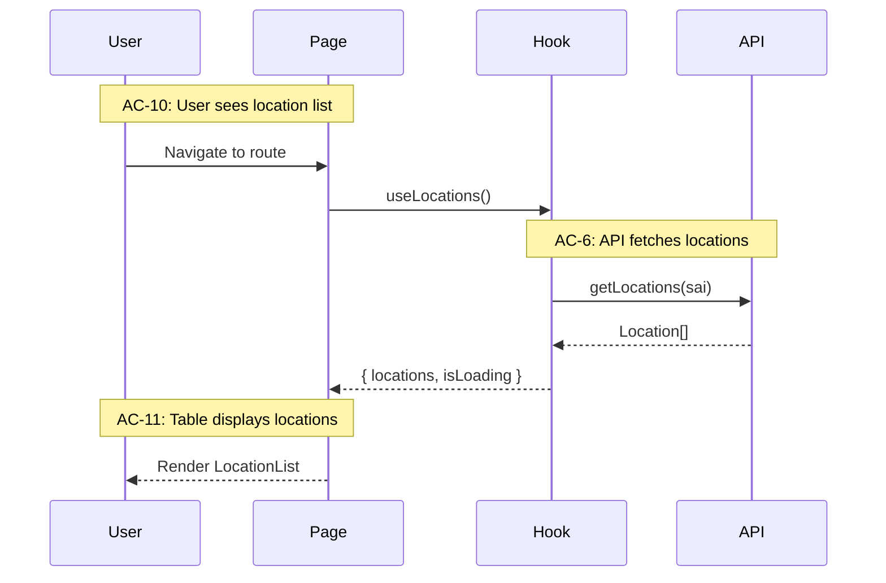

# Tech Design

**Purpose:** Transform Epic into Tech Design with architecture, interfaces, and test mapping.

**This phase is the downstream consumer of the Epic.** If you can't design from it, the spec isn't ready. Validation is part of the quality gate.

**When a Technical Architecture document exists,** also read it before designing. The tech arch establishes the technical world — system shape, core stack, cross-cutting decisions, and the top-tier surfaces (primary domains or organizing surfaces) that structure the system. The epic defines *what* this feature does. The tech arch defines *what technical world* it lives in. Your design works within both.

## Output Structure

The tech design always produces at least two documents:

**Config A: 2 docs (default)**
- `tech-design.md` — Index: decisions, context, system view, module architecture, work breakdown
- `test-plan.md` — TC→test mapping, mock strategy, fixtures, chunk breakdown with test counts

Everything lives in the index. Works when the design fits comfortably under ~1200-1500 lines. Typical for single-domain projects — a CLI, a backend service, a focused frontend feature.

**Config B: 4 docs (when the index gets dense)**
- `tech-design.md` — Index: decisions, context, system view, module architecture overview, work breakdown
- `tech-design-[domain-a].md` — Implementation depth for one domain (e.g., frontend, client, UI)
- `tech-design-[domain-b].md` — Implementation depth for the other domain (e.g., backend, server, API)
- `test-plan.md` — TC→test mapping, mock strategy, fixtures, chunk breakdown with test counts

The trigger is index density — when the index is approaching ~1200-1500 lines, split implementation depth into companion docs. Name companions by the project's actual domain boundaries (frontend/backend, client/server, renderer/engine — whatever fits the project). The index stays as the decision record and whole-system map. Companion docs carry the implementation detail.

**Never go 3.** You don't add just one companion doc. It's either everything in the index, or the index plus both companions. Two configurations, not a continuum.

The test plan is always its own document. If the work doesn't justify a separate test plan with TC traceability, this skill isn't the right tool — downshift to plan mode.

Companion docs maintain requirement traceability — they reference ACs and TCs so you can navigate from the companion back to the index and the epic.

## Dual Role: Designer and Validator

### As Validator

Before designing, validate the Epic:
- Can you map every AC to implementation?
- Are data contracts complete and realistic?
- Are there technical constraints the BA missed?
- Do the flows make sense from an implementation perspective?
- **Answer every question in the Epic's "Tech Design Questions" section.** These are legitimate technical questions raised during spec writing or validation that the spec intentionally deferred to this phase.

If issues found → return to BA for revision. Don't design from a broken spec.

**When a tech arch exists,** also validate against it:
- Does the epic's scope fit within the top-tier surfaces the tech arch defined?
- Are the cross-cutting decisions (auth, error handling, state management) compatible with what this epic needs?
- Are there tech arch assumptions that this epic's requirements challenge?
- Flag tensions early — they're cheaper to resolve before design than during implementation.

### As Designer

Once validated, produce:
- Architecture decisions
- Module breakdown
- Interface definitions
- Test architecture
- Work plan (phases/stories)

---

## The Altitude Model

Design from high to low. Don't skip levels. The template structures sections from system view down to interface definitions — use the altitude model to calibrate your depth at each level, but don't surface altitude labels in your output headings.

### High Altitude (30,000 ft) — System Context

When a tech arch exists, the System Context inherits rather than re-derives. The tech arch already established system shape, boundaries, and communication patterns at 50k-20k ft. Your System Context narrows that to this epic's slice — which top-tier surfaces this epic touches, which external boundaries are relevant, what data flows through them for this epic's functionality. When no tech arch exists, derive from scratch.

```markdown
## System Context

### External Systems
- **Backend API:** REST endpoints at `/api/v1/*`
- **Guidewire:** Embedded iframe, URL parameter communication
- **Auth:** JWT tokens from parent application

### Entry Points
- Route: `/locations/add`
- Triggered by: Guidewire "Add Location" button

### Data Flow Overview
Guidewire → Embed with params → Fetch locations → User selects → Return data → Guidewire
```

### Medium Altitude (10,000 ft) — Module Architecture

**When a tech arch exists,** start from: which top-tier surfaces does this epic live in? The file tree and module responsibility matrix should nest within those inherited surfaces, not create a parallel organizing structure. If this epic needs a module that doesn't fit in any surface the tech arch defined, that's a deviation — document it in the Issues Found table and surface it upstream. The inherited surfaces are the shared vocabulary across all epics; respecting them keeps the system coherent.

**When no tech arch exists,** still ask: what are the primary organizing surfaces of this system? If you can infer them from the codebase, state them as locally derived context. If the surface map is materially unclear, flag it as a discussion point with the human — don't silently invent a full system architecture. The goal is coherent decomposition for this epic, not a substitute tech arch.

**Human-first module design.** The module structure should be designed for human navigability. If a human can't look at the responsibility matrix and immediately know where to go for any capability in this epic, it's over-segmented. If half the epic's functionality is jammed into one module, it's under-decomposed. Strong human abstractions are also the most model-navigable abstractions — models work better within clear responsibility boundaries than within structures optimized for technical purity.

```markdown
## Module Architecture

src/features/add-location/
├── pages/
│   └── AddLocation.tsx        # Route entry
├── components/
│   ├── LocationList.tsx       # List display
│   └── LocationForm.tsx       # Create form
├── hooks/
│   ├── useLocations.ts        # Data fetching
│   └── useLocationSelection.ts # Selection state
├── api/
│   └── locationApi.ts         # API client
└── types/
    └── location.types.ts      # Shared types

### Module Responsibilities

| Module | Responsibility | ACs Covered |
|--------|----------------|-------------|
| AddLocation | Route, layout, flow control | AC-1 to AC-5 |
| LocationList | Display, filter, select | AC-10 to AC-20 |
| useLocations | Fetch, cache | AC-6 to AC-9 |
```

### Low Altitude (Ground Level) — Interface Definitions

```typescript
// types/location.types.ts
export interface Location {
  locRefId: string;
  locRefVerNbr: number;
  address: string;
  city: string;
  state: string;
  postalCode: string;
}

// hooks/useLocations.ts
interface UseLocationsReturn {
  locations: Location[] | undefined;
  isLoading: boolean;
  isError: boolean;
  error: Error | null;
}

// components/LocationList.tsx
interface LocationListProps {
  locations: Location[];
  selectedIds: Set<string>;
  onToggleSelection: (id: string) => void;
  onAddToPolicy: () => void;
}
```

---

## Weaving Functional to Technical

At each altitude, connect back to ACs and TCs:



---

## Tech Design Writing Style: Rich, Layered Context

**Tech designs are verbose and intentionally rich.**

This is NOT about being minimal. Build a sophisticated web of context.

### The Spiral Pattern

- **Functional ↔ Technical** — Repeatedly connect requirements to implementation. Don't just list interfaces — show how they fulfill ACs.
- **High level ↔ Low level** — Spiral through abstraction layers. Go high → low → back to high → lower. Not a linear descent.
- **Back and forth** — Revisit topics from different angles. Mention the same concept in system context, in module breakdown, in interface definitions.
- **Redundant connections** — Rich, layered, multiple paths to the same information.

### Why This Works

The goal is **redundant connections** — multiple paths through the material so the model (and humans) can navigate complexity.

**A web of weights around the material, not a thin thread.**

If someone enters the design at the interface section, they should still understand why this interface exists (AC reference). If they enter at the module section, they should still see how data flows (sequence connection).

### Anti-Pattern: Thin Linear Design

```markdown
## Bad: Linear descent, minimal context
- System: calls API
- Module: LocationList
- Interface: LocationListProps
```

### Pattern: Woven Context

```markdown
## Better: Rich connections

At 30,000 ft: "The system needs to display account locations (AC-10).
This requires a fetch from the XAPI..."

At 10,000 ft: "LocationList handles AC-10 through AC-20. It receives
locations from useLocations (established in system context above) and
displays them with selection capability (supporting the return flow
we'll detail at ground level)..."

At ground level: "LocationListProps includes selectedIds (supporting
AC-20 selection requirement) and onAddToPolicy (the return trigger
from our sequence diagram)..."
```

---

## Test Architecture

### Mock Strategy: API Boundary

**Mock at the API layer, not hooks.**

```typescript
// ✅ CORRECT
jest.mock('@/features/add-location/api/locationApi');

// ❌ WRONG
jest.mock('@/features/add-location/hooks/useLocations');
```

**Why API boundary:** Tests the real integration (Component → Hook → React Query → mock). Catches hook wiring bugs.

**When inherited top-tier surfaces exist,** they inform where to *enter* for high-leverage testing, not where to *mock*. Top-tier surfaces are internal responsibility zones — they're the natural entry points from which a single test exercises broad functionality with consistent input patterns. But mocking stays at external boundaries per the service mock philosophy: mock where your code ends and external systems begin (network, database, filesystem), never between your own internal domains. A test that enters at a top-tier surface boundary should exercise all internal modules within it and mock only what's truly external.

### TC to Test Mapping (Critical)

The test plan must explicitly map every TC from the Epic to a test. This is the Confidence Chain in action: AC → TC → Test → Implementation.

**Test plan table format:**

| TC | Test File | Test Description | Status |
|----|-----------|------------------|--------|
| TC-6a | AddLocation.test.tsx | shows loading during fetch | Planned |
| TC-6b | AddLocation.test.tsx | hides loading after fetch | Planned |
| TC-10a | LocationList.test.tsx | renders location rows | Planned |

**Rules:**
- Every TC from Epic must appear in this table
- TC ID must be visible in table OR in the test name/comment (for traceability)
- If you can't map a TC to a test, either the TC is untestable (return to spec) or you're missing a test boundary
- Group by test file for clarity; the TC column is what matters for traceability

→ See the Testing reference section in this skill for test code organization patterns.

---

## Work Plan: Chunking for Stories

Break work into manageable pieces. Each chunk becomes a story or set of stories. The chunk is the Tech Lead's unit of decomposition; chunks inform how stories are organized when the epic is published (usually 1:1, sometimes a chunk splits into multiple stories or merges with another).

### Chunks vs. Phases

**Chunks** are vertical slices (by functionality):
- Chunk 0: Infrastructure (types, fixtures, error classes)
- Chunk 1: Initial Load flow (ACs X-Y)
- Chunk 2: Selection flow (ACs Z-W)

**Phases** are horizontal stages (by workflow):
- Skeleton: Stubs that compile but throw
- TDD Red: Tests that run but fail
- TDD Green: Implementation that passes

The relationship: each chunk goes through all phases.

```
Chunk 0 (Skeleton) → Chunk 0 (Red) → Chunk 0 (Green) →
Chunk 1 (Skeleton) → Chunk 1 (Red) → Chunk 1 (Green) → ...
```

Some teams prefer completing all skeletons first (all Chunk Skeletons, then all Chunk Reds). Choose based on team preference and dependency structure. The default is vertical: complete each chunk fully before starting the next.

### Chunk 0: Infrastructure (Always First)

- Types and interfaces
- Test fixtures
- Test utilities
- Error classes (`NotImplementedError`)

### Subsequent Chunks

```markdown
## Chunk 1: Initial Load

**Scope:** Page component, data fetching, loading/error states
**ACs:** AC-1 to AC-9
**TCs:** TC-1a through TC-9b

**Files:**
- src/features/add-location/pages/AddLocation.tsx
- src/features/add-location/hooks/useLocations.ts
- src/features/add-location/api/locationApi.ts

**Relevant Tech Design Sections:** §System Context — Data Flow,
§Module Architecture — AddLocation Page, §Low Altitude — useLocations Hook,
§Flow 1: Initial Load Sequence, §Testing Strategy — Initial Load Tests

**Non-TC Decided Tests:** Empty state render (no locations), loading
skeleton timing assertion (Tech Design §Testing Strategy)

**Test Count:** 12 tests + 2 non-TC
**Running Total:** 14 tests
```

The "Relevant Tech Design Sections" field lists which headings from this tech design are relevant to the chunk. This directly supports story creation: when publishing the epic, these references help select which tech design content is relevant to each story's Technical Design section.

The "Non-TC Decided Tests" field lists tests this chunk needs that aren't 1:1 with a TC -- edge cases, collision tests, defensive tests. These must be carried forward into stories during technical enrichment so they aren't lost.

### Chunk Dependencies

```
Chunk 0 → Chunk 1 → Chunk 2
              ↘      ↗
               Chunk 3
```

---

## Dependency and Version Grounding

**When a tech arch exists,** distinguish between inherited and epic-scoped decisions. Core stack choices (framework, runtime, data layer, auth) are already settled — don't re-research them unless something specific to this epic challenges them. Epic-scoped dependencies (feature-specific libraries, adapters, connectors) get fresh research. If deeper research reveals that an inherited decision needs revision, treat it as a deviation: proceed with the better approach, document the rationale in the Issues Found table, and surface it upstream for backfill.

Dependency and version choices must be grounded by current web research, not training data. This is especially important for fast-moving ecosystems (build tools, frameworks, runtimes, packaging tools). Training data goes stale; the npm registry and GitHub releases don't.

Before pinning any epic-scoped version, research the current ecosystem status: latest stable version, known breaking changes, compatibility with the project's existing stack, and whether the package is actively maintained. Document your findings in a Stack Additions table:

| Package | Version | Purpose | Research Confirmed |
|---------|---------|---------|-------------------|
| [package] | [version] | [why this package] | Yes — [key finding from research] |

Also document packages considered and rejected, with rationale. This prevents future designers from re-evaluating the same alternatives.

---

## Upstream Document Evolution

Downstream work regularly surfaces new facts that reveal the need to realign upstream decisions. When the tech design discovers that a tech arch decision or an epic assumption needs revision — whether through deeper dependency research, implementation reality, or evolved understanding:

- **Proceed with the better approach.** Don't block progress waiting for upstream approval.
- **Document the deviation and rationale** in the Issues Found table. Include what the upstream document says, what the design does instead, and why.
- **Surface it upstream** to the orchestrator or human as a suggested update. The orchestrator tracks the backfill task.
- **The upstream documents are the starting position,** not inviolable sources of truth. Common sense and fresh appraisal of the problem space based on new knowledge, not artificial adherence to upstream documents.

This applies to both the epic and the tech arch. The Issues Found table in the template already supports this — use the "Resolved — deviated" status for design-time deviations.

---

## Verification Scripts

The tech design defines the project's verification gates before implementation begins. These become the quality gates that story technical sections reference — getting them right here prevents ad-hoc discovery during implementation.

Every project needs at least four verification tiers: `red-verify` (everything except tests — for TDD Red exit when stubs throw), `verify` (standard development gate), `green-verify` (verify + test immutability guard — for TDD Green exit), and `verify-all` (deep verification including integration and e2e suites). Define the specific commands for each tier in the tech design so stories can reference them consistently.

---

## Test Count Reconciliation

Test counts drift between documents. This is a known trap — the index work breakdown says one number, the test plan per-chunk totals say another, the per-file totals say a third. Each fix round can introduce new inconsistencies.

After completing the test plan, do a single mechanical reconciliation pass: per-file test counts sum to per-chunk totals, per-chunk totals sum to the index work breakdown summary. One pass, three cross-checks. If anything doesn't add up, fix it before self-review. This catches arithmetic drift in one pass instead of burning multiple verification rounds on it.

---

## Validation Before Handoff

**Before handing off:**

- [ ] Every TC mapped to test file
- [ ] All interfaces defined
- [ ] Module boundaries clear
- [ ] Chunk breakdown complete with relevant tech design section references per chunk
- [ ] Non-TC decided tests identified and assigned to chunks
- [ ] Test counts estimated (TC tests + non-TC tests)
- [ ] No circular dependencies
- [ ] Top-tier surfaces stated (inherited from tech arch, or locally derived with rationale)
- [ ] Modules nest within inherited surfaces (or deviations documented in Issues Found)
- [ ] Inherited stack decisions respected (or deviations documented with rationale)
- [ ] Epic-scoped dependency additions grounded in fresh research

**Self-review (CRITICAL):**
- Read your own design critically
- Is the spiral pattern present?
- Are there redundant connections or just thin threads?

**The BA/SM validates by confirming they can derive stories from the design. The Tech Lead validates by confirming they can add story-level technical sections from the design.** If either can't, the design isn't ready.

→ Verification prompt: `examples/tech-design-verification-prompt.md` — Ready-to-use prompt for external validation before handoff

---

## Output: Tech Design

The tech design expands significantly from the epic — typically 6-7x. The design includes:
- System context (external systems, data flow)
- Module architecture (files, responsibilities, AC mapping)
- Sequence diagrams (per flow)
- Interface definitions (types, props, signatures)
- TC-to-test mapping
- Chunk breakdown with test counts

The verbose, spiral style is intentional. It creates the redundant connections that help both humans and models navigate the complexity.
