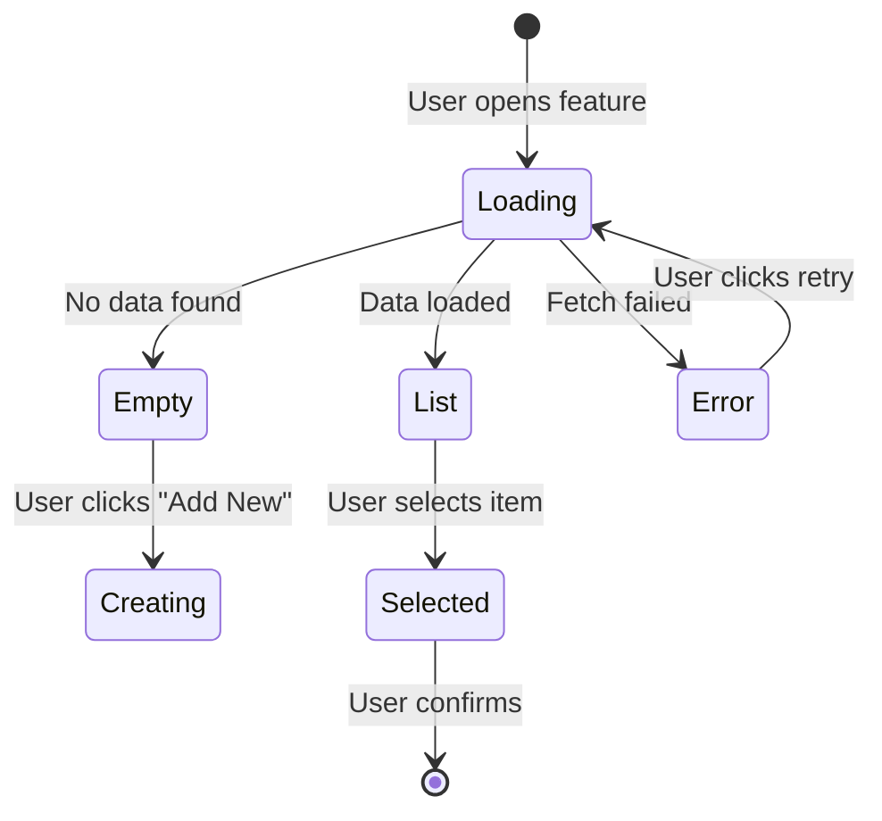

# Feature: [Feature Name]

This specification defines the complete requirements for [feature name]. It serves as the source of truth for the Tech Lead's design work and expands to approximately 2000 lines of technical design.

---

## User Profile

Understanding who uses this feature and how they think about it grounds every subsequent decision. The profile constrains what flows make sense, which in turn constrains acceptance criteria.

**Primary User:** [Role, e.g., "Policy underwriter"]

**Context:** [Situation when they use this, e.g., "Adding locations to a commercial policy during quote process"]

**Mental Model:** [How they conceptualize the task, e.g., "I have an account with locations, I pick which ones apply to this policy"]

**Key Constraint:** [Environmental or technical limitation, e.g., "Embedded in Guidewire, not standalone application"]

### User Story

As a [primary user role],
I want to [action aligned with mental model],
so that [benefit that matters in their context].

---

## Scope

Explicit boundaries prevent scope creep and set expectations for stakeholders, implementers, and testers. Define what's delivered, what's deliberately excluded, and what assumptions underpin the design.

### In Scope

Brief prose description of what this feature delivers and why it matters to the primary user:

- Capability 1
- Capability 2
- Capability 3

### Out of Scope

Items that might seem related but are explicitly excluded. Reference future features or separate specs where applicable:

- Excluded capability (see SDD-XXX if planned)
- Future enhancement (planned for Phase N)
- Related but separate concern (handled by [other system/feature])

### Assumptions

Assumptions affect implementation but require confirmation. Track validation status to surface risks early.

| ID | Assumption | Status | Owner | Notes |
|----|------------|--------|-------|-------|
| A1 | Assumption text | Unvalidated | [stakeholder/team] | Confirm by [date/milestone] |
| A2 | Assumption text | Validated | [who confirmed] | [any caveats] |

---

## User Flows

User flows reveal the real complexity of a feature. Each path through the feature gets its own numbered sequence. These flows constrain what acceptance criteria are needed—you can't write good ACs without understanding the flows.

### Flow 1: [Primary Happy Path Name]

The main success path that most users follow most of the time.

1. User [entry action, e.g., "clicks 'Add Location' button in Guidewire"]
2. System [response, e.g., "displays modal with account locations list"]
3. User [next action, e.g., "selects one or more locations"]
4. System [feedback, e.g., "highlights selected items, updates count"]
5. User [completion action, e.g., "clicks 'Add to Policy'"]
6. System [final response, e.g., "returns selected locations to Guidewire and closes modal"]

### Flow 2: [Alternate Path Name]

Describe when this alternate path applies (e.g., "When no existing locations match the user's needs").

1. User [entry action]
2. System [response]
3. User [different choice that triggers this path]
4. System [response to alternate choice]
5. [Continue to completion]

### Flow 3: [Error/Cancel Path]

How users exit without completing, and what the system preserves or discards.

1. User [triggers cancel/close at any point]
2. System [cleanup behavior, e.g., "discards unsaved changes"]
3. System [return behavior, e.g., "returns to Guidewire with no data"]

*Add additional flows as needed for edge cases, error recovery, or permission variations.*

---

## State Diagram (Optional)

*Use this section when the feature has complex state with conditional transitions—typically when User Flows have >3 states with branching logic. For linear flows, the User Flows section above suffices.*

A state diagram provides a visual overview of how the feature's states connect. Present it after the User Flows so readers have narrative context before seeing the technical representation.



### State Transition Summary

| From | Trigger | To | Condition |
|------|---------|-----|-----------|
| Loading | Fetch completes | List | Data exists |
| Loading | Fetch completes | Empty | No data |
| Loading | Fetch fails | Error | API error |
| List | User selection | Selected | Valid item |

---

## Visual Reference (Optional)

*Use this section when mockups or wireframes exist. Link states to visuals for design alignment.*

Reference mockup images with state identifiers for traceability to User Flows and Acceptance Criteria.

| State/Flow | Screenshot | Notes |
|------------|------------|-------|
| Flow 1, Step 2 | `docs/mocks/location-list.png` | Initial list view |
| Flow 2, Step 4 | `docs/mocks/create-form.png` | New location form |
| Error state | `docs/mocks/error-state.png` | Retry button visible |

*Note: Wireframes may show features that are out of scope. Cross-reference the Scope section for clarification.*

---

## Acceptance Criteria

Acceptance criteria are discrete, testable statements that define "done." Each AC must be verifiable as true or false—avoid vague terms like "appropriate," "properly," or "handles errors." If you can't write a test condition for an AC, the AC is too vague.

Group ACs by functional area. Each group gets a prose introduction explaining what it covers and why it matters.

### 1. [Functional Area 1, e.g., "Location List Display"]

Brief description of what this functional area covers and how it relates to the user flows above. Explain why these criteria matter to the primary user.

- **AC-1.1:** [Testable statement, e.g., "Page displays loading indicator while fetching locations"]
- **AC-1.2:** [Testable statement, e.g., "Page displays error message with retry button if fetch fails"]
- **AC-1.3:** [Testable statement, e.g., "Page displays location list when fetch succeeds"]
- **AC-1.4:** [Testable statement, e.g., "Each location row displays address, city, state, and zip code"]

### 2. [Functional Area 2, e.g., "Location Selection"]

Brief description of this area's scope and user value.

- **AC-2.1:** [Testable statement]
- **AC-2.2:** [Testable statement]
- **AC-2.3:** [Testable statement]

### 3. [Functional Area 3, e.g., "Form Submission"]

Brief description.

- **AC-3.1:** [Testable statement]
- **AC-3.2:** [Testable statement]

### AC Anti-Patterns

Avoid these common problems:

| ❌ Vague | ✅ Specific |
|----------|------------|
| "Page loads quickly" | "Page displays content within 3 seconds" |
| "User can add, edit, delete" | Three separate ACs, one per action |
| "Handles errors appropriately" | "Displays error message with retry button on API failure" |
| "Component uses React Query" | "Data is cached for 5 minutes between requests" |

---

## Data Contracts (Optional)

*Use this section when defining new or modified API shapes. These become the source of truth for implementation.*

Data contracts bridge the functional spec and technical design. Define shapes precisely so the Tech Lead can design without ambiguity.

### Request Parameters

| Parameter | Type | Required | Description |
|-----------|------|----------|-------------|
| accountId | string | Yes | Account identifier from Guidewire |
| policyId | string | Yes | Policy being quoted |
| filter | string | No | Optional search filter |

### Response Types

```typescript
/**
 * LocationListResponse - returned by GET /accounts/{id}/locations
 * 
 * Note: V2 types are NEW interfaces for this feature.
 * Do not modify existing V1 types.
 */
interface LocationListResponse {
  locations: Location[];
  pagination: {
    page: number;
    pageSize: number;
    totalCount: number;
  };
}

interface Location {
  locRefId: string;           // Unique identifier
  locRefVerNbr: number;       // Version for optimistic locking
  address: string;            // Street address
  city: string;
  state: string;              // Two-letter code
  postalCode: string;         // 5 or 9 digit
  isSelected?: boolean;       // UI state, not persisted
}
```

### Error Responses

| Status | Code | Description |
|--------|------|-------------|
| 400 | INVALID_ACCOUNT | Account ID format invalid |
| 404 | ACCOUNT_NOT_FOUND | Account does not exist |
| 500 | INTERNAL_ERROR | Unexpected server error |

---

## Test Conditions

Test conditions verify acceptance criteria through Given/When/Then precision. Each TC traces to its parent AC via naming convention: `TC-{AC-number}{letter}`.

### Coverage Checklist

For each AC, ensure TCs cover:

- [ ] Happy path (normal successful operation)
- [ ] Empty/null states (no data, missing optional fields)
- [ ] Error handling (API failures, validation errors)
- [ ] Loading states (in-progress indicators)
- [ ] Boundary values (min/max, edge cases)
- [ ] Permission variations (if applicable)

### 1. [Functional Area 1]

These tests verify [brief description of what the area covers]. They ensure [why this matters to users].

**TC-1.1a: Loading indicator shown during fetch**
- **Traces to:** AC-1.1
- **Given:** User navigates to location list
- **When:** Data fetch is in progress
- **Then:** Loading spinner is visible

**TC-1.1b: Loading indicator hidden after fetch completes**
- **Traces to:** AC-1.1
- **Given:** Data fetch was in progress
- **When:** Fetch completes (success or error)
- **Then:** Loading spinner is not visible

**TC-1.2a: Error state displayed on fetch failure**
- **Traces to:** AC-1.2
- **Given:** User navigates to location list
- **When:** API returns error (4xx or 5xx)
- **Then:** Error message is displayed
- **And:** Retry button is visible

**TC-1.2b: Retry triggers new fetch**
- **Traces to:** AC-1.2
- **Given:** Error state is displayed
- **When:** User clicks retry button
- **Then:** Loading indicator appears
- **And:** New fetch request is sent

**TC-1.3a: Location list displays on successful fetch**
- **Traces to:** AC-1.3
- **Given:** User navigates to location list
- **When:** API returns location data
- **Then:** List displays all returned locations

### 2. [Functional Area 2]

These tests verify [description]. Focus on [key aspect].

**TC-2.1a: [Descriptive name]**
- **Traces to:** AC-2.1
- **Given:** [Precondition]
- **When:** [Action]
- **Then:** [Expected result]

**TC-2.1b: [Descriptive name for edge case]**
- **Traces to:** AC-2.1
- **Given:** [Different precondition]
- **When:** [Action]
- **Then:** [Expected result]

### Test Condition Formats

Vary TC representation based on what you're testing:

**Simple checks (bullets):**
- **TC-3.1a:** Description *(Traces to: AC-3.1)*

**Sequential flows (numbered):**
1. **TC-3.2a:** First step in sequence *(Traces to: AC-3.2)*
2. **TC-3.2b:** Second step depends on first *(Traces to: AC-3.2)*

**Comparisons (table):**

| TC | Input | Expected Output | Traces to |
|----|-------|-----------------|-----------|
| TC-3.3a | Valid input | Success response | AC-3.3 |
| TC-3.3b | Empty input | Validation error | AC-3.3 |
| TC-3.3c | Malformed input | Parse error | AC-3.3 |

---

## Dependencies

Dependencies are prerequisites that must exist before this feature can be built. List both technical dependencies (APIs, libraries) and process dependencies (other features, approvals).

Technical dependencies:

- Existing API endpoint: `GET /accounts/{id}` (must be deployed)
- Library: React Query v4+ for data fetching
- SDD-XXX: [Feature name] must be completed first

Process dependencies:

- Design approval for mockups
- API contract sign-off from backend team
- V1 routes must remain untouched during migration

---

## Related Features

Other features that interact with this one. Document the relationship to help the Tech Lead understand integration points.

- **SDD-XXX: [Feature Name]** — [Relationship, e.g., "Shares LocationService, coordinate caching strategy"]
- **SDD-YYY: [Feature Name]** — [Relationship, e.g., "Downstream consumer of location data we create"]

---

## Validation Checklist

Before handing to Tech Lead, verify completeness:

### Content Completeness

- [ ] User Profile has all four fields (Primary User, Context, Mental Model, Key Constraint)
- [ ] User Flows cover all paths (happy path, alternates, cancel/error)
- [ ] Every AC can be verified as true/false (no vague terms)
- [ ] Every AC has at least one TC
- [ ] TCs cover happy path, edge cases, and error handling for each AC
- [ ] Data contracts are fully typed (no `any`, no missing fields)
- [ ] Scope boundaries are explicit (in/out/assumptions)
- [ ] Assumptions have owners and validation status

### Self-Review

- [ ] Read the spec fresh, as if someone else wrote it
- [ ] Can you explain why each AC matters to the primary user?
- [ ] Do the flows match how the user actually thinks about the task?
- [ ] Are there any "AI wrote this and I didn't read it" sections?

### Tech Lead Validation

The spec is ready when the Tech Lead confirms they can design from it. Their feedback may require iteration:

- [ ] Data contract shapes are realistic given existing APIs
- [ ] No technical constraints that affect scope (negotiate if needed)
- [ ] Integration points are clear
- [ ] Ambiguities resolved

**The Tech Lead is the consumer of this artifact. Their inability to use it means the spec isn't ready.**
