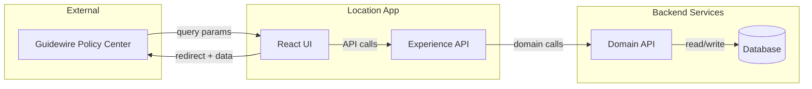
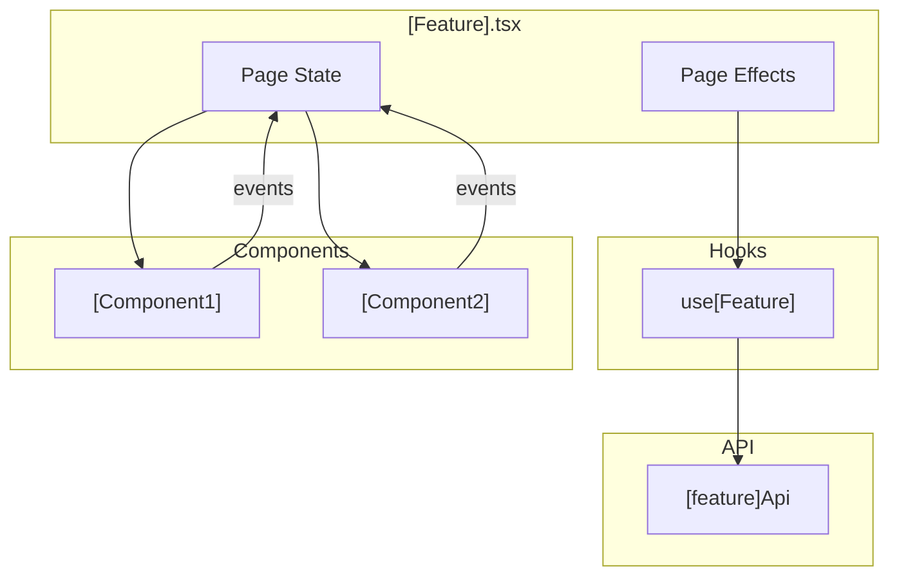
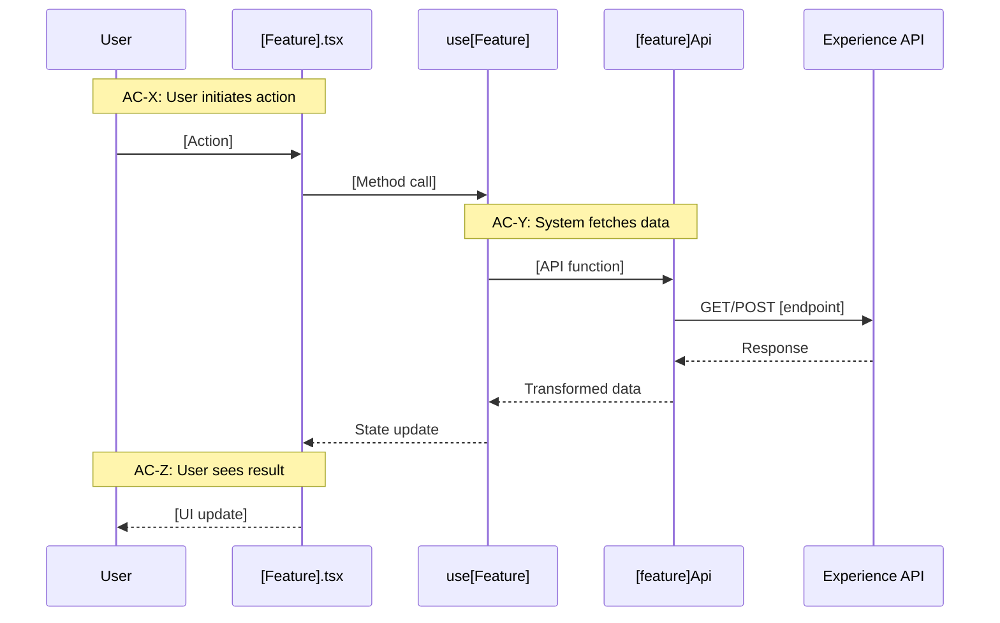

# Technical Design: [Feature Name]

## Purpose

This document translates feature requirements into implementable architecture. It serves three audiences:

| Audience | Value |
|----------|-------|
| Reviewers | Validate design before code is written |
| Developers | Clear blueprint for implementation |
| Phase Prompts | Source of specific file paths, interfaces, and test mappings |

**Prerequisite:** The feature spec must be complete (all ACs have TCs) before starting this document.

**Expected Length:** A complete tech design expands significantly from the feature spec — typically 6-7×. The richness comes from redundant connections: the same concepts appearing at multiple altitudes, woven through functional and technical perspectives. Shorter usually means insufficient depth. Longer usually means scope creep.

---

## Spec Validation

Before designing, validate the Feature Spec is implementation-ready. You are the downstream consumer—if you can't design from it, the spec isn't ready.

**Validation Checklist:**
- [ ] Every AC maps to clear implementation work
- [ ] Data contracts are complete and realistic
- [ ] Edge cases have TCs, not just happy path
- [ ] No technical constraints the BA missed
- [ ] Flows make sense from implementation perspective

**Issues Found:**

| Issue | Spec Location | Recommendation | Status |
|-------|---------------|----------------|--------|
| [description] | AC-X | [fix needed] | Pending/Resolved |

If blocking issues exist, return to BA for revision. Don't design from a broken spec. Document what you found—even minor issues—so there's a record of spec evolution.

---

## Context

This section establishes the "why" behind architectural choices. Write 3-5 paragraphs covering the landscape that shaped this design. Someone entering this document without prior conversation should understand:

- **What triggered this feature?** Business driver, user need, or technical debt that created the work.
- **What constraints shaped the design?** Existing systems that can't change, timeline pressure, risk tolerance, team capabilities.
- **What major decisions were made early?** Technology choices, boundary decisions, trade-offs accepted.
- **How does this connect to adjacent work?** Related features, future phases, dependencies on other teams.

The goal is rich context that survives isolated reading. Don't summarize—immerse the reader in the problem space so architectural choices feel inevitable rather than arbitrary.

*Example (note the paragraph depth):*

This feature addresses Guidewire users who need to add multiple locations to commercial policies during the quoting process. Currently, users exit Guidewire entirely, navigate to the legacy location system, and manually re-enter policy context. The round-trip takes 8-12 minutes and is the #2 complaint in broker feedback surveys.

The primary constraint is iframe embedding—Guidewire's extension framework prohibits navigation or popups. All data must flow through URL parameters (in) and redirect URLs (out). This limits payload size to roughly 2KB encoded, which influenced our decision to return location IDs rather than full location objects. The parent application will re-fetch details as needed.

We chose to isolate this feature under the `/locations` namespace, creating a parallel implementation rather than extending v1 flows. This increases some code duplication (shared components will be extracted in Phase 2) but eliminates integration risk during the policy renewal window in Q4. The v1 system handles 40% of premium volume; we cannot risk destabilization.

The design assumes the XAPI team delivers their location search endpoint by Sprint 23. If delayed, Chunk 2 (search functionality) slides but Chunk 1 (browse existing locations) can proceed independently.

---

## High Altitude: System View

Start at the highest level. How does this feature fit into the broader system? What crosses the application boundary? This altitude answers: "What does the system look like from the outside?"

### System Context Diagram

Show external actors and systems. For complex integrations, consider building the diagram progressively—start with core actors, then add external systems, then show the full picture. This helps readers construct understanding rather than absorb a complete diagram all at once.



### External Contracts

What crosses the boundary? This section connects to the feature spec's Data Contracts and establishes what the implementation must honor. These contracts become the fixed points around which internal architecture flexes.

**Incoming (from Guidewire):**

Describe what arrives and why. The table enumerates; the prose contextualizes.

| Parameter | Required | Source | Purpose |
|-----------|----------|--------|---------|
| param1 | Yes | Query string | Description |

**Outgoing (to Guidewire):**

Describe what returns and the format constraints. Note any size limits, encoding requirements, or ordering expectations.

| Data | Format | Destination | Purpose |
|------|--------|-------------|---------|
| Location data | Base64 JSON | Redirect URL | Return selected/created locations |

**Error Responses:**

Errors are part of the contract. Define shapes so tests can mock realistic failures and UI can handle them gracefully. These error shapes should appear again in the testing section—that redundancy is intentional, creating multiple paths to the same information.

| Source | Status | Shape | UI Handling |
|--------|--------|-------|-------------|
| XAPI | 400 | `{ status: 'ERROR', messages: [{ code: string, message: string }] }` | Show validation message |
| XAPI | 500 | `{ status: 'ERROR', messages: [{ message: string }] }` | Show generic error |
| Network | — | `TypeError: Failed to fetch` | Show connection error |

---

**✏️ Connection Check:** Before moving to Medium Altitude, verify you've established:
- External systems and their integration patterns
- Data that crosses the boundary (in and out)
- Error contracts that tests will mock

These external contracts constrain everything below. Module boundaries exist to fulfill these contracts. Interface definitions implement them. If an external contract is unclear here, it will haunt every subsequent section.

---

## Medium Altitude: Module Boundaries

Zoom into the application. What modules exist? How do they divide responsibility? This altitude answers: "How is the application organized internally?"

The module breakdown creates the skeleton that Phase 1 will implement. Each module listed here becomes a stub file. Think carefully about boundaries—they're expensive to change once tests are written against them.

### Module Architecture

Show the file structure with annotations. Mark what exists vs. what's new. This becomes the implementation checklist for skeleton phase. Adapt the structure to your stack — the principle is the same: group by responsibility, mark mock boundaries, trace to ACs.

**React/UI example:**

```
src/
├── errors.ts                           # EXISTS: Add NotImplementedError if missing
├── types/
│   └── [Feature].ts                    # NEW: Type definitions for this feature
├── pages/
│   └── [feature]/
│       ├── [Feature].tsx               # NEW: Main page component
│       └── [feature].module.scss       # NEW: Page styles
├── components/
│   └── [ComponentName]/
│       ├── [ComponentName].tsx         # NEW: Reusable component
│       └── [ComponentName].module.scss # NEW: Component styles
├── hooks/
│   └── use[Feature].ts                 # NEW: Custom hook encapsulating logic
└── api/
    └── [feature]Api.ts                 # NEW: API functions (mock boundary)
```

**API service / CLI example:**

```
src/
├── errors.ts                           # EXISTS: Add NotImplementedError if missing
├── types/
│   └── [feature].types.ts              # NEW: Request/response types, domain models
├── commands/                            # or routes/, handlers/
│   └── [feature].command.ts            # NEW: Entry point (command handler or route handler)
├── services/
│   └── [feature].service.ts            # NEW: Business logic, orchestration
├── clients/
│   └── [external].client.ts            # NEW: External API/DB client (mock boundary)
└── utils/
    └── [feature].utils.ts              # NEW: Pure transformations (testable without mocks)
```

### Module Responsibility Matrix

Define what each module does, what it depends on, and which ACs it serves. This matrix is the rosetta stone connecting functional requirements to code locations. When someone asks "where is AC-15 implemented?"—this table answers.

| Module | Type | Responsibility | Dependencies | ACs Covered |
|--------|------|----------------|--------------|-------------|
| `[entrypoint]` | Handler | Entry point, request/response orchestration | services, components | AC-1 to AC-5 |
| `[service/hook]` | Logic | Business logic, data fetching, state | clients, api | AC-6 to AC-10 |
| `[component/formatter]` | Output | Renders/formats results | types | AC-11 to AC-15 |
| `[client/api]` | Boundary | External calls (mock boundary) | network/fs | (supports above) |

Notice how ACs appear here after appearing in the Context section (implicitly) and before appearing in Flow-by-Flow (explicitly). This repetition is intentional—the spiral pattern creates redundant paths through the material.

### Component Interaction Diagram

Show runtime communication between modules. This diagram should feel like a zoomed-in view of the System Context diagram—same actors at different magnification.



---

**✏️ Connection Check:** The modules above should clearly map to:
- External contracts (High Altitude) — Which module handles incoming params? Which prepares outgoing data?
- ACs from the feature spec — Every AC should have a home in the responsibility matrix
- Interface definitions (Low Altitude, coming next) — Each module will need types, props, or signatures

If a module exists but you can't trace it to an AC, question whether it's needed. If an AC exists but no module owns it, you've found a gap.

---

## Medium Altitude: Flow-by-Flow Design

For each major flow, provide a sequence diagram and connect to functional requirements. This section weaves functional (ACs/TCs) with technical (modules/methods), showing *how* the architecture fulfills requirements.

Each flow should reference ACs covered, show the sequence of module interactions, list what skeleton phase must create, and map TCs to test approaches. This is the densest section—and intentionally so. It's where functional and technical interlock.

### Flow 1: [Flow Name]

**Covers:** AC-X through AC-Y

Begin with prose describing this flow's purpose, when it executes, and why it matters to users. Connect to the problem established in Context. Two to three sentences minimum—don't jump straight to the diagram.



**Skeleton Requirements:**

This flow requires the following stubs. Each row becomes a file created in skeleton phase with a `NotImplementedError` body. The signature column is copy-paste ready.

| What | Where | Stub Signature |
|------|-------|----------------|
| Page component | `src/pages/[feature]/[Feature].tsx` | `export const [Feature] = () => { throw new NotImplementedError('[Feature]') }` |
| Hook | `src/hooks/use[Feature].ts` | `export const use[Feature] = () => { throw new NotImplementedError('use[Feature]') }` |
| API function | `src/api/[feature]Api.ts` | `export const [apiFunction] = async () => { throw new NotImplementedError('[apiFunction]') }` |

**TC Mapping for this Flow:**

How do we verify this flow works? Each TC from the feature spec maps to a test. The test file, setup, and assertion approach are specified here—TDD Red phase will implement exactly these tests.

| TC | Tests | Module | Setup | Assert |
|----|-------|--------|-------|--------|
| TC-XX | [What behavior] | `use[Feature]` | Mock API returns data | Hook returns transformed data |
| TC-YY | [What behavior] | `[Feature].tsx` | Render with mocked hook | Shows expected UI |

---

### Flow 2: [Flow Name]

**Covers:** AC-X through AC-Y

*Repeat the same structure: context prose → sequence diagram with AC annotations → skeleton requirements → TC mapping*

The repetition of structure isn't monotony—it's navigability. Someone looking for "how does selection work?" can scan flow headings. Someone looking for "where is TC-25 tested?" can scan TC mapping tables. Multiple entry points to the same information.

---

**✏️ Connection Check:** Each flow should trace to:
- Context (why this flow matters to users/business)
- Module Responsibility Matrix (which modules participate)
- External Contracts (what data crosses boundaries)
- Low Altitude interfaces (what methods/types enable it)

If you can't draw these connections, the design has gaps. Fill them before proceeding.

---

## Low Altitude: Interface Definitions

Now at the lowest altitude before code. Specific types, method signatures, and implementation contracts. These become copy-paste ready for skeleton phase and serve as the source of truth for what gets built.

This section should feel like the inevitable conclusion of everything above. The types exist because the flows need them. The method signatures fulfill the module responsibilities. The props/parameters enable the interactions shown in diagrams. Adapt to your stack — the examples below use TypeScript but the pattern (types → service signatures → boundary contracts → entry point signatures) applies to any language.

### Types

Types establish the vocabulary of the feature. Define them with JSDoc comments that reference their purpose—where they come from, where they're used, which ACs they support.

```typescript
/**
 * Represents a [domain concept] in the V2 location flow.
 * 
 * Used by: use[Feature] hook, [Feature].tsx page
 * Supports: AC-X (display), AC-Y (selection)
 * 
 * Note: V2 types are NEW interfaces for this feature.
 * Do not modify existing types in other files.
 */
export interface [TypeName]V2 {
  /** Unique identifier from backend */
  id: string;

  /** [Field description - what it represents, where it comes from] */
  fieldName: string;

  /** [Optional field description] */
  optionalField?: string;
}
```

### Service / Hook Interface

Services (or hooks in React) encapsulate business logic and data fetching. Define the return type contract—this is what entry points and consumers program against.

```typescript
/**
 * Manages [feature] data and operations.
 * 
 * Covers: TC-XX (loading state), TC-YY (data fetch), TC-ZZ (error handling)
 * Depends on: [feature]Api for data fetching
 * Used by: [Feature].tsx page component
 */
export interface Use[Feature]Return {
  /** Current data state - null until first fetch completes */
  data: [TypeName]V2[] | null;

  /** True while fetch is in flight */
  isLoading: boolean;

  /** Error from most recent failed fetch, null if successful */
  error: Error | null;

  /** 
   * [Action method description]
   * Triggers: [what happens when called]
   * Covers: AC-X
   */
  performAction: (param: string) => void;
}

export const use[Feature] = (): Use[Feature]Return => {
  throw new NotImplementedError('use[Feature]');
};
```

### API Functions

API functions are the mock boundary. Tests mock these; hooks call these. Define request/response contracts precisely.

```typescript
/**
 * Fetches [data description] from XAPI.
 * 
 * Endpoint: GET /api/[endpoint]
 * Covers: TC-XX (success), TC-XY (error handling)
 * Called by: use[Feature] hook
 * 
 * @param param - [parameter description]
 * @returns [return description]
 * @throws {Error} When network fails or response is not OK
 */
export const fetch[Data] = async (param: string): Promise<[ResponseType]> => {
  throw new NotImplementedError('fetch[Data]');
};

/**
 * Submits [data description] to XAPI.
 * 
 * Endpoint: POST /api/[endpoint]
 * Covers: TC-YY (success), TC-YZ (validation error)
 * Called by: use[Feature] hook
 */
export const submit[Data] = async (data: [RequestType]): Promise<[ResponseType]> => {
  throw new NotImplementedError('submit[Data]');
};
```

### Entry Point / Component Interface

Entry points (route handlers, command handlers, component props) define the contract at the top of your call stack. Include parameter types and document what triggers each entry.

```typescript
/**
 * Props for [ComponentName] component.
 * 
 * Renders: [what the component displays]
 * Used in: [Feature].tsx
 * Supports: AC-XX (display), AC-YY (interaction)
 */
export interface [ComponentName]Props {
  /** [Prop description - what it contains, where it comes from] */
  propName: string;

  /** 
   * Called when user [action description].
   * Parent should: [expected parent response]
   */
  onAction: (value: string) => void;
}
```

---

## Functional-to-Technical Traceability

Complete mapping from Test Conditions to implementation. This table drives TDD Red phase—every row becomes a test. The grouping by test file makes implementation straightforward: open file, write listed tests.

This section synthesizes everything above. Each TC traces back through:
- Low Altitude (interface being tested)
- Flow-by-Flow (sequence it validates)
- Module Responsibility (component under test)
- Feature Spec (AC it verifies)

### By Module

Group by test file to show what each module is responsible for testing.

#### `[Feature].test.tsx`

Page-level integration tests. Tests the assembled component with mocked APIs (not mocked hooks—see Testing Strategy). These tests verify the page orchestrates correctly.

| TC | Test Name | Setup | Action | Assert |
|----|-----------|-------|--------|--------|
| TC-XX | TC-XX: [user-visible behavior] | Render with query params | [user action or wait] | [expected outcome] |

#### `use[Feature].test.ts`

Hook unit tests. Tests business logic in isolation with mocked API functions. Focus on data transformation, state management, error handling.

| TC | Test Name | Setup | Action | Assert |
|----|-----------|-------|--------|--------|
| TC-YY | TC-YY: [behavior description] | Mock API response | Call hook method | Returns expected shape |

#### `[ComponentName].test.tsx`

Component tests. Tests rendering and user interaction. Mock only what's passed via props.

| TC | Test Name | Setup | Action | Assert |
|----|-----------|-------|--------|--------|
| TC-ZZ | TC-ZZ: [behavior description] | Render with props | [user interaction] | [expected render/callback] |

---

## Testing Strategy

> **Reference:** See `references/testing.md` for full methodology, mock strategy, and test patterns.

### Test Pyramid for This Feature

The pyramid visualizes where tests live. More tests at the bottom (fast, isolated), fewer at the top (slow, integrated). Adapt labels to your stack.

```
         /\
        /  \  Manual / Gorilla testing
       /----\  - Full flow end-to-end
      /      \
     /--------\  Entry point tests (handler, page, command)
    /          \  - Full request/response or user flow
   /------------\  Module tests (service, component)
  /              \  - Business logic with mocked boundaries
 /----------------\  Pure logic (utils, algorithms)
/                  \  - No mocks needed, edge case coverage
```

### The Critical Mocking Rule

**Mock at the external boundary, never at internal module boundaries.**

This rule preserves integration between your own modules. Mock where your code ends and external systems begin (network, database, filesystem). Mocking internal modules hides wiring bugs between your own components.

```typescript
// ✅ CORRECT: Mock at external boundary
// (Examples use Vitest syntax; pattern applies to any mock framework)
vi.mock('@/clients/[external]Client', () => ({
  getData: vi.fn(() => Promise.resolve(mockData)),
}));

// ✅ OK: Mock config/environment injection
vi.mock('@/config', () => ({
  getConfig: vi.fn(() => testConfig),
}));

// ❌ WRONG: Never mock your own business logic modules
// This hides integration bugs between your own code
vi.mock('@/services/[feature]Service');  // Don't do this
```

### What Gets Mocked

This table appears here (Testing Strategy) after error shapes appeared in External Contracts. The repetition is intentional—someone entering from either section finds what they need. Adapt to your stack — the principle is consistent: mock external, exercise internal.

| Layer | Mock? | Why |
|-------|-------|-----|
| External API clients / DB | Yes | External boundary — control responses |
| Filesystem / network / child processes | Yes | External boundary — determinism |
| Config / environment injection | Yes | No business logic, just setup |
| Your services / business logic | **No** | That's what you're testing |
| Framework internals (React Query, Express middleware) | **No** | Preserve real behavior |

### Dev Server Mocks (UI projects — optional)

For UI projects, dev server mock handlers (MSW or similar) provide mock responses for manual testing. Test files use `vi.mock()` (or equivalent) instead — dev mocks are for humans, test mocks are for tests. Skip this section for API/CLI projects.

```typescript
// src/services/[feature]/handlers.ts (for dev server)
http.get('*/api/[endpoint]', () => { 
  return HttpResponse.json(mockSuccessResponse);
}),
http.post('*/api/[endpoint]', () => { 
  return HttpResponse.json(mockSubmitResponse);
}),
```

### Manual Verification Checklist

After TDD Green, verify manually. Automated tests catch regressions; manual testing catches "it works but feels wrong."

1. [ ] Start dev server: `npm run dev:start`
2. [ ] Open launcher: `http://localhost:3000/[feature]/launcher.html`
3. [ ] Select "[Feature]" preset (or configure parameters)
4. [ ] [Specific action to test]
5. [ ] Verify [expected outcome]
6. [ ] Check redirect contains expected data
7. [ ] Test error states (disconnect network, use error preset)

---

## Work Breakdown: Chunks and Phases

Work breaks along two axes:

**Vertical Chunks** (story-sized functionality):
- Chunk 0: Infrastructure — Types, fixtures, error classes (always first)
- Chunk 1: [First capability] — ACs X-Y
- Chunk 2: [Second capability] — ACs Z-W

**Horizontal Phases** (per-chunk workflow):
- Skeleton — Stubs that compile but throw `NotImplementedError`
- TDD Red — Tests that run but fail (stubs throw)
- TDD Green — Implementation that passes all tests

Each chunk typically goes through all three phases before the next chunk starts. This keeps work vertically integrated—each chunk delivers testable, working functionality.

### Chunk 0: Infrastructure (Always First)

Creates shared foundation that all subsequent chunks build on. No user-facing functionality, no stubs, no TDD cycle — pure setup. Component/hook/API stubs come in Chunk 1+ skeleton phases.

| Deliverable | Path | What It Contains |
|-------------|------|------------------|
| Error class | `src/errors.ts` | `NotImplementedError` if not present |
| Types | `src/types/[Feature].ts` | All interfaces from Low Altitude section |
| Test fixtures | `src/test/fixtures/[feature].ts` | Mock data matching data contracts |
| Test utilities | `src/test/utils/[feature].ts` | Shared test helpers, factory functions |
| Error classes | `src/errors/[feature].ts` | Feature-specific errors from tech design |
| Project config | — | Test config, path aliases, setup files if needed |

**Exit Criteria:** `npm run typecheck` passes. No tests yet (types and fixtures don't need TDD).

### Chunk 1: [First Capability Name]

**Scope:** [What this chunk delivers]
**ACs:** AC-X through AC-Y
**TCs:** TC-Xa through TC-Yb

#### Skeleton (if not covered in Chunk 0)

Additional stubs specific to this chunk's flows.

#### TDD Red

Creates tests that assert real behavior. Tests ERROR because stubs throw.

| Test File | # Tests | TCs Covered |
|-----------|---------|-------------|
| `[Feature].test.tsx` | X | TC-XX through TC-YY |
| `use[Feature].test.ts` | Y | TC-AA through TC-BB |

**Exit Criteria:** `npm test` runs. New tests ERROR (NotImplementedError). Existing tests PASS.

#### TDD Green

Implements real logic. Tests PASS.

| Module | Implementation Notes |
|--------|---------------------|
| `use[Feature].ts` | [Key logic points, edge cases to handle] |
| `[Feature].tsx` | [Key UI points, state management approach] |

**Exit Criteria:** `npm test` all PASS. Typecheck passes. Manual verification for this chunk complete.

### Chunk Dependencies

```
Chunk 0 (Infrastructure)
    ↓
Chunk 1 ([First Capability])
    ↓
Chunk 2 ([Second Capability])
```

For features with parallel chunks:

```
Chunk 0 → Chunk 1 → Chunk 3
              ↘      ↗
               Chunk 2
```

---

## Self-Review Checklist

Before handoff, verify quality. Read your own design critically—the Orchestrator validates by confirming they can derive stories from this design. If they can't, the design isn't ready.

### Completeness

- [ ] Every TC from feature spec mapped to a test file
- [ ] All interfaces fully defined (types, props, hook returns, API signatures)
- [ ] Module boundaries clear—no ambiguity about what lives where
- [ ] Chunk breakdown includes test count estimates
- [ ] Skeleton stubs are copy-paste ready

### Richness (The Spiral Test)

- [ ] Context section is 3+ paragraphs establishing rich background
- [ ] External contracts from High Altitude appear again in Testing Strategy
- [ ] Module descriptions include AC coverage references
- [ ] Interface definitions include TC coverage references
- [ ] Flows reference Context (why) and Interfaces (how)
- [ ] Someone could enter at any section and navigate to related content

### Writing Quality

- [ ] More prose than tables (~70% prose target for explanatory sections)
- [ ] Lists and tables have paragraph context above them
- [ ] Diagrams are introduced with prose, not orphaned
- [ ] Sequence diagrams include AC annotations
- [ ] Connection Check prompts answered (or deleted after verification)

### Agent Readiness

- [ ] File paths are exact and complete
- [ ] Stub signatures are copy-paste ready with correct throws
- [ ] Test names describe user-visible outcomes
- [ ] Each section standalone-readable (isolation test)

---

## Open Questions

Unresolved questions that may affect implementation. Be explicit about what blocks which phase—this prevents work starting on shaky foundations.

| # | Question | Owner | Blocks | Resolution |
|---|----------|-------|--------|------------|
| Q1 | [Question] | [Name] | Chunk N | Pending |

---

## Deferred Items

Items identified during design that are out of scope. Document them so they're not lost and so reviewers know they were considered, not missed.

| Item | Related AC | Reason Deferred | Future Work |
|------|-----------|-----------------|-------------|
| [Item] | AC-XX | [Why out of scope] | [Where to track—ticket, phase 2, etc.] |

---

## Related Documentation

- Feature Spec: `[feature-spec filename]`
- Story Prompts: `stories/`
- Testing Reference: `references/testing.md`
- Methodology: `SKILL.md`
